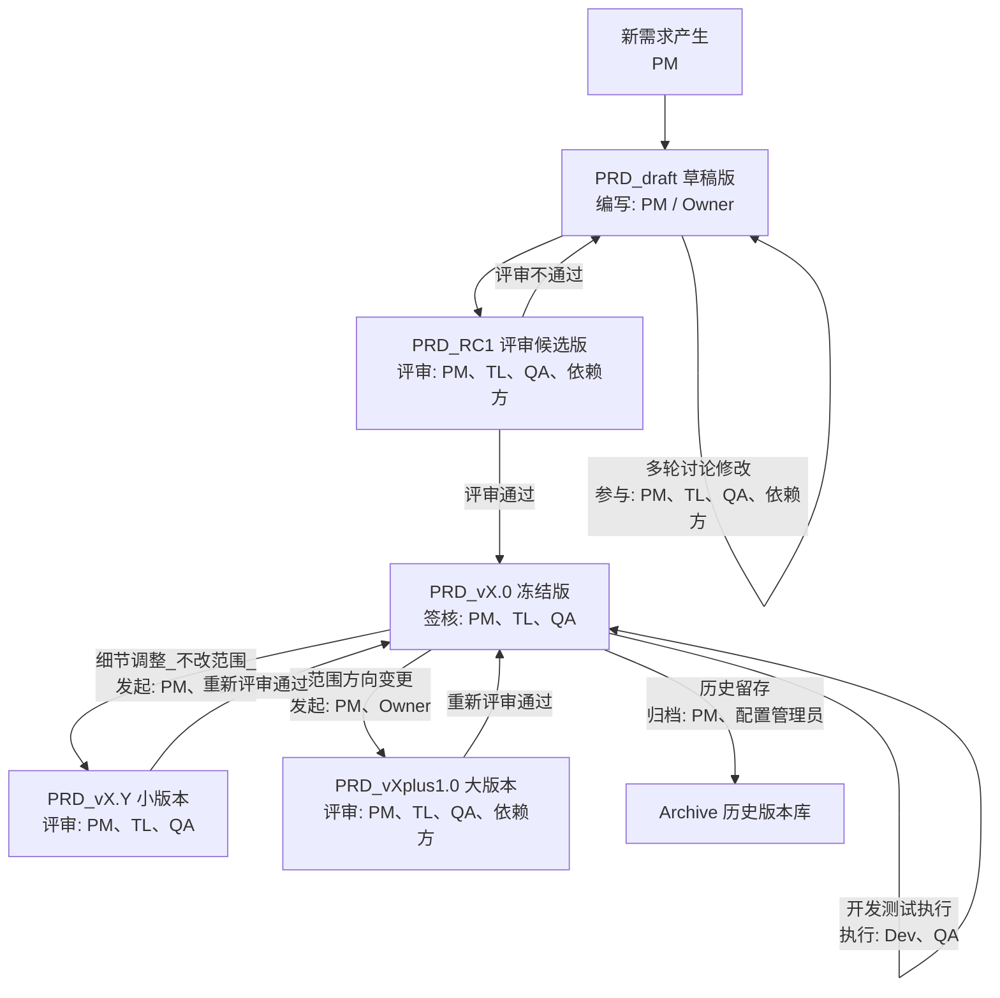

# PRD 文档管理 & 版本作用机制


## 1. PRD 版本管理的目标

* **历史可追溯**：任何阶段都能看到当时的需求内容和决策依据
* **变更可控**：重要改动需要评审和签核，防止随意改需求
* **版本可引用**：开发、测试、外部对接方能固定依赖某个版本，不受后续改动影响


## 2. 推荐的 PRD 版本命名规则

| 场景                | 命名示例                | 说明                             |
| ----------------- | ------------------- | ------------------------------ |
| **初版发布**          | `PRD_v1.0.md`       | 功能范围第一次冻结                      |
| **小改（不影响核心范围）**   | `PRD_v1.1.md`       | 补充样例、修正文案、优化描述等                |
| **大改（需求方向或范围变更）** | `PRD_v2.0.md`       | 增加新模块、删改主要功能                   |
| **草稿版**           | `PRD_v1.0_draft.md` | 未评审的工作中版本                      |
| **评审版**           | `PRD_v1.0_RC1.md`   | 进入评审环节的候选版本（Release Candidate） |

> 版本号规则：
>
> * **大版本号**（X.0）：需求范围或核心目标变更
> * **小版本号**（X.Y）：细节修改，不影响主要目标
> * 后缀 `_draft` / `_RC1`：表示未冻结或评审中

---

## 3. PRD 在不同阶段的作用

| 阶段        | 使用的 PRD 版本          | 谁依赖它         | 作用                      |
| --------- | ------------------- | ------------ | ----------------------- |
| **需求澄清**  | `*_draft.md`        | PM、TL、QA     | 用于讨论和迭代，允许大改            |
| **评审会**   | `*_RC1.md`          | PM、TL、QA、依赖方 | 用验收清单确认是否冻结             |
| **开发进行中** | `*_vX.Y.md`（冻结版）    | 开发、QA        | 开发和测试的唯一需求依据，禁止私自改      |
| **测试阶段**  | 同开发阶段               | QA           | 按冻结 PRD 写测试用例           |
| **上线后维护** | 新版本 `*_v(X+1).0.md` | 全员           | 如果需求变更，新版本替换旧版本，同时保留旧文件 |

## 4. 版本变更的执行规则

1. **任何改动都必须走变更流程**

   * 细节修改 → 新建小版本（v1.1）
   * 功能范围改动 → 新建大版本（v2.0）
2. **保留历史版本**，不要覆盖（用 Git 也要保留文件副本）
3. **变更记录写进文档**（PRD 内的“版本与变更记录”表）
4. **新版本必须重新走评审流程**，确认签核后才能生效
5. **开发/测试必须指向具体版本号**，避免“哪个 PRD 是准的”这种争议

---

## 5. 推荐目录结构（Git/Confluence 通用）

```
docs/
  PRD/
    PRD_v1.0.md          # 冻结版
    PRD_v1.1.md          # 小改版
    PRD_v2.0.md          # 大改版
    archive/             # 归档的历史版本
```

---

## 6. 版本作用举例

假设你的团队在做一个批量下载股票数据的工具：

* 2025-08-01：`PRD_v1.0.md` 冻结 → 开发和测试都按这个版本工作
* 2025-08-10：补充异常样例 → 新建 `PRD_v1.1.md`，QA 更新用例
* 2025-09-01：新增支持加密货币下载 → 新建 `PRD_v2.0.md`，重新评审、重新排期

这样每个阶段都能清楚：

* 当前进行的是哪一版需求
* 历史版本做过哪些改动
* 为什么改（版本记录表里能看到）
## 7. PRD 生命周期

