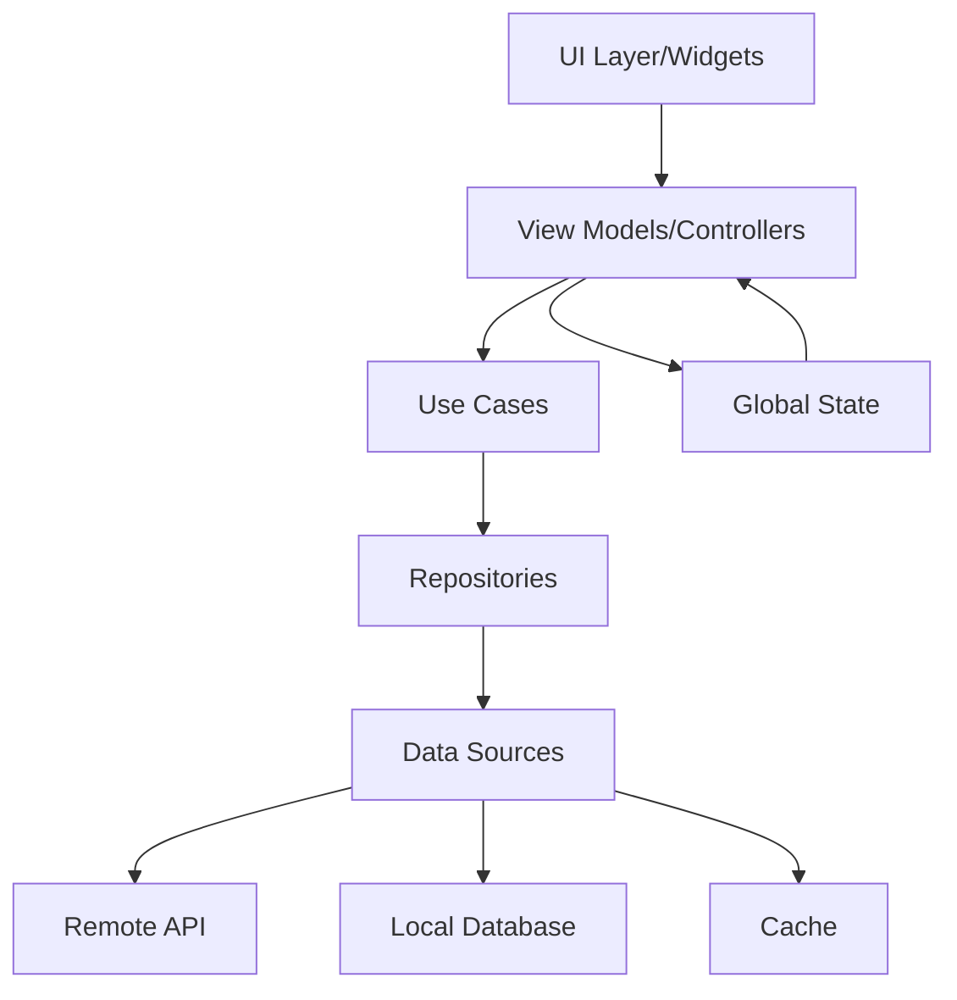

# State Management Architecture

## Overview
- **App Name**: [App Name]
- **State Management Solution**: Riverpod / Bloc / Provider
- **Architecture Pattern**: Clean Architecture + MVVM
- **Data Flow**: Unidirectional
- **State Persistence**: Hive / SharedPreferences

## Architecture Diagram



## State Management with Riverpod

### Provider Types

#### StateProvider
```dart
// Simple state that can be modified from outside
final counterProvider = StateProvider<int>((ref) => 0);

// Usage in widget
class CounterWidget extends ConsumerWidget {
  @override
  Widget build(BuildContext context, WidgetRef ref) {
    final count = ref.watch(counterProvider);
    
    return Text('Count: $count');
  }
}
```

#### StateNotifierProvider
```dart
// Complex state with business logic
class AuthState {
  final User? user;
  final bool isLoading;
  final String? error;
  
  const AuthState({
    this.user,
    this.isLoading = false,
    this.error,
  });
  
  AuthState copyWith({
    User? user,
    bool? isLoading,
    String? error,
  }) {
    return AuthState(
      user: user ?? this.user,
      isLoading: isLoading ?? this.isLoading,
      error: error ?? this.error,
    );
  }
}

class AuthNotifier extends StateNotifier<AuthState> {
  AuthNotifier(this._authRepository) : super(const AuthState());
  
  final AuthRepository _authRepository;
  
  Future<void> login(String email, String password) async {
    state = state.copyWith(isLoading: true, error: null);
    
    try {
      final user = await _authRepository.login(email, password);
      state = state.copyWith(user: user, isLoading: false);
    } catch (e) {
      state = state.copyWith(
        error: e.toString(),
        isLoading: false,
      );
    }
  }
  
  Future<void> logout() async {
    await _authRepository.logout();
    state = const AuthState();
  }
}

final authProvider = StateNotifierProvider<AuthNotifier, AuthState>((ref) {
  return AuthNotifier(ref.read(authRepositoryProvider));
});
```

#### FutureProvider
```dart
// Async data fetching
final userProfileProvider = FutureProvider.family<UserProfile, String>((ref, userId) async {
  final repository = ref.read(userRepositoryProvider);
  return repository.getUserProfile(userId);
});

// Usage with error handling
class ProfileWidget extends ConsumerWidget {
  final String userId;
  
  const ProfileWidget({required this.userId});
  
  @override
  Widget build(BuildContext context, WidgetRef ref) {
    final profileAsync = ref.watch(userProfileProvider(userId));
    
    return profileAsync.when(
      data: (profile) => ProfileView(profile: profile),
      loading: () => const CircularProgressIndicator(),
      error: (error, stack) => ErrorWidget(error: error.toString()),
    );
  }
}
```

#### StreamProvider
```dart
// Real-time data updates
final messagesProvider = StreamProvider<List<Message>>((ref) {
  final chatService = ref.read(chatServiceProvider);
  return chatService.getMessagesStream();
});
```

### Dependency Injection

```dart
// Repository providers
final authRepositoryProvider = Provider<AuthRepository>((ref) {
  return AuthRepositoryImpl(
    apiService: ref.read(apiServiceProvider),
    storageService: ref.read(storageServiceProvider),
  );
});

final userRepositoryProvider = Provider<UserRepository>((ref) {
  return UserRepositoryImpl(
    apiService: ref.read(apiServiceProvider),
    cacheService: ref.read(cacheServiceProvider),
  );
});

// Service providers
final apiServiceProvider = Provider<ApiService>((ref) {
  return ApiService(
    baseUrl: Environment.apiUrl,
    interceptors: [
      AuthInterceptor(ref.read(authProvider)),
      LoggingInterceptor(),
    ],
  );
});

final storageServiceProvider = Provider<StorageService>((ref) {
  return StorageServiceImpl();
});
```

## State Management with Bloc

### Bloc Pattern

#### Events
```dart
abstract class AuthEvent {}

class LoginRequested extends AuthEvent {
  final String email;
  final String password;
  
  LoginRequested({required this.email, required this.password});
}

class LogoutRequested extends AuthEvent {}

class AuthCheckRequested extends AuthEvent {}
```

#### States
```dart
abstract class AuthState {}

class AuthInitial extends AuthState {}

class AuthLoading extends AuthState {}

class AuthAuthenticated extends AuthState {
  final User user;
  
  AuthAuthenticated({required this.user});
}

class AuthUnauthenticated extends AuthState {}

class AuthError extends AuthState {
  final String message;
  
  AuthError({required this.message});
}
```

#### Bloc Implementation
```dart
class AuthBloc extends Bloc<AuthEvent, AuthState> {
  final AuthRepository _authRepository;
  
  AuthBloc({required AuthRepository authRepository})
      : _authRepository = authRepository,
        super(AuthInitial()) {
    on<LoginRequested>(_onLoginRequested);
    on<LogoutRequested>(_onLogoutRequested);
    on<AuthCheckRequested>(_onAuthCheckRequested);
  }
  
  Future<void> _onLoginRequested(
    LoginRequested event,
    Emitter<AuthState> emit,
  ) async {
    emit(AuthLoading());
    
    try {
      final user = await _authRepository.login(
        event.email,
        event.password,
      );
      emit(AuthAuthenticated(user: user));
    } catch (e) {
      emit(AuthError(message: e.toString()));
    }
  }
  
  Future<void> _onLogoutRequested(
    LogoutRequested event,
    Emitter<AuthState> emit,
  ) async {
    await _authRepository.logout();
    emit(AuthUnauthenticated());
  }
  
  Future<void> _onAuthCheckRequested(
    AuthCheckRequested event,
    Emitter<AuthState> emit,
  ) async {
    final user = await _authRepository.getCurrentUser();
    if (user != null) {
      emit(AuthAuthenticated(user: user));
    } else {
      emit(AuthUnauthenticated());
    }
  }
}
```

#### Bloc Usage
```dart
class LoginPage extends StatelessWidget {
  @override
  Widget build(BuildContext context) {
    return BlocConsumer<AuthBloc, AuthState>(
      listener: (context, state) {
        if (state is AuthAuthenticated) {
          Navigator.of(context).pushReplacementNamed('/home');
        } else if (state is AuthError) {
          ScaffoldMessenger.of(context).showSnackBar(
            SnackBar(content: Text(state.message)),
          );
        }
      },
      builder: (context, state) {
        if (state is AuthLoading) {
          return const CircularProgressIndicator();
        }
        
        return LoginForm(
          onSubmit: (email, password) {
            context.read<AuthBloc>().add(
              LoginRequested(email: email, password: password),
            );
          },
        );
      },
    );
  }
}
```

## Global State Management

### App State Model
```dart
class AppState {
  final AuthState auth;
  final ThemeState theme;
  final SettingsState settings;
  final NavigationState navigation;
  
  const AppState({
    required this.auth,
    required this.theme,
    required this.settings,
    required this.navigation,
  });
  
  AppState copyWith({
    AuthState? auth,
    ThemeState? theme,
    SettingsState? settings,
    NavigationState? navigation,
  }) {
    return AppState(
      auth: auth ?? this.auth,
      theme: theme ?? this.theme,
      settings: settings ?? this.settings,
      navigation: navigation ?? this.navigation,
    );
  }
}
```

### Theme State
```dart
enum ThemeMode { light, dark, system }

class ThemeState {
  final ThemeMode mode;
  final Color primaryColor;
  final String fontFamily;
  
  const ThemeState({
    this.mode = ThemeMode.system,
    this.primaryColor = Colors.blue,
    this.fontFamily = 'Roboto',
  });
}

class ThemeNotifier extends StateNotifier<ThemeState> {
  ThemeNotifier() : super(const ThemeState());
  
  void setThemeMode(ThemeMode mode) {
    state = state.copyWith(mode: mode);
    _saveThemePreference(mode);
  }
  
  void setPrimaryColor(Color color) {
    state = state.copyWith(primaryColor: color);
  }
  
  Future<void> _saveThemePreference(ThemeMode mode) async {
    final prefs = await SharedPreferences.getInstance();
    await prefs.setString('theme_mode', mode.name);
  }
}

final themeProvider = StateNotifierProvider<ThemeNotifier, ThemeState>((ref) {
  return ThemeNotifier();
});
```

## Local State Management

### Form State
```dart
class FormController extends ChangeNotifier {
  final _formKey = GlobalKey<FormState>();
  
  String _email = '';
  String _password = '';
  bool _isLoading = false;
  String? _error;
  
  GlobalKey<FormState> get formKey => _formKey;
  String get email => _email;
  String get password => _password;
  bool get isLoading => _isLoading;
  String? get error => _error;
  
  void setEmail(String value) {
    _email = value;
    notifyListeners();
  }
  
  void setPassword(String value) {
    _password = value;
    notifyListeners();
  }
  
  Future<void> submit() async {
    if (!_formKey.currentState!.validate()) return;
    
    _isLoading = true;
    _error = null;
    notifyListeners();
    
    try {
      // Perform submission
      await Future.delayed(const Duration(seconds: 2));
      // Success
    } catch (e) {
      _error = e.toString();
    } finally {
      _isLoading = false;
      notifyListeners();
    }
  }
}
```

## State Persistence

### Hive Configuration
```dart
class HiveService {
  static const String userBoxName = 'users';
  static const String settingsBoxName = 'settings';
  static const String cacheBoxName = 'cache';
  
  static Future<void> init() async {
    await Hive.initFlutter();
    
    // Register adapters
    Hive.registerAdapter(UserAdapter());
    Hive.registerAdapter(SettingsAdapter());
    
    // Open boxes
    await Hive.openBox<User>(userBoxName);
    await Hive.openBox<Settings>(settingsBoxName);
    await Hive.openBox(cacheBoxName);
  }
  
  static Box<User> get userBox => Hive.box<User>(userBoxName);
  static Box<Settings> get settingsBox => Hive.box<Settings>(settingsBoxName);
  static Box get cacheBox => Hive.box(cacheBoxName);
}
```

### Hydrated State
```dart
class HydratedAuthNotifier extends StateNotifier<AuthState> {
  HydratedAuthNotifier() : super(const AuthState()) {
    _loadState();
  }
  
  Future<void> _loadState() async {
    final box = HiveService.userBox;
    final user = box.get('current_user');
    if (user != null) {
      state = state.copyWith(user: user);
    }
  }
  
  Future<void> _saveState() async {
    final box = HiveService.userBox;
    if (state.user != null) {
      await box.put('current_user', state.user!);
    } else {
      await box.delete('current_user');
    }
  }
  
  @override
  set state(AuthState value) {
    super.state = value;
    _saveState();
  }
}
```

## State Testing

### Unit Tests
```dart
void main() {
  group('AuthNotifier', () {
    late AuthNotifier authNotifier;
    late MockAuthRepository mockRepository;
    
    setUp(() {
      mockRepository = MockAuthRepository();
      authNotifier = AuthNotifier(mockRepository);
    });
    
    test('initial state should be unauthenticated', () {
      expect(authNotifier.state.user, isNull);
      expect(authNotifier.state.isLoading, isFalse);
    });
    
    test('login should update state with user', () async {
      const user = User(id: '1', email: 'test@example.com');
      when(() => mockRepository.login(any(), any()))
          .thenAnswer((_) async => user);
      
      await authNotifier.login('test@example.com', 'password');
      
      expect(authNotifier.state.user, equals(user));
      expect(authNotifier.state.isLoading, isFalse);
    });
    
    test('login failure should update state with error', () async {
      when(() => mockRepository.login(any(), any()))
          .thenThrow(Exception('Invalid credentials'));
      
      await authNotifier.login('test@example.com', 'wrong');
      
      expect(authNotifier.state.user, isNull);
      expect(authNotifier.state.error, contains('Invalid credentials'));
    });
  });
}
```

### Widget Tests
```dart
void main() {
  testWidgets('should update UI when state changes', (tester) async {
    await tester.pumpWidget(
      ProviderScope(
        overrides: [
          authProvider.overrideWith((ref) => MockAuthNotifier()),
        ],
        child: const MaterialApp(home: AuthStatusWidget()),
      ),
    );
    
    // Initial state
    expect(find.text('Not authenticated'), findsOneWidget);
    
    // Trigger authentication
    await tester.tap(find.byType(ElevatedButton));
    await tester.pumpAndSettle();
    
    // Authenticated state
    expect(find.text('Authenticated'), findsOneWidget);
  });
}
```

## Best Practices

### State Organization
1. **Separation of Concerns**: Keep UI state separate from business logic
2. **Single Source of Truth**: Each piece of state should have one owner
3. **Immutable State**: Always create new state objects instead of mutating
4. **Minimal State**: Store only what you need, derive the rest

### Performance Optimization
```dart
// Use select to listen to specific fields
final userNameProvider = Provider<String>((ref) {
  return ref.watch(authProvider.select((state) => state.user?.name ?? ''));
});

// Debounce search queries
final searchProvider = StateNotifierProvider<SearchNotifier, String>((ref) {
  return SearchNotifier();
});

class SearchNotifier extends StateNotifier<String> {
  SearchNotifier() : super('');
  Timer? _debounceTimer;
  
  void updateQuery(String query) {
    _debounceTimer?.cancel();
    _debounceTimer = Timer(const Duration(milliseconds: 500), () {
      state = query;
    });
  }
  
  @override
  void dispose() {
    _debounceTimer?.cancel();
    super.dispose();
  }
}
```

### Error Handling
```dart
class ErrorHandler {
  static void handleError(Object error, StackTrace stack) {
    if (error is NetworkException) {
      // Handle network errors
      showToast('No internet connection');
    } else if (error is ValidationException) {
      // Handle validation errors
      showToast(error.message);
    } else {
      // Log unexpected errors
      logger.error('Unexpected error', error, stack);
      showToast('Something went wrong');
    }
  }
}
```

## Migration Guide

### From Provider to Riverpod
```dart
// Before (Provider)
class MyApp extends StatelessWidget {
  @override
  Widget build(BuildContext context) {
    return MultiProvider(
      providers: [
        ChangeNotifierProvider(create: (_) => AuthProvider()),
      ],
      child: MaterialApp(),
    );
  }
}

// After (Riverpod)
class MyApp extends StatelessWidget {
  @override
  Widget build(BuildContext context) {
    return ProviderScope(
      child: MaterialApp(),
    );
  }
}
```

### From setState to State Management
```dart
// Before (setState)
class _CounterPageState extends State<CounterPage> {
  int _counter = 0;
  
  void _increment() {
    setState(() {
      _counter++;
    });
  }
}

// After (Riverpod)
final counterProvider = StateProvider<int>((ref) => 0);

class CounterPage extends ConsumerWidget {
  @override
  Widget build(BuildContext context, WidgetRef ref) {
    final counter = ref.watch(counterProvider);
    
    return ElevatedButton(
      onPressed: () => ref.read(counterProvider.notifier).state++,
      child: Text('Count: $counter'),
    );
  }
}
```