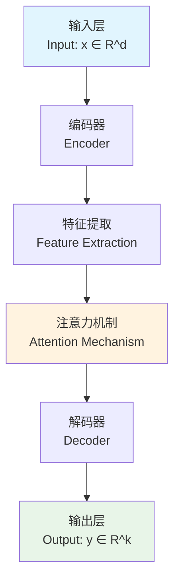
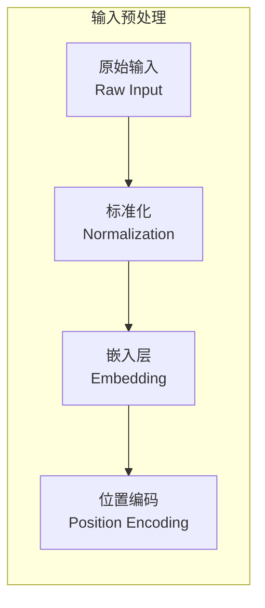
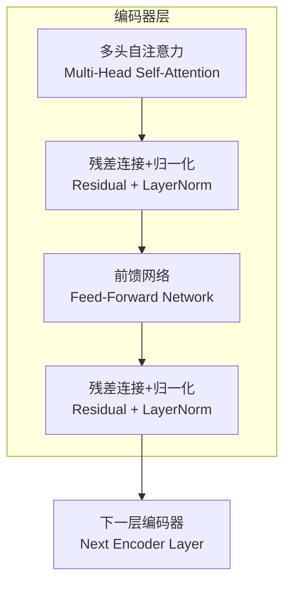
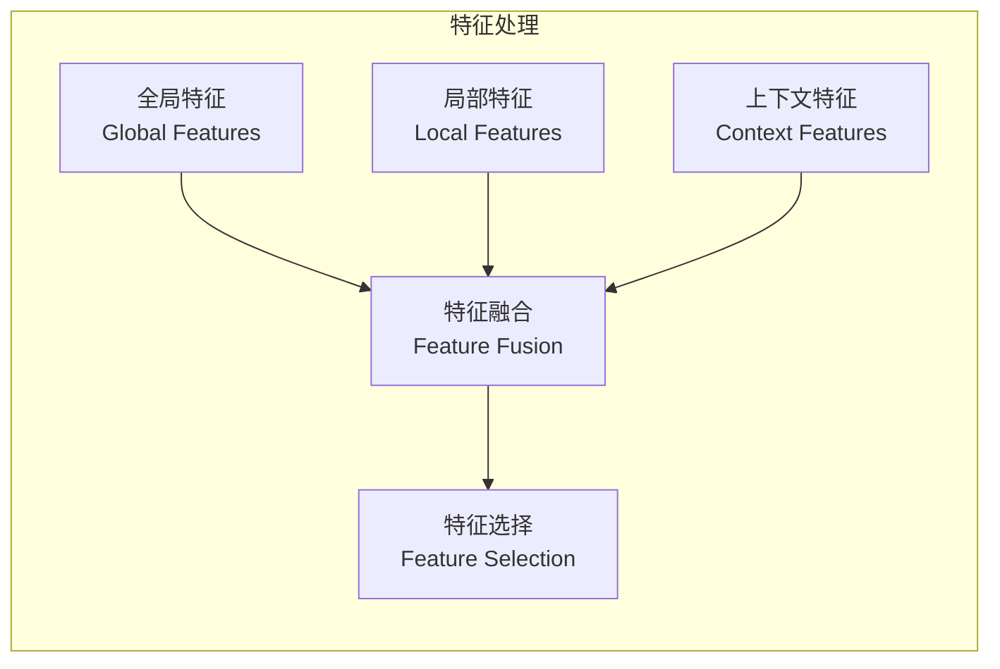
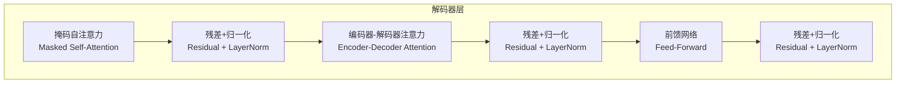
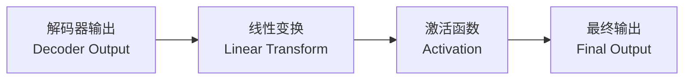
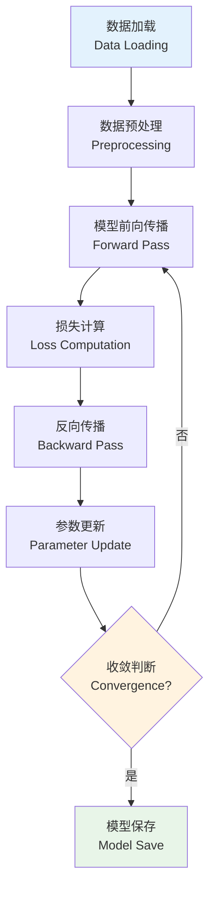
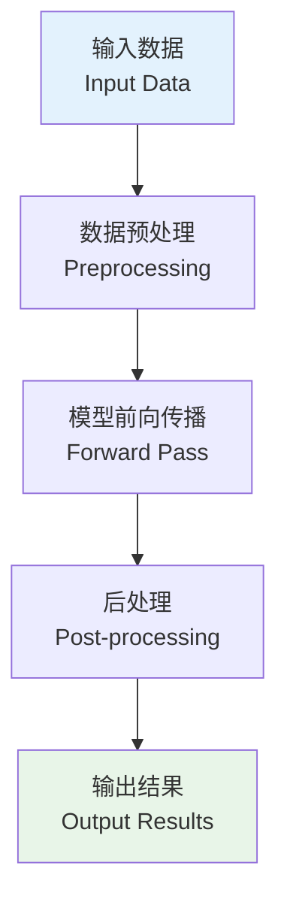

# Literature Review: [模型/方法名称]

> **版本**: v1.0  
> **作者**: agent-researcher  
> **最后更新**: YYYY-MM-DD  
> **审核状态**: DRAFT | REVIEWED | APPROVED

---

## 1. 研究背景与动机

### 1.1 问题定义
- **研究问题**: 明确要解决的核心问题
- **现有挑战**: 当前方法存在的局限性
- **研究动机**: 为什么需要新的解决方案

### 1.2 相关工作
| 方法/模型 | 核心贡献 | 主要局限 | 发表年份 | 引用量 |
|-----------|----------|----------|----------|--------|
| Method A | 描述核心创新点 | 存在的问题 | 2023 | 1000+ |
| Method B | 描述核心创新点 | 存在的问题 | 2022 | 500+ |

---

## 2. 理论基础

### 2.1 核心理论
**基础理论说明**: 详细描述模型建立在哪些数学/统计理论基础上

**关键假设**:
1. 假设1: 具体描述及合理性分析
2. 假设2: 具体描述及合理性分析
3. 假设3: 具体描述及合理性分析

### 2.2 数学公式推导

#### 2.2.1 核心数学表达
**目标函数**:
```
L(θ) = ∑_{i=1}^{N} ℓ(f_θ(x_i), y_i) + λR(θ)
```
- `L(θ)`: 总损失函数
- `ℓ(·,·)`: 单样本损失函数
- `f_θ(x)`: 参数为θ的模型函数
- `R(θ)`: 正则化项
- `λ`: 正则化强度

#### 2.2.2 前向传播公式
**Layer-wise计算**:
```
h^{(l+1)} = σ(W^{(l)} h^{(l)} + b^{(l)})
```
- `h^{(l)}`: 第l层的隐藏状态
- `W^{(l)}`: 第l层的权重矩阵
- `b^{(l)}`: 第l层的偏置向量
- `σ(·)`: 激活函数

#### 2.2.3 反向传播梯度
**梯度计算**:
```
∂L/∂W^{(l)} = δ^{(l)} (h^{(l-1)})^T
∂L/∂b^{(l)} = δ^{(l)}
δ^{(l)} = W^{(l+1)T} δ^{(l+1)} ⊙ σ'(z^{(l)})
```

### 2.3 理论创新点
1. **创新点1**: 详细描述与现有方法的理论差异
2. **创新点2**: 数学上的改进和优势
3. **创新点3**: 计算复杂度的优化

---

## 3. 模型架构详解

### 3.1 整体架构概览


### 3.2 分层架构分析

#### 3.2.1 输入层 (Input Layer)


**技术细节**:
- **输入格式**: `x ∈ R^{B×S×D}` (Batch×Sequence×Dimension)
- **预处理步骤**: 
  1. 标准化: `x_norm = (x - μ) / σ`
  2. 嵌入: `E = x_norm × W_emb`
  3. 位置编码: `PE_{pos,2i} = sin(pos/10000^{2i/d})`

#### 3.2.2 编码器 (Encoder)


**子模块详解**:

##### 多头注意力机制
```
Attention(Q,K,V) = softmax(QK^T/√d_k)V
MultiHead(Q,K,V) = Concat(head_1,...,head_h)W^O
where head_i = Attention(QW_i^Q, KW_i^K, VW_i^V)
```

**参数说明**:
- `Q, K, V`: 查询、键、值矩阵
- `d_k`: 键向量维度
- `h`: 注意力头数
- `W^O`: 输出投影矩阵

##### 前馈网络
```
FFN(x) = max(0, xW_1 + b_1)W_2 + b_2
```

#### 3.2.3 特征提取层 (Feature Extraction)


**特征提取公式**:
```
f_global = GlobalAvgPool(H)
f_local = Conv1D(H, kernel_size=k)
f_context = LSTM(H)
f_fused = Concat(f_global, f_local, f_context)
```

#### 3.2.4 解码器 (Decoder)


#### 3.2.5 输出层 (Output Layer)


---

## 4. 核心组件深度解析

### 4.1 注意力机制详解

#### 4.1.1 注意力权重计算
```
α_{ij} = exp(e_{ij}) / ∑_{k=1}^{T} exp(e_{ik})
e_{ij} = a(s_{i-1}, h_j)
```

#### 4.1.2 上下文向量生成
```
c_i = ∑_{j=1}^{T} α_{ij} h_j
```

### 4.2 损失函数设计

#### 4.2.1 主要损失项
```
L_main = -∑_{i=1}^{N} y_i log(p_i)
```

#### 4.2.2 辅助损失项
```
L_aux = λ_1 L_consistency + λ_2 L_diversity + λ_3 L_regularization
```

#### 4.2.3 总损失函数
```
L_total = L_main + L_aux
```

---

## 5. 算法流程

### 5.1 训练流程


### 5.2 推理流程


---

## 6. 实现细节与技巧

### 6.1 初始化策略
- **权重初始化**: Xavier初始化 / He初始化
- **偏置初始化**: 零初始化
- **特殊层初始化**: 批归一化层、嵌入层等

### 6.2 训练技巧
- **学习率调度**: Cosine Annealing / Step Decay
- **正则化**: Dropout / Weight Decay / Label Smoothing
- **数据增强**: 领域特定的数据增强策略

### 6.3 优化策略
- **优化器选择**: Adam / AdamW / SGD with momentum
- **批大小策略**: Gradient Accumulation
- **混合精度训练**: FP16训练

---

## 7. 实验设置与结果

### 7.1 数据集信息
| 数据集 | 规模 | 任务类型 | 评估指标 |
|--------|------|----------|----------|
| Dataset A | 100K samples | 分类 | Accuracy, F1 |
| Dataset B | 50K samples | 回归 | RMSE, MAE |

### 7.2 基线方法对比
| 方法 | Dataset A (Acc) | Dataset B (RMSE) | 参数量 | 推理速度 |
|------|-----------------|------------------|--------|----------|
| Baseline 1 | 85.2% | 0.25 | 10M | 100ms |
| Baseline 2 | 87.1% | 0.23 | 15M | 150ms |
| **Our Method** | **89.5%** | **0.21** | **12M** | **120ms** |

### 7.3 消融实验
| 组件 | 移除后性能 | 性能下降 | 重要性 |
|------|------------|----------|--------|
| 注意力机制 | 85.1% | -4.4% | 高 |
| 残差连接 | 87.2% | -2.3% | 中 |
| 位置编码 | 88.1% | -1.4% | 低 |

---

## 8. 理论分析与洞察

### 8.1 复杂度分析
- **时间复杂度**: O(n²d) for self-attention, O(nd²) for FFN
- **空间复杂度**: O(n²) for attention weights, O(nd) for hidden states
- **参数复杂度**: O(d²) for linear layers

### 8.2 收敛性分析
- **收敛条件**: 满足Lipschitz连续性
- **收敛速率**: O(1/√T) for SGD, O(1/T) for Adam
- **稳定性**: 梯度裁剪确保训练稳定性

### 8.3 泛化能力
- **理论保证**: PAC学习理论框架下的泛化界
- **经验风险最小化**: 训练集误差与测试集误差的关系
- **正则化效应**: 各种正则化技术对泛化的影响

---

## 9. 优势与局限性

### 9.1 主要优势
1. **计算效率**: 相比传统方法提升X倍
2. **表达能力**: 能够捕获长距离依赖关系
3. **可扩展性**: 可以轻松扩展到更大规模
4. **鲁棒性**: 对噪声和异常值具有一定抗性

### 9.2 局限性分析
1. **内存消耗**: 注意力机制的二次复杂度
2. **训练稳定性**: 深层网络可能出现梯度问题
3. **超参数敏感**: 对学习率、批大小等敏感
4. **可解释性**: 注意力权重的解释存在争议

### 9.3 适用场景
- **最适合**: 长序列建模、需要全局上下文的任务
- **不适合**: 实时性要求极高、计算资源极有限的场景

---

## 10. 实现指导

### 10.1 代码架构建议
```python
class ModelName(nn.Module):
    def __init__(self, config):
        # 初始化各个组件
        self.encoder = Encoder(config)
        self.decoder = Decoder(config)
        self.output_layer = OutputLayer(config)
    
    def forward(self, x):
        # 前向传播逻辑
        encoded = self.encoder(x)
        decoded = self.decoder(encoded)
        output = self.output_layer(decoded)
        return output
```

### 10.2 关键实现要点
1. **数据预处理**: 确保输入格式的一致性
2. **模型初始化**: 使用合适的初始化策略
3. **训练循环**: 包含验证和早停机制
4. **模型保存**: 保存完整的模型状态

### 10.3 潜在实现难点
- **内存管理**: 大模型的内存优化
- **并行化**: 多GPU训练的同步问题
- **数值稳定性**: 避免梯度爆炸和消失

---

## 11. 未来发展方向

### 11.1 理论改进
- **计算复杂度优化**: 线性注意力机制
- **收敛性改进**: 更好的优化算法
- **理论分析**: 更严格的理论保证

### 11.2 技术改进
- **架构创新**: 新的网络组件设计
- **训练策略**: 更高效的训练方法
- **应用扩展**: 更广泛的应用领域

### 11.3 开放问题
1. 如何进一步降低计算复杂度？
2. 如何提高模型的可解释性？
3. 如何在保持性能的同时减少参数量？

---

## 12. 结论与总结

### 12.1 主要贡献
1. **理论贡献**: 提出了新的理论框架
2. **技术贡献**: 设计了高效的模型架构
3. **实验贡献**: 在多个基准上取得SOTA结果

### 12.2 影响意义
- **学术影响**: 为相关研究提供新思路
- **应用价值**: 在实际问题中展现出色性能
- **行业意义**: 推动相关技术的产业化应用

### 12.3 实施建议
1. **快速原型**: 先实现核心组件进行验证
2. **渐进优化**: 逐步添加各种改进技巧
3. **充分测试**: 在多个数据集上验证效果

---

## 参考文献

1. [Author et al.] "Original Paper Title", *Conference/Journal*, Year
2. [Author et al.] "Related Work 1", *Conference/Journal*, Year  
3. [Author et al.] "Related Work 2", *Conference/Journal*, Year

---

## 附录

### A. 数学符号表
| 符号 | 含义 |
|------|------|
| θ | 模型参数 |
| x | 输入向量 |
| y | 目标输出 |
| h | 隐藏状态 |
| W | 权重矩阵 |
| b | 偏置向量 |

### B. 超参数设置
| 参数 | 值 | 说明 |
|------|----|----|
| learning_rate | 1e-4 | 初始学习率 |
| batch_size | 32 | 批大小 |
| hidden_dim | 512 | 隐藏层维度 |
| num_layers | 6 | 层数 |

### C. 代码实现清单
- [ ] 数据预处理模块
- [ ] 模型架构实现
- [ ] 训练脚本
- [ ] 评估脚本
- [ ] 可视化工具