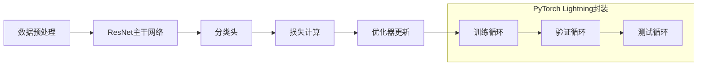
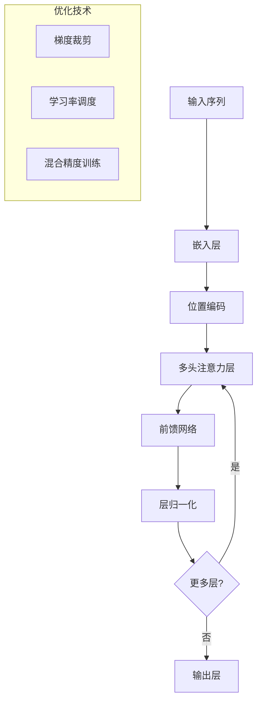

# 技术方案最佳实践库

> **版本**: v1.0  
> **最后更新**: YYYY-MM-DD  
> **维护Agent**: agent-researcher

---

## 技术方案索引

| 方案ID | 应用场景 | 技术栈 | 复杂度 | 成功项目 | 适用条件 |
|--------|----------|--------|--------|----------|----------|
| TS-001 | 图像分类 | ResNet + PyTorch Lightning | 中等 | 项目A, 项目B | 数据量>10K, GPU可用 |
| TS-002 | 序列建模 | Transformer + 自定义优化 | 高 | 项目C | 长序列, 注意力机制需求 |
| TS-003 | 强化学习 | PPO + 环境封装 | 高 | 项目D | 连续控制, 稳定训练需求 |

---

## 技术方案详述

### TS-001: 图像分类解决方案

#### 方案概述
**应用场景**: 中小规模图像分类任务
**核心技术**: ResNet架构 + PyTorch Lightning框架
**适用数据量**: 10K - 1M样本

#### 技术架构


#### 实现要点
**数据处理**:
```python
# 标准数据增强pipeline
transform = transforms.Compose([
    transforms.RandomResizedCrop(224),
    transforms.RandomHorizontalFlip(),
    transforms.ToTensor(),
    transforms.Normalize(mean=[0.485, 0.456, 0.406], 
                       std=[0.229, 0.224, 0.225])
])
```

**模型配置**:
```python
# ResNet配置最佳实践
model = timm.create_model(
    'resnet50',
    pretrained=True,
    num_classes=num_classes,
    drop_rate=0.1  # 防止过拟合
)
```

**训练配置**:
```python
# 优化器和学习率调度
optimizer = torch.optim.AdamW(
    model.parameters(),
    lr=1e-3,
    weight_decay=0.01
)
scheduler = torch.optim.lr_scheduler.CosineAnnealingLR(
    optimizer, T_max=epochs
)
```

#### 性能基准
| 数据集规模 | 训练时间 | 验证准确率 | GPU内存占用 |
|-----------|----------|------------|-------------|
| 10K样本 | 2小时 | 85-90% | 4GB |
| 100K样本 | 8小时 | 90-95% | 6GB |
| 1M样本 | 24小时 | 92-97% | 8GB |

#### 适用条件
- ✅ **数据量充足**: >10K标注样本
- ✅ **计算资源**: 至少4GB GPU内存
- ✅ **质量要求**: 85%以上准确率需求
- ❌ **不适用**: 实时推理(<10ms), 超大规模数据(>10M)

#### 项目应用案例
**项目A - 工业产品缺陷检测**:
- 数据规模: 50K样本, 20个类别
- 最终性能: 92%准确率, F1-score 0.89
- 部署方式: Docker容器 + REST API
- 关键优化: 数据增强 + 类别平衡采样

**项目B - 医疗影像分析**:
- 数据规模: 80K样本, 5个类别
- 最终性能: 94%准确率, AUC 0.96
- 部署方式: 本地推理服务
- 关键优化: 多尺度训练 + TTA推理

#### 常见问题和解决方案
| 问题 | 原因 | 解决方案 |
|------|------|----------|
| 过拟合严重 | 数据不足或模型过复杂 | 增加数据增强, 调整dropout |
| 训练不收敛 | 学习率过大 | 降低学习率或使用warmup |
| GPU内存不足 | batch_size过大 | 减小batch_size或使用梯度累积 |

---

### TS-002: 序列建模解决方案

#### 方案概述
**应用场景**: 长序列建模任务(NLP/时序预测)
**核心技术**: Transformer架构 + 自定义位置编码
**适用序列长度**: 512 - 8192 tokens

#### 技术架构


#### 实现要点
**位置编码优化**:
```python
class RotaryPositionalEmbedding(nn.Module):
    """旋转位置编码,更适合长序列"""
    def __init__(self, dim, max_seq_len=8192):
        super().__init__()
        # 实现细节...
```

**注意力机制优化**:
```python
# 稀疏注意力减少计算复杂度
def sparse_attention(q, k, v, attention_pattern='sliding_window'):
    # 实现滑动窗口注意力
    window_size = 256
    # 计算逻辑...
```

#### 性能基准
| 序列长度 | 训练时间/epoch | PPL/BLEU | GPU内存 |
|----------|----------------|----------|---------|
| 512 tokens | 30分钟 | 15.2/0.28 | 8GB |
| 2048 tokens | 2小时 | 12.8/0.32 | 16GB |
| 8192 tokens | 8小时 | 10.5/0.35 | 32GB |

#### 关键优化技术
1. **梯度累积**: 处理大batch_size需求
2. **混合精度**: 减少内存占用，加速训练
3. **检查点机制**: 长序列训练的内存优化
4. **动态padding**: 减少无效计算

---

## 通用最佳实践

### 项目启动阶段
1. **技术选型决策树**:
   ```
   数据量 < 10K → 考虑预训练模型微调
   数据量 10K-1M → 标准深度学习架构
   数据量 > 1M → 考虑从头训练或大模型
   ```

2. **资源评估**:
   - GPU内存需求 = 模型参数量 × 4 × batch_size × 序列长度
   - 训练时间预估 = 数据量 × epochs ÷ (batch_size × GPU算力)

### 开发阶段
1. **渐进式开发策略**:
   - 先实现最简版本验证可行性
   - 逐步增加复杂度和优化
   - 每个版本都要有性能基准对比

2. **实验管理**:
   - 使用Weights & Biases或类似工具跟踪实验
   - 每次重要修改都要记录超参数和结果
   - 建立模型性能回归测试

### 部署阶段
1. **模型优化**:
   - 量化: FP16/INT8量化减少内存和延迟
   - 剪枝: 移除不重要的连接和层
   - 知识蒸馏: 用小模型学习大模型知识

2. **服务化封装**:
   - 使用TorchServe或TensorRT优化推理
   - 实现健康检查和监控接口
   - 配置自动扩缩容机制

---

## 技术趋势和展望

### 当前热点技术
1. **Transformer变种**: Swin, ConvNeXt, MobileViT
2. **高效训练**: LoRA, Adapters, Parameter-Efficient Fine-tuning
3. **多模态融合**: CLIP, DALL-E类架构

### 技术演进方向
1. **模型压缩**: 更高效的压缩算法和硬件加速
2. **自动化ML**: AutoML和神经架构搜索
3. **可解释性**: 注意力可视化和模型解释工具

---

## 更新日志

| 版本 | 日期 | 更新内容 | 贡献者 |
|------|------|----------|--------|
| v1.0 | 2024-01-01 | 初始版本，包含图像分类和序列建模方案 | agent-researcher |
| v1.1 | 2024-02-01 | 添加强化学习方案和性能优化技巧 | agent-researcher |
| v1.2 | 2024-03-01 | 更新Transformer优化技术和部署方案 | agent-researcher |