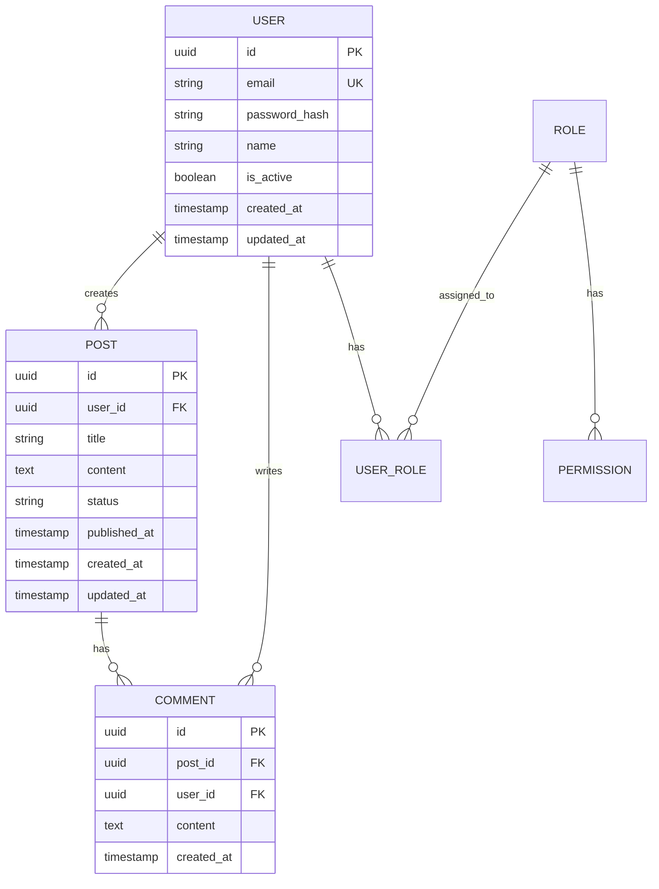

# Database Design Document

## Database Overview
- **Database System**: PostgreSQL 14+
- **Database Name**: [database_name]
- **Character Set**: UTF-8
- **Collation**: en_US.UTF-8
- **Time Zone**: UTC

## Entity Relationship Diagram



## Table Definitions

### users
Primary table for user account information.

| Column | Type | Constraints | Description |
|--------|------|-------------|-------------|
| id | UUID | PRIMARY KEY, DEFAULT uuid_generate_v4() | Unique identifier |
| email | VARCHAR(255) | UNIQUE, NOT NULL | User email address |
| password_hash | VARCHAR(255) | NOT NULL | Bcrypt password hash |
| name | VARCHAR(100) | NOT NULL | Display name |
| phone | VARCHAR(20) | | Phone number |
| is_active | BOOLEAN | DEFAULT true | Account active status |
| is_verified | BOOLEAN | DEFAULT false | Email verification status |
| last_login | TIMESTAMP | | Last login timestamp |
| created_at | TIMESTAMP | DEFAULT CURRENT_TIMESTAMP | Creation timestamp |
| updated_at | TIMESTAMP | DEFAULT CURRENT_TIMESTAMP | Last update timestamp |

**Indexes**:
- `idx_users_email` ON (email)
- `idx_users_created_at` ON (created_at DESC)

### roles
Role definitions for RBAC.

| Column | Type | Constraints | Description |
|--------|------|-------------|-------------|
| id | UUID | PRIMARY KEY | Unique identifier |
| name | VARCHAR(50) | UNIQUE, NOT NULL | Role name |
| description | TEXT | | Role description |
| is_system | BOOLEAN | DEFAULT false | System role flag |
| created_at | TIMESTAMP | DEFAULT CURRENT_TIMESTAMP | Creation timestamp |

### user_roles
Many-to-many relationship between users and roles.

| Column | Type | Constraints | Description |
|--------|------|-------------|-------------|
| user_id | UUID | FOREIGN KEY | Reference to users.id |
| role_id | UUID | FOREIGN KEY | Reference to roles.id |
| assigned_at | TIMESTAMP | DEFAULT CURRENT_TIMESTAMP | Assignment timestamp |
| assigned_by | UUID | FOREIGN KEY | Reference to users.id |

**Constraints**:
- PRIMARY KEY (user_id, role_id)
- FOREIGN KEY (user_id) REFERENCES users(id) ON DELETE CASCADE
- FOREIGN KEY (role_id) REFERENCES roles(id) ON DELETE CASCADE

### sessions
Active user sessions for authentication.

| Column | Type | Constraints | Description |
|--------|------|-------------|-------------|
| id | UUID | PRIMARY KEY | Session identifier |
| user_id | UUID | FOREIGN KEY, NOT NULL | Reference to users.id |
| token_hash | VARCHAR(255) | UNIQUE, NOT NULL | Session token hash |
| ip_address | INET | | Client IP address |
| user_agent | TEXT | | Client user agent |
| expires_at | TIMESTAMP | NOT NULL | Session expiration |
| created_at | TIMESTAMP | DEFAULT CURRENT_TIMESTAMP | Creation timestamp |

**Indexes**:
- `idx_sessions_token_hash` ON (token_hash)
- `idx_sessions_expires_at` ON (expires_at)

### audit_logs
Audit trail for critical operations.

| Column | Type | Constraints | Description |
|--------|------|-------------|-------------|
| id | BIGSERIAL | PRIMARY KEY | Auto-incrementing ID |
| user_id | UUID | FOREIGN KEY | Reference to users.id |
| action | VARCHAR(50) | NOT NULL | Action performed |
| entity_type | VARCHAR(50) | | Entity type affected |
| entity_id | UUID | | Entity ID affected |
| old_values | JSONB | | Previous values |
| new_values | JSONB | | New values |
| ip_address | INET | | Client IP address |
| created_at | TIMESTAMP | DEFAULT CURRENT_TIMESTAMP | Action timestamp |

**Indexes**:
- `idx_audit_logs_user_id` ON (user_id)
- `idx_audit_logs_entity` ON (entity_type, entity_id)
- `idx_audit_logs_created_at` ON (created_at DESC)

## Database Migrations

### Migration Strategy
1. Use Alembic for version control
2. Always include rollback scripts
3. Test migrations on staging first
4. Backup production before migration

### Migration Template
```python
"""Add user profile table

Revision ID: xxxx
Revises: yyyy
Create Date: 2024-01-01

"""
from alembic import op
import sqlalchemy as sa

def upgrade():
    op.create_table(
        'user_profiles',
        sa.Column('id', sa.UUID(), primary_key=True),
        sa.Column('user_id', sa.UUID(), sa.ForeignKey('users.id')),
        sa.Column('bio', sa.Text()),
        sa.Column('avatar_url', sa.String(500)),
        sa.Column('created_at', sa.DateTime(), server_default=sa.func.now())
    )
    op.create_index('idx_user_profiles_user_id', 'user_profiles', ['user_id'])

def downgrade():
    op.drop_index('idx_user_profiles_user_id')
    op.drop_table('user_profiles')
```

## Query Optimization

### Common Query Patterns
```sql
-- Get user with roles
SELECT u.*, array_agg(r.name) as roles
FROM users u
LEFT JOIN user_roles ur ON u.id = ur.user_id
LEFT JOIN roles r ON ur.role_id = r.id
WHERE u.email = $1
GROUP BY u.id;

-- Paginated resource list
SELECT * FROM resources
WHERE user_id = $1
  AND status = 'active'
ORDER BY created_at DESC
LIMIT $2 OFFSET $3;
```

### Performance Guidelines
1. Always use indexes for foreign keys
2. Create composite indexes for common WHERE clauses
3. Use EXPLAIN ANALYZE for query optimization
4. Implement database connection pooling
5. Use prepared statements for repeated queries

## Data Integrity

### Constraints
- Foreign key constraints with appropriate CASCADE rules
- CHECK constraints for enums and ranges
- UNIQUE constraints for business keys
- NOT NULL constraints for required fields

### Triggers
```sql
-- Update timestamp trigger
CREATE OR REPLACE FUNCTION update_updated_at()
RETURNS TRIGGER AS $$
BEGIN
    NEW.updated_at = CURRENT_TIMESTAMP;
    RETURN NEW;
END;
$$ LANGUAGE plpgsql;

CREATE TRIGGER update_users_updated_at
BEFORE UPDATE ON users
FOR EACH ROW
EXECUTE FUNCTION update_updated_at();
```

## Backup and Recovery

### Backup Strategy
- **Full Backup**: Daily at 02:00 UTC
- **Incremental Backup**: Every 6 hours
- **Transaction Log Backup**: Continuous (WAL archiving)
- **Retention**: 30 days for full, 7 days for incremental

### Recovery Procedures
1. Point-in-time recovery using WAL
2. Automated failover to read replica
3. Manual recovery from backup
4. Data consistency verification

## Security Considerations

### Access Control
- Use database roles for different access levels
- Application user with limited permissions
- Admin user for migrations only
- Read-only user for analytics

### Data Protection
- Encrypt sensitive data at rest
- Use SSL for connections
- Implement row-level security where needed
- Regular security audits

### SQL Injection Prevention
- Always use parameterized queries
- Validate input types
- Escape special characters
- Use stored procedures for complex operations

## Monitoring and Maintenance

### Key Metrics
- Connection pool usage
- Query response times
- Table sizes and growth rates
- Index usage statistics
- Lock wait times

### Maintenance Tasks
- Weekly VACUUM ANALYZE
- Monthly index rebuild
- Quarterly partition maintenance
- Annual archive of old data

## Scaling Strategy

### Vertical Scaling
- Current: 8 CPU, 32GB RAM
- Next: 16 CPU, 64GB RAM
- Maximum: 32 CPU, 128GB RAM

### Horizontal Scaling
1. Read replicas for read-heavy workloads
2. Partitioning for large tables
3. Sharding for multi-tenant architecture
4. Caching layer with Redis

## Change Log
| Version | Date | Changes |
|---------|------|---------|
| 1.0.0 | 2024-01-01 | Initial schema |
| 1.1.0 | 2024-02-01 | Added audit logging |
| 1.2.0 | 2024-03-01 | Implemented partitioning |