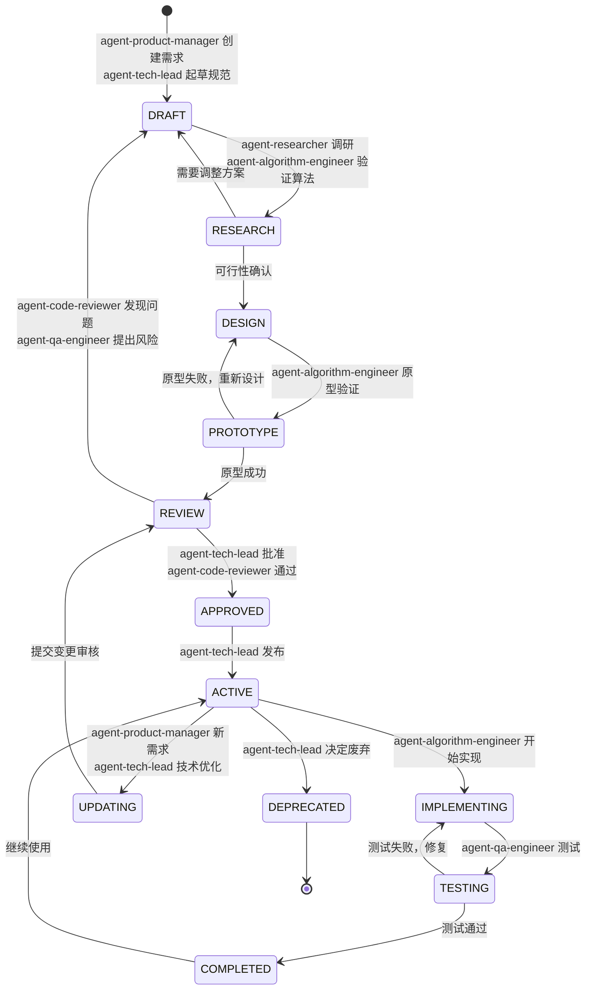

# TECH_SPEC 管理方案

## 版本控制
```bash
project/
├── specs/
│   ├── TECH_SPEC.md           # 当前版本（主文档）
│   ├── versions/               # 历史版本
│   │   ├── v1.0_2024-01-15.md
│   │   ├── v1.1_2024-02-01.md
│   │   └── v2.0_2024-03-01.md
│   ├── components/             # 模块化管理
│   │   ├── _header.md          # 文档头部模板
│   │   ├── architecture.md     # 架构部分
│   │   ├── interfaces.md       # 接口部分
│   │   ├── implementation.md   # 实现部分
│   │   └── performance.md      # 性能部分
│   └── changelog.md            # 变更记录
```

## 版本号管理
```
# TECH_SPEC.md 头部
---
version: 2.1.0
date: 2024-03-15
status: ACTIVE | DRAFT | DEPRECATED
authors: [Alice, Bob]
reviewers: [Charlie, David]
---

# 版本规则
Major.Minor.Patch
- Major: 架构级变更（不兼容）
- Minor: 新增功能/模块
- Patch: 小修改/修复
```

## 3. 状态管理




1. 草稿（DRAFT）
   产品经理提出需求，技术负责人起草技术规范与范围。输出：问题定义、目标、初版 TECH\_SPEC/CONTRACTS。若调研后发现设想不妥，会回到这里重写。

2. 调研与可行性（RESEARCH）
   研究员做方案与竞品调研，算法工程师做快速可行性验证（小实验/PoC）。

* 不可行或需调整：回 DRAFT 改方案。
* 可行：进入设计。

3. 方案设计（DESIGN）
   沉淀系统/数据/模型/评测方案，明确输入输出契约、风控与里程碑。设计作为原型实现的蓝本。进入原型阶段。

4. 原型验证（PROTOTYPE）
   算法工程师做最小可行原型，跑通端到端链路并拿到关键指标。

* 原型失败：回 DESIGN 重构/换方案。
* 原型成功：进入评审。

5. 评审（REVIEW）
   代码评审与质量/风险评审同时进行（Code Reviewer、QA）。

* 发现结构性问题或范围需改：回 DRAFT 重新修订规范。
* 通过：进入批准。

6. 批准（APPROVED）
   技术负责人与代码评审人正式通过，确认范围/方案冻结，可进入实施。

7. 激活（ACTIVE）
   技术负责人发布立项/计划，项目进入活动态，允许投入资源与排期。

8. 实施（IMPLEMENTING）
   算法工程师按设计实现（数据管道、训练/推理、配置、脚本等），形成可测产物。

9. 测试（TESTING）
   QA 进行单测/集成/性能/稳定性/安全等验证。

* 测试失败：回 IMPLEMENTING 修复再测。
* 通过：进入完成。

10. 完成（COMPLETED）
    版本达成验收标准并可用；产物回流到 ACTIVE 状态，进入持续使用与运维阶段。

11. 持续更新（UPDATING）
    当产品经理有新需求或技术负责人提出优化时，从 ACTIVE 切到 UPDATING，提交变更再走一次 REVIEW→（通过后）实施与测试的闭环。

12. 废弃（DEPRECATED）
    当技术负责人决定终止维护/替换方案时，从 ACTIVE 进入废弃，归档与善后，流程结束。


## 变更记录
```
# changelog.md

## [2.1.0] - 2024-03-15

### Added
- Streaming data loading support in Data Module
- Mixed precision training in Training Module

### Changed
- Model interface now returns attention weights
- Batch size increased from 32 to 64

### Deprecated
- Old tokenizer interface (will be removed in 3.0.0)

### Fixed
- Memory leak in data preprocessing

### Impact
- **Breaking**: Model interface change requires client update
- **Migration**: Use `migration/v2.0_to_v2.1.py` script
```