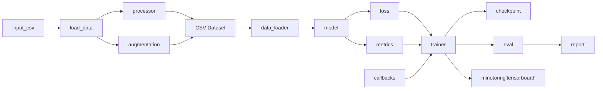

# TECH_SPEC.md

> 版本: v1.0
> 最后更新: YYYY-MM-DD
> 负责人: TL (Tech Lead)
> 审核人: PM, Modeling Engineer, QA, Code Reviewer


## 背景与目标
- **背景**: 简述该技术实现是基于什么需求（参考 `PRD.md`），以及为什么需要这个结构。
- **目标**: 明确项目完成后在技术层面要达到什么效果

## 初步设计
> tech-lead 根据`PRD.md`内容，对项目设计和技术选择做的初步构思和规划。


**设计主旨**
本项目的技术实现以满足 `<PRD 中的核心目标>` 为导向：在不牺牲 `<关键质量属性，如稳定性/可维护性>` 的前提下，优先交付 `<最小可用能力>`，并为后续扩展保留清晰的演进路径。

**使用场景与约束**
预期用户在 `<典型场景>` 下运行本工具，输入 `<主要输入>`，获得 `<主要输出>`。我们假设 `<关键前提，例如网络、权限、依赖可用性>`。在 `<时间/人力/合规>` 的限制下，方案需要保持实现简洁、上手容易。

**方案轮廓**
整体流程遵循“`<步骤1>`→`<步骤2>`→`<步骤3>`→`<步骤4>`”的顺序：

* 先对 `<输入/资源>` 做规范化与基本校验；
* 再以 `<调度/控制方式>` 执行核心动作；
* 期间对 `<关键数据/状态>` 做最小必要的校验与归一；
* 最后以 `<约定格式>` 落盘/返回，并生成简要报告以便排错与复跑。

**核心选择与理由**
我们选用 `<主要技术/库/模式>`，因为其在 `<兼容性/学习成本/生态>` 上更匹配项目目标；暂不采用 `<备选方案>`，原因是 `<维护成本/复杂度/收益比不高>`。该选择可在后续版本无痛替换或并行引入。

**关键权衡**
为换取 `<性能/稳定性/交付速度>`，我们接受 `<复杂度/灵活性/依赖性>` 的适度增加。若触发 `<极端情况>`，系统将优先保证 `<数据一致性/可观测性>`，允许 `<性能/实时性>` 降级。

**接口与数据口径（非详规）**
对外仅暴露少量、稳定的入口（如 `<CLI/函数>`），输入输出遵循“**可读、可追溯、可复跑**”的原则：输入尽量原子化且易于脚本化，输出在结构与命名上保持一致以便下游处理。字段细节与错误码由后续详细设计与测试用例固化。

**质量目标（可被证明）**
系统在 `<标准环境>` 下应达到：`<成功率阈值>`、`<性能目标>`、`<可观测性要求>`。这些指标将通过 `<验收手段，如端到端用例/基准脚本>` 进行验证，并在报告中留存证据。

**边界与不做**
本版本不包含 `<明确不做的能力>`；与 `<相关但非必要的扩展>` 保持接口兼容，但不实现。超出边界的需求将记录为后续里程碑候选。

**主要风险与缓解思路**

* 若出现 `<高概率风险>`，将以 `<降级/重试/隔离>` 处理，并给出明确的用户提示与重跑指引；
* 对 `<中概率风险>`，通过 `<超时/限速/幂等写入>` 降低影响面；
* `<低概率但高影响风险>` 将设置监控与开关，必要时快速回退到安全路径。

**开放问题与下一步**
当前仍需确认 `<1~3 个关键未决点>`（负责人：`<姓名>`，截止：`<日期>`）。在这些问题明确前，实施将围绕“**最小闭环**”推进，并保留可替换的实现缝隙以降低返工成本。

## Source Inventory


###  源头清单（Source Inventory）

| id | 源类型   | 名称/repo           | url/论文 | 许可证        | 版本/commit | 领域/标签     | 相关性(0-5) | 质量(0-5) | 备注      |
| -- | ----- | ----------------- | ------ | ---------- | --------- | --------- | -------: | ------: | ------- |
| S1 | repo  | foo/awesome-model | …      | Apache-2.0 | a1b2c3d   | cv, t2i   |        5 |       4 | 训练脚本可参考 |
| S2 | paper | Bar et al., 2024  | …      | N/A        | v2        | loss, dpo |        4 |       5 | 损失函数原理  |

> 说明：**相关性**评估功能覆盖度；**质量**综合代码健康、测试、维护度。

---

### 组件级映射（Component → Target）

| src.id | src.path / section | 作用简介  | 依赖             | 现状问题    | 目标模块(`TECH_SPEC`) | 重用策略 | 预估工作量 | 风险      |
| ------ | ------------------ | ----- | -------------- | ------- | ----------------- | ---- | ----- | ------- |
| S1     | `train/engine.py`  | 训练循环  | torch, pl      | 混合精度逻辑散 | `trainer.loop`    | 重写   | 2d    | amp/恢复点 |
| S1     | `data/dataset.py`  | 数据集装配 | albumentations | 非确定性增强  | `data.datamodule` | 改造   | 1d    | 复现性     |
| S2     | §3.2 loss          | 自蒸馏损失 | —              | 公式有两版   | `models.loss.kd`  | 概念复用 | 1d    | 收敛性     |


### 机器可读附录（可选，便于自动化）

用 YAML/JSON 存一份同构数据，方便脚本生成任务与工单。

```yaml
sources:
  - id: S1
    type: repo
    name: awesome-model
    url: https://…
    license: Apache-2.0
    commit: a1b2c3d
    tags: [cv, t2i]
    components:
      - path: train/engine.py
        purpose: training loop
        deps: [torch, pytorch-lightning]
        issues: [mixed-precision scattered]
        mapping:
          target: trainer.loop
          reuse: rewrite
          effort_days: 2
          risks: [amp, resume]
      - path: data/dataset.py
        purpose: dataset build
        mapping:
          target: data.datamodule
          reuse: adapt
          effort_days: 1
contracts_diff:
  - capability: train_entry
    src_api: "python train.py --gpu 0"
    tgt_api: "sh train.sh --gpus 0,1 --config cfg.yaml"
    rule: "normalize via shell + yaml"
licenses:
  - source_id: S1
    license: GPL-3.0
    risk: high
    action: "ideas-only"
```

##  API  standards
训练方式，指定 GPU
```bash
sh train.sh 1,2
```

测试方式，指定 GPU 和输入输出
```bash
sh test.sh input_csv output.csv 0
```

进行 unit 测试
```bash
python3 -m pytest
```

其他对外提供的 API等,比如使用模型进行预测
```bash
python -m train <path_to_image>
```


## 3. 模块拆分与职责
参考 [pytorch standards](pytorch_project/standards/pytorch_standards.md) 关于模块的划分的规范。对于具体任务会有相对的改动

## 4. 数据流与调用关系
下面是一个实例


## 4. 模块内部结构设计

### 4.1 数据模块 (`data_loader`)

* **类与方法**

```python
class CustomDataset(torch.utils.data.Dataset):
    def __init__(self, root: str, processor_config: dict, augmentation_config: dict, train=False, debug=False):
        self.processor = instantiated(processor_config)
        self.augmentation = instantiated(augmentation_config)
        self.train = train
        self.debug = debug
        self.load_data()
        ...
    def load_data(self):
        ...
    def get_raw_data(self, idx) -> dict:
        ...
    def __getitem__(self, idx: int) -> Dict[str, Tensor]:
        data = self.get_raw_data(idx)
        data = self.processor.preprocess(data, img_aug=self.augmentation)
        return data

        ...
    def __len__(self) -> int:
        ...
```

* **约束**: 输出必须符合 `CONTRACTS.md` 中的 batch 规范

### 4.2 模型模块 (`model`)

* 模型类签名：

```python
class MyModel(torch.nn.Module):
    def __init__(self, num_classes: int):
        ...
    def forward(self, images: Tensor, labels: Optional[Tensor] = None) -> Dict[str, Tensor]:
        ...
```

---

## 5. 关键技术细节与决策

* 使用的框架/库版本（如 PyTorch 2.3, torchvision 0.16）
* 模型初始化策略（如 kaiming\_normal\_）
* 优化器类型与参数（如 AdamW, lr=1e-4）
* 数据增强策略（如 RandAugment, MixUp）
* 训练策略（如 FP16, DDP, gradient accumulation）


## 6. 边界条件与异常处理

| 场景       | 期望行为             | 处理方式      |
| -------- | ---------------- | --------- |
| 数据缺失     | 样本丢弃             | WARN 日志记录 |
| 标签越界     | 抛出 ValueError    | CRITICAL  |
| GPU 显存不足 | 自动缩小 batch\_size | WARN      |


## 7. 测试与验证计划

* 单元测试模块：`data_loader`, `model`, `loss`, `metrics`
* 集成测试模块：`train_loop`, `eval`
* 回归基线比较：与 `baseline.json` 中的指标比较，容差 ±0.5%


## 审核意见

### 审核记录
| Agent | 日期 | 版本 | 状态 | 主要问题 | 建议 |
|-------|------|------|------|----------|------|
| agent-researcher | YYYY-MM-DD | v1.0 | ✅通过 | Source Inventory需补充性能基准 | 添加模型压缩备选方案 |
| agent-algorithm-engineer | YYYY-MM-DD | v1.0 | ⚠️有条件通过 | 数据流需优化，显存占用需关注 | 添加缓存机制和梯度累积 |
| agent-qa-engineer | YYYY-MM-DD | v1.0 | ⚠️有条件通过 | 缺少大规模数据集成测试 | 补充端到端自动化测试 |

### 关键问题与解决方案
| 问题 | 影响 | 负责人 | 解决方案 | 截止日期 |
|------|------|--------|----------|----------|
| 显存占用可能超限 | Medium | agent-algorithm-engineer | 添加梯度累积策略 | YYYY-MM-DD |
| 缺乏大规模数据测试 | Medium | agent-qa-engineer | 补充集成测试方案 | YYYY-MM-DD |
| 性能基准数据不足 | Low | agent-researcher | 提供基准参考数据 | YYYY-MM-DD |

### 审核决策
**状态**: ⚠️ 有条件通过
**条件**: 解决上述Medium级别问题
**下一步**: 问题解决后进入原型开发阶段


## 版本与变更记录

| 版本   | 日期         | 修改内容            | 修改人 |
| ---- | ---------- | --------------- | --- |
| v1.0 | YYYY-MM-DD | 初版              | XXX |
| v1.1 | YYYY-MM-DD | 更新模型结构，调整数据增强策略 | XXX |

