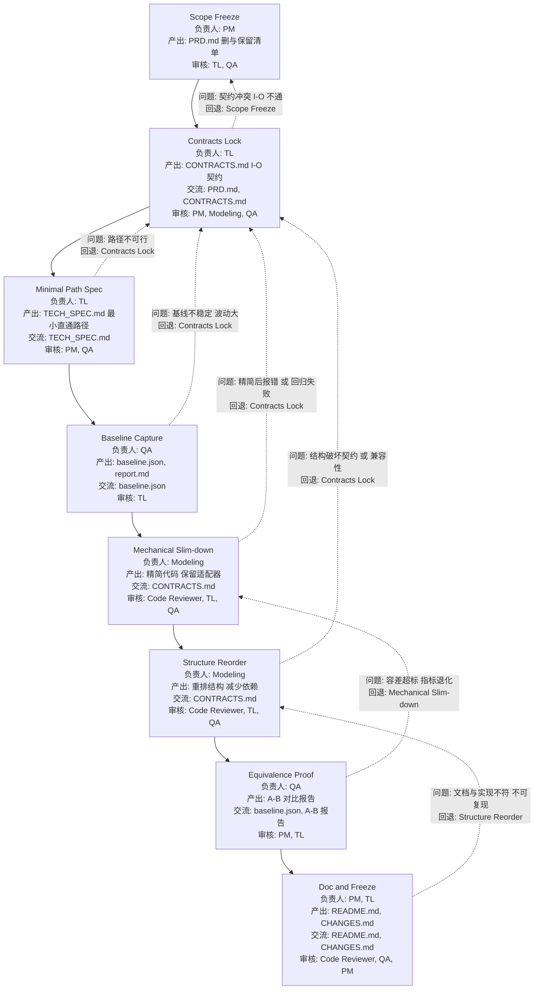

# Agent work flow for the deeplearing coding projects

##  1 Refactor (behavior must not change)

| Stage                 | Agent    | Deliverables                                                         | Gate (Exit Criteria)                    | If fails → Roll back to |
| --------------------- | -------- | -------------------------------------------------------------------- | --------------------------------------- | ----------------------- |
| Scope freeze          | PM       | `PRD.md` (why refactor, non-functional goals), freeze current metric | Stakeholders agree “no behavior change” | —                       |
| Contracts lock        | TL       | `CONTRACTS.md` (I/O shapes, dtypes), **compatibility matrix**        | Old & new interfaces mapped 1:1         | Scope                   |
| Baseline capture      | QA       | `baseline.json`, golden outputs, perf snapshot                       | `eval.py` reproduces baseline on seed   | Contracts               |
| Strangler scaffolding | TL       | New module path + adapters/shims                                     | Old tests still pass via adapters       | Contracts               |
| Mechanical refactor   | Modeling | Code moved, split, renamed; **no logic change**                      | Unit + golden tests green               | Strangler               |
| Equivalence proof     | QA       | **A/B diff report** (old vs new outputs ≤ ε; perf within band)       | CI A/B job green                        | Mechanical              |
| Cutover & cleanup     | TL       | Remove adapters, update docs                                         | All tests green, CI stable              | Equivalence             |

**Refactor DoD**: Golden tests unchanged, A/B within tolerance, perf ±X% band, docs updated.

## 2 Paper-Repro (match a paper; dataset in CSV)

| Stage                | Agent      | Deliverables                                                                  | Gate (Exit Criteria)                            | If fails → Roll back to |
| -------------------- | ---------- | ----------------------------------------------------------------------------- | ----------------------------------------------- | ----------------------- |
| Scope & target       | PM         | `PRD.md` (target numbers, tables to match), timeline                          | Target parity band defined (e.g., ±5%)          | —                       |
| Repro plan           | TL         | `TECH_SPEC.md`, `REPRO_NOTES.md` (preproc, init, LR schedule), `CONTRACTS.md` | All preprocessing & schedules specified         | Scope                   |
| Data pipeline parity | Modeling   | Exact preproc code (tokenize/resize/norm), split strategy                     | Sanity stats match paper (means/len/dist)       | Repro plan              |
| Model parity         | Modeling   | `models/*` per paper (init, layers, norm), loss/scheduler                     | Toy batch ok; overfit 1 mini-batch              | Data pipeline           |
| Training parity run  | Modeling   | `train.py`, configs mirroring paper; checkpoints                              | Curves shape match; metric enters paper’s range | Model parity            |
| Parity verification  | QA         | Seed sweep (n≥3), CI variance band, `report.md`                               | Mean±CI hits target table within band           | Training run            |
| Ablation (optional)  | Specialist | One key ablation reproduced                                                   | Matches paper’s delta trend                     | Training run            |

**Paper-Repro DoD**: Reported metric/table reproduced within band; seeds & variance documented; code+configs recreate results.

## 3 Add New Function (extend capability; backward compatible)

| Stage               | Agent    | Deliverables                                               | Gate (Exit Criteria)                          | If fails → Roll back to |
| ------------------- | -------- | ---------------------------------------------------------- | --------------------------------------------- | ----------------------- |
| Scope & KPI         | PM       | `PRD.md` (user story, KPI uplift), feature flag plan       | KPI defined; non-goals listed                 | —                       |
| Contract delta      | TL       | `CONTRACTS.md` **diff** (new fields/args), versioning note | Back-compat policy agreed (flags, defaults)   | Scope                   |
| API & schema update | TL       | `CONTRACTS.md` updated; migration notes                    | Old configs/scripts still run                 | Contract delta          |
| Feature impl        | Modeling | New modules/functions, guarded by flag                     | Unit tests pass; no regression                | API update              |
| Integration test    | QA       | New + legacy test matrix                                   | Legacy baselines unaffected; new KPI ≥ target | Feature impl            |
| Doc & examples      | PM/TL    | README examples, usage guide                               | New feature discoverable & reproducible       | Integration             |

**Add-Function DoD**: Legacy baselines intact; new KPI achieved; feature off by default (or guarded); docs/examples present.

## 4 Simplify-from-GitHub（在现有仓库上做“瘦身与收敛”）

* 去掉与当前任务无关的框架/抽象/脚手架，只保留**能训练成功**所需最小集合。
* 输出**更短调用链**、**更少依赖**、**更低上手成本**，同时**结果不退化**。

### 阶段 → 角色 → 产出 → 验收门槛（失败回退）

| 阶段         | 负责人      | 产出物                                                  | Gate（通过标准）                  | 失败回退到 |
| ---------- | -------- | ---------------------------------------------------- | --------------------------- | ----- |
| 目标冻结     | PM       | `PRD.md`（任务、指标、截止、允许删减范围）                            | 指标/范围明确；列出**可删清单**与**必须保留** | —     |
|  合同锁定     | TL       | `CONTRACTS.md`（CSV→Tensor、Model I/O、Loss/Metric I/O） | I/O 契约确定，简化后不改变对外接口         | 0/1   |
|  画“保留最小集” | TL       | `TECH_SPEC.md`（最小工作集：数据→模型→训练→评估的直通路径）               | 一条端到端最短路径可被解释               | 2     |
|  先立基线     | QA       | `baseline.json`、`report.md`（从原仓库跑出基线）                | 可复现实验（固定 seed）              | 2/3   |
|  机械化瘦身    | Modeling | 批量删除/折叠：多余入口、重复层、过度封装；保留适配器                          | 单测/基线回归均绿；API 未变            | 4     |
|  结构重排     | Modeling | 将多文件/多层抽象合并为清晰模块；减少依赖                                | 关键脚本 < N 行（自定），启动命令简化       | 5     |
|  等效性证明    | QA       | **A/B 对比报告**（简化前后指标在容差内；性能不劣化）                       | 容差带内（±ε 或 ±X%）；曲线形态一致       | 6     |
|  文档与冻结    | PM/TL    | `README.md`（一步跑通）、`CHANGES.md`（删了啥为何安全）              | 新人 30 分钟可跑 `train_small` 成功 | 7     |

### 简化原则（执行清单）

**删减优先序：**

1. 不被调用的脚本/模块（`ripgrep`/call graph 证明）
2. 只用于已明确“**不做**”范围的功能（多任务/多头、分布式变体、UI）
3. 过度抽象（工厂/注册器/动态反射）→ 固化为**显式构造**
4. 复杂配置系统（多层 YAML/环境变量）→ 一份主 `configs/train.yaml`
5. 依赖金字塔 → 移除重依赖：替换为标准 PyTorch/内置 API

**保留规则：**

* **I/O 契约不变**（由 `CONTRACTS.md` 约束）
* **指标不退化**（`baseline.json` 容差带）
* **单条命令可跑通**（新人可复现）

## 常见风险 & 处理

| 风险      | 触发点          | 缓解                              |
| ------- | ------------ | ------------------------------- |
| 隐式副作用被删 | 注册器/全局钩子     | 用显式构造与依赖注入替换；加单测                |
| 配置耦合    | 多层 YAML 交叉覆盖 | 合并为单一主配置；在 `TECH_SPEC.md` 固定优先级 |
| 性能倒退    | 删了特定加速       | 在 `AUDIT.md` 标注性能关键点；A/B 性能对比门槛 |

## 谁评审谁（角色分工）

| 产出物                  | 作者       | Reviewer         | 关注点           |
| -------------------- | -------- | ---------------- | ------------- |
| PRD                  | PM       | TL, QA           | 可删与必保留是否清晰    |
| AUDIT                | TL       | Modeling, QA     | 删减候选的依据充分     |
| CONTRACTS/TECH\_SPEC | TL       | PM, Modeling, QA | I/O 稳定，直通路径明确 |
| 机械化瘦身 PR             | Modeling | TL, QA           | 行为不变（或在容差内）   |
| A/B 报告               | QA       | PM, TL           | 指标与曲线形态一致     |
| CHANGES/README       | PM/TL    | QA               | 新人可复现，理由可追溯   |

## Check List

任务状态标记：
- ✅ 完成
- 🚧 进行中
- ⏳ 待开始
- ❌ 阻塞/取消

---

### 1. Refactor（行为不变）
| 阶段 | 负责人 | 任务 | 状态 | 备注 |
|------|--------|------|------|------|
| Scope Freeze | PM | 完成 `PRD.md`（目标、非功能需求、范围） | ⏳ | |
| Contracts Lock | TL | 完成 `CONTRACTS.md`（I/O 契约） | ⏳ | |
| Baseline Capture | QA | 跑原始版本，生成 `baseline.json` | ⏳ | |
| Strangler Scaffolding | TL | 创建新模块骨架，保留适配器 | ⏳ | |
| Mechanical Refactor | Modeling | 代码搬运/合并，无逻辑改动 | ⏳ | |
| Equivalence Proof | QA | A/B 测试报告 | ⏳ | |
| Cutover & Cleanup | TL | 删除旧代码，更新文档 | ⏳ | |-

### 2. Paper-Repro（复现论文）
| 阶段 | 负责人 | 任务 | 状态 | 备注 |
|------|--------|------|------|------|
| Scope & Target | PM | 完成 `PRD.md`（目标表格、容差） | ⏳ | |
| Repro Plan | TL | `TECH_SPEC.md` & `REPRO_NOTES.md` | ⏳ | |
| Data Pipeline Parity | Modeling | 实现论文一致的预处理 | ⏳ | |
| Model Parity | Modeling | 按论文结构/初始化实现模型 | ⏳ | |
| Training Parity Run | Modeling | 训练到论文指标范围 | ⏳ | |
| Parity Verification | QA | 多种子评估，输出报告 | ⏳ | |
| Ablation（可选） | Modeling | 复现关键消融实验 | ⏳ | |

### 3. Add-Function（扩展功能）
| 阶段 | 负责人 | 任务 | 状态 | 备注 |
|------|--------|------|------|------|
| Scope & KPI | PM | 完成 `PRD.md`（KPI、新功能范围） | ⏳ | |
| Contract Delta | TL | 更新 `CONTRACTS.md` 差异部分 | ⏳ | |
| API & Schema Update | TL | 接口更新，保留兼容性 | ⏳ | |
| Feature Impl | Modeling | 实现新功能（加 Feature Flag） | ⏳ | |
| Integration Test | QA | 新旧功能回归 + 新 KPI 测试 | ⏳ | |
| Doc & Examples | PM/TL | 更新使用说明和示例 | ⏳ | |

### 4. Simplify-from-GitHub（精简代码）
| 阶段 | 负责人 | 任务 | 状态 | 备注 |
|------|--------|------|------|------|
| Scope Freeze | PM | 完成 `PRD.md`（删/保留清单） | ⏳ | |
| Asset Audit | TL | 完成 `AUDIT.md`（依赖/调用链分析） | ⏳ | |
| Contracts Lock | TL | 完成 `CONTRACTS.md`（I/O 契约） | ⏳ | |
| Minimal Path Spec | TL | 完成 `TECH_SPEC.md`（最小直通路径） | ⏳ | |
| Baseline Capture | QA | 跑原始版本生成 `baseline.json` | ⏳ | |
| Mechanical Slim-down | Modeling | 删除多余模块、简化调用链 | ⏳ | |
| Structure Reorder | Modeling | 重排代码结构，减少文件和依赖 | ⏳ | |
| Equivalence Proof | QA | A/B 对比报告 | ⏳ | |
| Doc & Freeze | PM/TL | 更新 README，完成 `CHANGES.md` | ⏳ | |

### 共用任务
- [ ] ✅ 更新 `README.md`（运行方法）
- [ ] ✅ 确保 `make train_small` 在新环境可跑
- [ ] 🚧 CI 测试全绿
- [ ] ⏳ 所有文档更新到最新版本号

