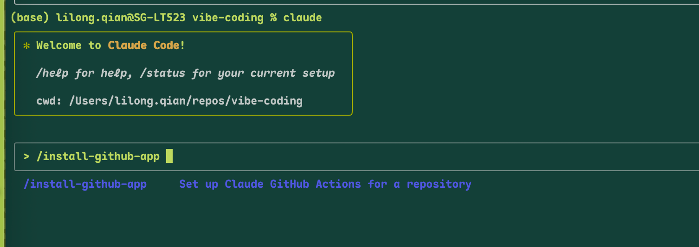
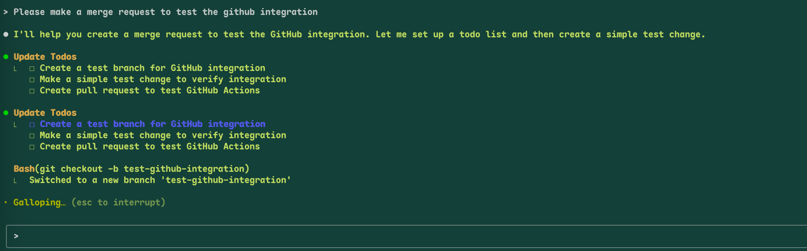
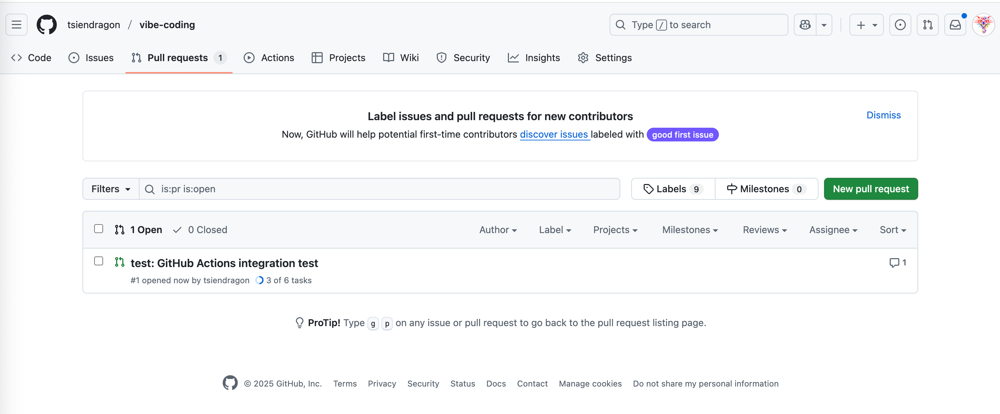
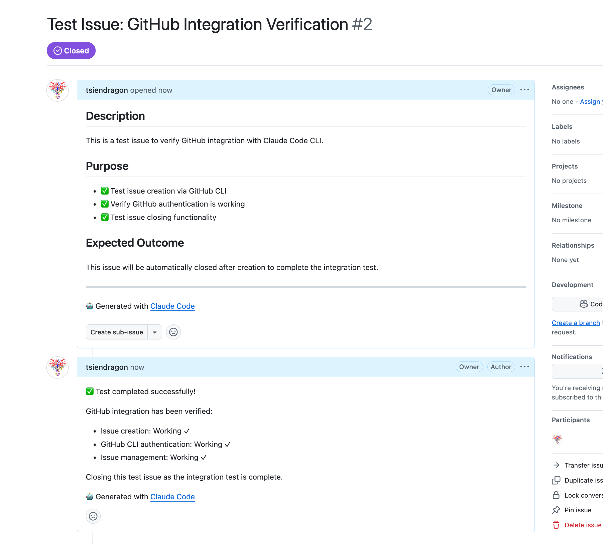

# Claude Code CLI 完整指南

> 从零到精通 Claude Code CLI：记忆管理、子 Agent、权限控制、工作流与实战技巧

---

## 目录

1. [基础概念](#1-基础概念)
2. [记忆系统](#2-记忆系统)
3. [子 Agent](#3-子-agent)
4. [权限与安全](#4-权限与安全)
5. [命令系统](#5-命令系统)
6. [CLI 模式命令](#6-cli-模式命令)
7. [MCP 集成](#7-mcp-集成)
8. [工作流](#8-工作流)
9. [图片与长文本](#9-图片与长文本)
10. [Python 集成](#10-python-集成)
11. [Git 平台集成](#11-git-平台集成)
12. [最佳实践](#12-最佳实践)
13. [Claude Code vs Cursor](#13-claude-code-vs-cursor为什么选择命令行)
14. [GitHub Integration Test](#14-github-integration-test)

---

## 1. 基础概念

Claude Code 是本地运行的智能 Agent，支持交互模式和脚本模式，能操作文件、执行命令、联网搜索。

### 核心特性
- **文件操作**：读写项目文件、执行 git 命令
- **工具集成**：连接外部系统（GitHub、数据库等）
- **双模式**：交互式 REPL + 脚本化执行
- **权限控制**：细粒度安全管理

### Installation

## 2. 记忆系统

### 记忆层级（按优先级）

| 层级 | 位置 | 用途 |
|------|------|------|
| 企业 | `/Library/Application Support/ClaudeCode/CLAUDE.md` | 组织规范 |
| 项目 | `./CLAUDE.md` | 团队共享规范 |
| 用户 | `~/.claude/CLAUDE.md` | 个人全局偏好 |

### 记忆引用与发现

```markdown
# CLAUDE.md 中引用其他文件
@docs/coding-standards.md
@~/.claude/personal-preferences.md

# 支持 5 层递归引用
```

### 记忆管理命令

```bash
/init          # 生成项目 CLAUDE.md
/memory        # 编辑记忆文件
# 规则写入    # 以 # 开头输入规则，自动提示存储位置
```

---

## 3. 子 Agent

### 存储与优先级

| 类型 | 目录 | 作用域 | 优先级 |
|------|------|--------|--------|
| 项目 | `.claude/agents/` | 当前项目 | 高 |
| 用户 | `~/.claude/agents/` | 所有项目 | 低 |

### 子 Agent 文件格式

```markdown
---
name: code-reviewer
description: 代码审查专家，必须在编辑后使用
tools: Read, Grep, Glob, Bash
---

你是资深代码审查专家，专注于代码质量和安全性检查...
```

### 调用方式

- **自动调用**：Claude 根据任务描述自动选择合适的子 Agent
- **显式调用**：`Use the code-reviewer subagent to review this code`
- **链式调用**：先用分析 Agent，再用优化 Agent

### 版本管理

```bash
# 纳入 Git 版本控制
git add .claude/agents/
git commit -m "feat: add code reviewer agent"

# 查看变更历史
git log -p .claude/agents/code-reviewer.md
```

---

## 4. 权限与安全

### 权限模式

| 模式 | 说明 |
|------|------|
| `default` | 首次使用工具时询问 |
| `acceptEdits` | 自动接受文件编辑 |
| `plan` | 只读规划模式 |
| `bypassPermissions` | 跳过所有权限检查 |

### 权限配置示例

```json
{
  "permissions": {
    "allow": [
      "Bash(npm run test:*)",
      "Read(~/.zshrc)"
    ],
    "deny": [
      "Bash(curl:*)",
      "Read(./.env)",
      "Read(./secrets/**)"
    ]
  },
  "defaultMode": "plan"
}
```

### 设置文件优先级
企业策略 > 命令行参数 > `.claude/settings.local.json` > `.claude/settings.json` > `~/.claude/settings.json`

---

## 5. 命令系统

### 内置 Slash 命令

| 命令 | 功能 |
|------|------|
| `/add-dir` | 添加工作目录 |
| `/agents` | 管理 AI 子代理 |
| `/bug` | 向 Anthropic 报告错误 |
| `/clear` | 清空对话历史 |
| `/compact` | 压缩会话保留要点 |
| `/config` | 查看/修改配置 |
| `/cost` | 显示令牌使用情况 |
| `/help` | 获取使用帮助 |
| `/init` | 生成项目 CLAUDE.md |
| `/login` | 切换 Anthropic 账户 |
| `/memory` | 编辑记忆文件 |
| `/model` | 选择 AI 模型 |
| `/permissions` | 管理权限 |
| `/review` | 请求代码审查 |

### Slash 命令语法

**基本格式**：`/command-name [arguments]`

**参数传递**：
- 单个参数：`/deploy production`
- 多个参数：`/migration up head staging`
- 在命令文件中通过 `$ARGUMENTS` 访问所有参数

### 自定义 Slash 命令

#### 存储位置
- **项目命令**：`.claude/commands/` （项目级别，团队共享）
- **个人命令**：`~/.claude/commands/` （用户级别，个人使用）

#### 命令文件格式

```markdown
---
allowed-tools: Bash, Read, Edit
description: 命令描述
---

# 命令内容
使用 $ARGUMENTS 获取传入的参数
使用 !`command` 执行 bash 命令
使用 @file 引用文件
```

#### 基础示例：Git 提交命令

创建 `.claude/commands/commit.md`：
```markdown
---
allowed-tools: Bash(git add:*), Bash(git status:*), Bash(git commit:*)
description: 创建 Git 提交
---

## 上下文
- 状态：!`git status`
- 差异：!`git diff HEAD`
- 分支：!`git branch --show-current`

## 任务
基于上述改动撰写清晰的提交信息并执行提交。
```

使用方式：`/commit`

#### 带参数的命令示例

创建 `.claude/commands/deploy.md`：
```markdown
---
allowed-tools: Bash, Read, Edit
description: 部署到指定环境
---

## 部署到 $ARGUMENTS 环境

### 前置检查
- 环境状态：!`kubectl get pods -n $ARGUMENTS`
- 镜像版本：!`docker images | grep app`
- 配置文件：@configs/$ARGUMENTS.yaml

### 部署流程
1. 构建镜像：!`docker build -t app:$ARGUMENTS .`
2. 推送仓库：!`docker push registry/app:$ARGUMENTS`
3. 更新配置：基于 @configs/$ARGUMENTS.yaml
4. 执行部署：!`kubectl apply -f k8s/$ARGUMENTS/`
5. 健康检查：!`kubectl rollout status deployment/app -n $ARGUMENTS`

请执行到 $ARGUMENTS 环境的完整部署流程。
```

使用方式：
```bash
/deploy staging     # $ARGUMENTS = "staging"
/deploy production  # $ARGUMENTS = "production"
```

#### 复杂参数处理

创建 `.claude/commands/db.md`：
```markdown
---
allowed-tools: Bash, Read, Edit
description: 数据库操作工具
---

## 数据库操作：$ARGUMENTS

### 参数说明
传入格式：`操作类型 [版本] [环境]`

示例用法：
- `/db status dev` - 查看开发环境状态
- `/db migrate head prod` - 升级生产环境到最新
- `/db rollback -1 staging` - 回滚测试环境一个版本

### 执行操作
根据第一个参数执行相应的数据库操作，后续参数作为操作的配置参数。
```

#### 命名空间组织

可以在 `.claude/commands/` 下创建子目录来组织命令：

```bash
.claude/commands/
├── git/
│   ├── commit.md
│   ├── pr.md
│   └── hotfix.md
├── deploy/
│   ├── staging.md
│   ├── production.md
│   └── rollback.md
└── test/
    ├── unit.md
    ├── integration.md
    └── e2e.md
└── command_customized.md
```

使用方式：
```bash
/git:commit
/deploy:staging
/test:unit
/command_customized <arg1> <arg2>
```

### 输出风格

用于切换 Claude 的响应风格（教学、解释、审计等）：
```bash
/output-style          # 切换风格
/output-style:new      # 创建新风格
```

---

## 6. CLI 模式命令

除了交互模式的 Slash 命令，Claude Code 还支持脱离交互式的脚本模式，适用于自动化和 CI/CD 集成。

### 基础语法

```bash
# 基本命令格式
claude -p "任务描述"
claude --prompt "任务描述"

# 示例
claude -p "分析这个项目的结构并生成文档"
claude -p "运行测试并生成报告"
```

### 输出格式控制

```bash
# JSON 格式输出（适用于程序解析）
claude -p "任务" --output-format json

# 纯文本输出（默认）
claude -p "任务" --output-format text

# 结构化数据处理示例
claude -p "分析代码质量" --output-format json | jq '.result.summary'
```

### 权限模式

```bash
# 规划模式（只读，不修改文件）
claude -p "任务" --permission-mode plan

# 自动执行模式（自动接受文件编辑）
claude -p "任务" --permission-mode acceptEdits

# 跳过所有权限检查（危险，谨慎使用）
claude -p "任务" --permission-mode bypassPermissions

# 示例：先规划，再执行
claude -p "重构这个组件" --permission-mode plan
# 确认方案后再执行
claude -p "重构这个组件" --permission-mode acceptEdits
```

### 工具授权

```bash
# 允许特定工具
claude -p "查询天气" --allowedTools "WebSearch"
claude -p "分析文件" --allowedTools "Read,Grep,Write"
claude -p "部署应用" --allowedTools "Bash,Read,Edit"

# 组合使用
claude -p "搬家中文文件" \
  --allowedTools "WebSearch,Read,Write" \
  --permission-mode acceptEdits
```

### 执行控制

```bash
# 限制回合数（防止无限循环）
claude -p "任务" --max-turns 5

# 超时控制（秒）
claude -p "任务" --timeout 60

# 组合示例
claude -p "进行性能测试" \
  --max-turns 3 \
  --timeout 300 \
  --output-format json
```

### 管道输入模式

CLI 模式的最大优势：与其他命令无缝衔接，实现工作流自动化。

```bash
# 文件分析
cat error.log | claude -p "分析错误日志并给出解决方案"

# Git 工作流
git diff | claude -p "生成详细的提交信息"
git log --oneline -10 | claude -p "总结最近的更新"

# 数据处理
ls -la | claude -p "查找大文件并给出清理建议"
ps aux | claude -p "分析进程占用情况"

# 网络参数传递
curl -s https://api.github.com/repos/owner/repo | \
  claude -p "分析这个仓库的健康状况"
```

### 复杂工作流示例

#### CI/CD 集成

```bash
#!/bin/bash
# ci-analysis.sh

# 代码质量检查
RESULT=$(npm run lint 2>&1 | claude -p "分析 lint 结果，给出修复建议" --output-format json)

# 测试结果分析
npm test 2>&1 | \
  claude -p "分析测试结果，生成详细报告" \
  --output-format json \
  --max-turns 2 > test-report.json

# 部署决策
echo "$RESULT" | jq '.result' | \
  claude -p "根据结果决定是否可以部署" \
  --permission-mode plan
```

#### 日志监控

```bash
# 实时日志分析
tail -f /var/log/app.log | \
  claude -p "监控日志，发现异常立即报告" \
  --allowedTools "WebSearch,Bash" \
  --permission-mode acceptEdits

# 批量日志分析
find /var/log -name "*.log" -mtime -1 | \
  xargs cat | \
  claude -p "分析近24小时内的所有错误" \
  --output-format json > daily-errors.json
```

#### 数据备份与分析

```bash
# 数据库分析
mysqldump -u user -p database | \
  claude -p "分析数据库结构，检查潜在问题" \
  --allowedTools "Read,Write" \
  --output-format json

# 文件系统检查
df -h | claude -p "检查磁盘使用情况，给出优化建议"
```

### 环境变量配置

```bash
# 设置默认参数
export CLAUDE_DEFAULT_MODE="plan"
export CLAUDE_DEFAULT_FORMAT="json"
export CLAUDE_DEFAULT_TOOLS="Read,Bash,WebSearch"

# 在脚本中使用
claude -p "任务" # 会自动使用上面的配置
```

### 错误处理与调试

```bash
# 调试模式
claude -p "任务" --debug

# 错误时继续执行
claude -p "任务" --continue-on-error

# 详细日志
claude -p "任务" --verbose

# 组合示例
claude -p "复杂任务" \
  --permission-mode acceptEdits \
  --max-turns 5 \
  --output-format json \
  --debug \
  --continue-on-error
```

### 性能优化

```bash
# 并发执行多个任务
claude -p "任务1" --output-format json > result1.json &
claude -p "任务2" --output-format json > result2.json &
wait

# 合并结果
jq -s '.' result1.json result2.json | \
  claude -p "合并分析结果" --output-format json
```

CLI 模式的核心优势在于**可组合性**和**自动化能力**，它将 Claude 从一个对话工具升级为强大的工作流自动化引擎。

---

## 7. MCP 集成

### MCP 服务器管理

```bash
claude mcp add <server>    # 添加 MCP 服务器
/mcp                       # 查看 MCP 状态和 OAuth
```

### 资源引用

```bash
# 引用 MCP 资源
@github:owner/repo/issues/123
@notion:page-id
@database:table/records
```

### MCP Prompt 命令

MCP 服务器的 Prompt 会自动变成 Slash 命令：
```bash
/mcp__github__create_issue
/mcp__notion__search_pages
```

---

## 8. 工作流

### 规划执行模式

```bash
# 规划模式（只读）
claude --permission-mode plan

# 执行模式
claude --permission-mode acceptEdits

# 交互切换：Shift+Tab
```

### 无头自动化

```bash
# 脚本模式
claude -p "分析代码并生成报告" --output-format json --max-turns 3

# CI/CD 集成
claude -p "运行测试并总结结果" --permission-mode bypassPermissions
```

### Hooks 自动化

**保存 Bash 命令历史**
```json
{
  "hooks": {
    "PreToolUse": [{
      "matcher": "Bash",
      "hooks": [{
        "type": "command",
        "command": "jq -r '\"\\(.tool_input.command)\"' >> ~/.claude/bash-log.txt"
      }]
    }]
  }
}
```

**任务完成通知**
```json
{
  "hooks": {
    "Stop": [{
      "type": "command",
      "command": "afplay /System/Library/Sounds/Glass.aiff"
    }]
  }
}
```


## 9. 图片与长文本

### 图片粘贴

**支持场景**
- UI 调试：截图界面问题，直接粘贴分析
- 架构分析：贴系统架构图，生成代码框架
- 错误诊断：错误截图快速定位问题

**粘贴方式**
- macOS: `Cmd+Shift+4` 截图后 `Cmd+V` 粘贴
- Windows: `Win+Shift+S` 截图后 `Ctrl+V` 粘贴
- Linux: 截图工具后 `Ctrl+V` 粘贴

**处理能力**
- 格式：PNG、JPG、GIF、WebP 等
- OCR：提取图片中的文字
- 视觉分析：布局、颜色、对齐分析

### 长文本处理

**处理策略**

1. **分段粘贴**
```bash
# 大日志分段分析
用户：我有 10MB 日志，分段粘贴
# 第一段：错误前上下文（1000 行）
# 第二段：核心错误（500 行）
# 第三段：错误后影响（500 行）
```

2. **文件引用**
```bash
# 保存文件后引用
@debug.log 分析所有 ERROR 级别问题
```

3. **预处理过滤**
```bash
grep ERROR app.log | head -100 | pbcopy
# 粘贴过滤后的内容
```

---

## 10. Python 集成

### 权限解决方案

```bash
# 方法1：配置文件永久授权
~/.claude/settings.json:
{
  "permissions": {
    "allow": ["WebSearch"]
  }
}

# 方法2：命令行临时授权
claude -p "天气查询" --allowedTools "WebSearch"

# 方法3：跳过所有权限
claude -p "任务" --permission-mode bypassPermissions
```

### Python 包装器使用

```python
from claude_cli_wrapper import simple_claude_prompt, ClaudeCLI

# 简单调用
result = simple_claude_prompt("计算 2+2")

# 完整功能
cli = ClaudeCLI()
result = cli.prompt(
    "分析代码质量",
    output_format="json",
    allow=["WebSearch"],
    max_turns=3
)

# 管道输入
result = cli.pipe_input(
    code_content,
    "审查这段代码",
    output_format="text"
)
```

### JSON 响应结构

```json
{
  "type": "result",
  "subtype": "success",
  "result": "Claude 的回复内容",
  "total_cost_usd": 0.1234,
  "duration_ms": 5678,
  "usage": {
    "input_tokens": 100,
    "output_tokens": 200
  }
}
```


## 11. Git 平台集成

### GitHub 集成
1. 使用 claude code 自带的命令安装

2. Ask the claude code to create a merge request

3. The claude code successfully create a PR


4. Create a Issue

#### 常用 GitHub 操作

**查看和管理 Issues**
```bash
# 列出仓库的 Issues
claude -p "列出 owner/repo 仓库的前 10 个未关闭 Issues"

# 创建新 Issue
claude -p "为 owner/repo 创建 Issue：标题'修复登录bug'，描述包含复现步骤"

# 关闭 Issue
claude -p "关闭 owner/repo 的 Issue #123，添加解决方案说明"
```

**Pull Request 管理**
```bash
# 创建 PR
claude -p "为当前分支创建 PR，标题'feat: 添加用户认证'，自动生成描述"

# 审查 PR
claude -p "审查 owner/repo 的 PR #456，检查代码质量和安全问题"

# 合并 PR
claude -p "合并 PR #456 到 main 分支，使用 squash merge"
```

**仓库分析**
```bash
# 分析代码库
claude -p "分析 owner/repo 的项目结构，生成技术文档"

# 检查最新提交
claude -p "查看 owner/repo 最近 5 次提交的变更摘要"
```

#### 自动化工作流示例

**Issue 驱动开发**
```markdown
# .claude/commands/issue-workflow.md
---
allowed-tools: Bash, Read, Edit
description: 从 Issue 到 PR 的完整工作流
---

## 工作流程
1. 读取 Issue 详情：@github:owner/repo/issues/$ARGUMENTS
2. 创建功能分支：!`git checkout -b feature/issue-$ARGUMENTS`
3. 分析需求并实现代码
4. 运行测试：!`npm test`
5. 提交代码：!`git add . && git commit -m "feat: 解决 #$ARGUMENTS"`
6. 创建 PR 并关联 Issue

请基于 Issue #$ARGUMENTS 完成以上工作流程。
```

**代码审查自动化**
```markdown
# .claude/commands/code-review.md
---
allowed-tools: Bash, Read, Grep
description: 自动化代码审查
---

## 审查 PR #$ARGUMENTS

### 代码质量检查
- 安全漏洞扫描：!`npm audit`
- 代码规范检查：!`npm run lint`
- 测试覆盖率：!`npm run test:coverage`

### 文件变更分析
- PR 差异：@github:owner/repo/pulls/$ARGUMENTS/files
- 影响分析和建议

请提供详细的审查报告和改进建议。
```


### 高级集成场景

#### 自动化发布流程
```markdown
# .claude/commands/release.md
---
allowed-tools: Bash, Read, Edit
description: 自动化发布流程
---

## 发布版本 $ARGUMENTS

### 准备工作
1. 检查所有 PR 是否已合并
2. 更新版本号：!`npm version $ARGUMENTS`
3. 生成 CHANGELOG：!`conventional-changelog -p angular -i CHANGELOG.md -s`

### GitHub 发布
- 创建 Release：@github:owner/repo/releases
- 上传构建产物
- 创建 Tag：!`git tag v$ARGUMENTS`
- 触发 GitHub Actions 部署

请完成版本 $ARGUMENTS 的完整发布流程。
```

#### 智能 PR 描述生成
```bash
# 基于提交历史生成 PR 描述
claude -p "分析最近的提交，生成 PR 描述，包含：功能说明、测试情况、影响范围"

# 自动添加标签和里程碑
claude -p "根据代码变更自动为 PR 添加合适的标签（bug/feature/docs 等）"
```

### 集成最佳实践

#### 权限管理
```json
{
  "permissions": {
    "allow": [
      "Bash(git:*)",
      "Bash(npm:*)",
      "WebFetch(*.github.com)"
    ],
    "deny": [
      "Bash(git push --force:*)"
    ]
  }
}
```

#### 安全考虑
- 使用 Fine-grained tokens 限制权限范围
- Token 存储在环境变量而非代码中
- 定期轮换访问令牌
- 审计 API 调用日志

#### 团队协作配置
```bash
# 团队共享的 Git 操作命令
.claude/commands/
├── create-pr.md          # 标准化 PR 创建
├── code-review.md        # 统一审查流程
├── hotfix.md            # 紧急修复流程
└── release.md           # 发布管理
```

#### 监控和通知
```json
{
  "hooks": {
    "PostToolUse": [{
      "matcher": "WebFetch(*github.com*)",
      "hooks": [{
        "type": "command",
        "command": "echo '$(date): GitHub API 调用' >> ~/.claude/git-api.log"
      }]
    }]
  }
}
```

通过这些集成配置，Claude Code CLI 成为连接代码、Issues、PR 和 CI/CD 的智能中枢，实现真正的 DevOps 自动化。

---

## 12. 最佳实践

### 开发工作流

1. **规划执行分离**：Plan 模式规划 → 执行模式实现
2. **小步快跑**：定期 `/compact` 压缩对话
3. **权责分离**：专门的子 Agent 负责审查、测试、部署
4. **自动化 Hooks**：把规范变成强制执行的脚本

### 团队协作

1. **共享配置**：`.claude/` 目录纳入版本控制
2. **统一规范**：项目 `CLAUDE.md` 记录团队约定
3. **权限管理**：敏感操作设置权限控制
4. **CI 集成**：无头模式用于自动化流程

### 常见误区

❌ **把所有规则塞进 CLAUDE.md** → 会话冗杂，改用 `@` 模块化
❌ **只靠提示语约束** → 不可靠，用权限和 Hooks 硬约束
❌ **无头模式当编排器** → 复杂流程需结合子 Agent 和 Hooks

### 快速配置清单

```bash
# 1. 初始化项目
/init

# 2. 配置权限
/permissions

# 3. 创建子 Agent
/agents

# 4. 自定义命令
# 创建 .claude/commands/commit.md

# 5. 设置 Hooks
# 编辑 settings.json 添加自动化脚本

# 6. CI 集成
claude -p "测试并总结" --output-format json --max-turns 3
```

---

## 命令速查

| 命令 | 功能 |
|------|------|
| `claude` | 启动交互模式 |
| `claude -p "任务"` | 无头执行模式 |
| `claude -p "任务" --output-format json` | JSON 输出 |
| `claude --allowedTools "WebSearch"` | 临时授权工具 |
| `claude --permission-mode plan` | 规划模式 |
| `claude --max-turns 3` | 限制回合数 |
| `cat file \| claude -p "分析"` | 管道输入 |

---

## 13. Claude Code vs Cursor：为什么选择命令行？

### 核心优势对比

| 特性 | Claude Code CLI | Cursor |
|------|-----------------|--------|
| **系统集成** | 深度命令行集成，可组合脚本化 | GUI 界面，VS Code 生态 |
| **自动化程度** | 端到端工作流自动化 | 主要辅助编辑 |
| **大文件处理** | 18000+ 行文件无压力 | 大文件容易出问题 |
| **上下文理解** | 智能映射整个代码库 | 需手动选择文件 |
| **工作流控制** | Plan 模式 + 自定义命令 | 相对固定的工作方式 |

### Claude Code 独有优势

#### 🔥 **终端原生**
```bash
# 实时日志监控
tail -f app.log | claude -p "发现异常立即通知我"

# CI/CD 集成
claude -p "发现新字符串则翻译并创建 PR" --output-format json

# 管道工作流
git diff | claude -p "生成提交信息" | git commit -F -
```

#### 🧠 **代码库全局理解**
- 几秒内映射整个项目结构
- 自动理解依赖关系和模块连接
- 无需手动选择上下文文件

#### 🤖 **真正的自主工作**
```bash
# 完整工作流程自动化
claude -p "读取 GitHub issue #123，实现功能，运行测试，提交 PR"

# 支持的集成
- GitHub/GitLab issues 和 PR
- Jira 工单管理
- Google Drive 文档
- 各种开发工具和 API
```

#### 🛠️ **MCP 协议生态**
- 连接任意数量的外部工具
- 企业级服务集成
- 自定义工具开发

#### 📊 **企业级部署**
```bash
# 支持的部署方式
- 本地 Anthropic API
- AWS Bedrock 托管
- Google Cloud Vertex AI
- 企业私有部署
```

#### ⚙️ **高度可定制**
```markdown
# 自定义工作流 (.claude/commands/debug.md)
---
allowed-tools: Bash, Read, Grep
---
## 调试流程
1. 分析错误日志：@error.log
2. 检查相关代码：!`find . -name "*.py" | head -10`
3. 运行测试：!`npm test`
```

### 适用场景对比

#### 👑 **选择 Claude Code CLI**
- **DevOps 和 SRE**：日志分析、监控告警
- **大型项目**：复杂代码库重构
- **自动化需求**：CI/CD 流水线集成
- **团队协作**：标准化开发流程
- **企业环境**：安全性和可控性要求

#### 💻 **选择 Cursor**
- **日常编码**：快速代码补全
- **学习阶段**：可视化交互体验
- **小型项目**：简单功能开发
- **VS Code 用户**：熟悉的编辑器环境

### 实际案例

#### 场景 1：大文件重构
```bash
# Claude Code：轻松处理 18000 行组件
claude -p "重构这个 React 组件，拆分成多个子组件" @LargeComponent.jsx

# Cursor：处理超大文件时可能遇到性能瓶颈
```

#### 场景 2：系统监控
```bash
# Claude Code：实时智能监控
tail -f /var/log/nginx/error.log | claude -p "发现 5xx 错误立即分析原因并通知"

# Cursor：无法实现此类集成
```

#### 场景 3：工作流自动化
```bash
# Claude Code：端到端自动化
claude -p "检查代码质量 → 运行测试 → 部署到测试环境 → 通知团队"

# Cursor：需要手动执行每个步骤
```

### 总结

Claude Code CLI 不是 Cursor 的简单替代品，而是**更高维度的开发工具**：

- **Cursor** = 智能代码编辑器
- **Claude Code CLI** = 可编程的 AI 开发伙伴

如果你的需求是：
- ✅ 深度系统集成和自动化
- ✅ 处理大型复杂项目
- ✅ 端到端工作流控制
- ✅ 团队协作和标准化

那么 Claude Code CLI 是更好的选择。它不仅能写代码，更能**管理整个开发生命周期**。