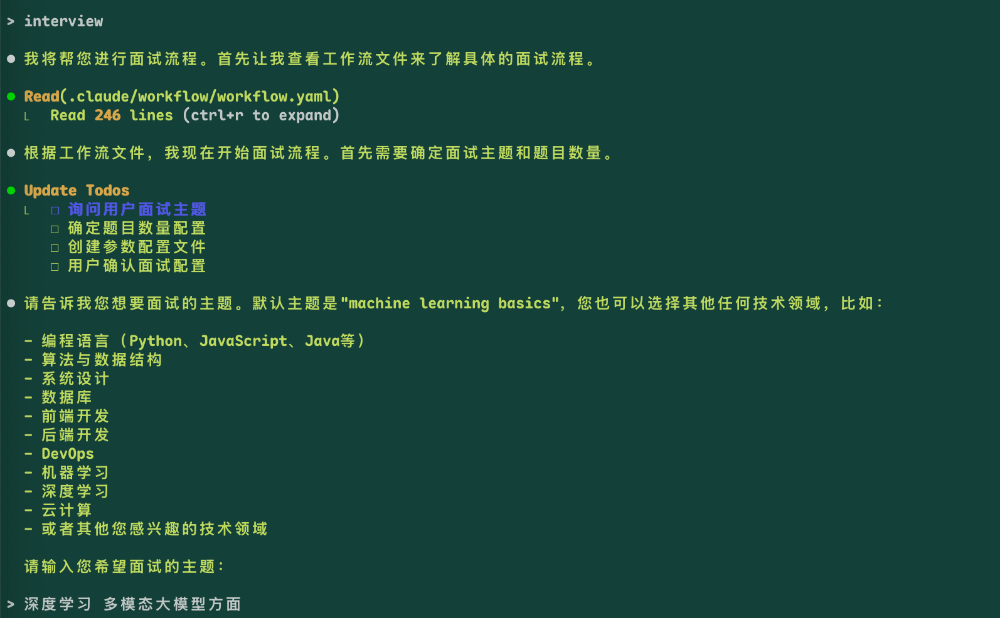
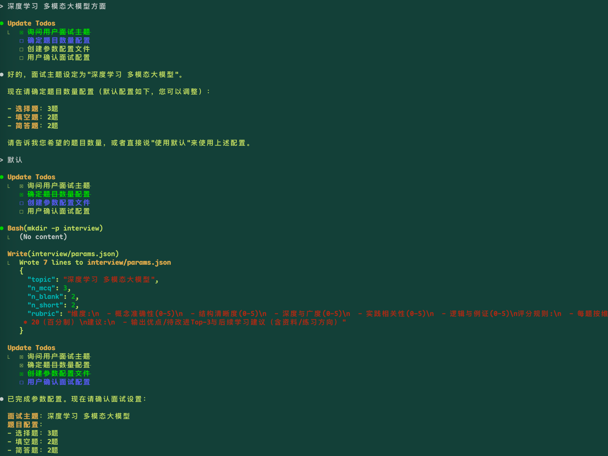
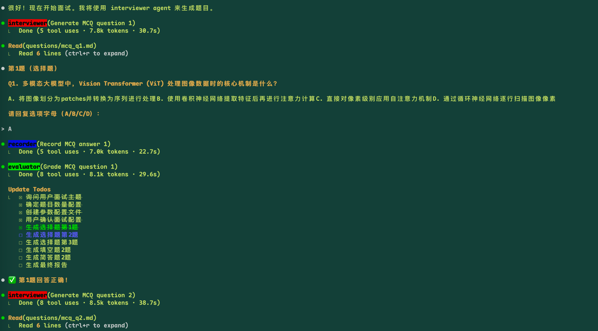
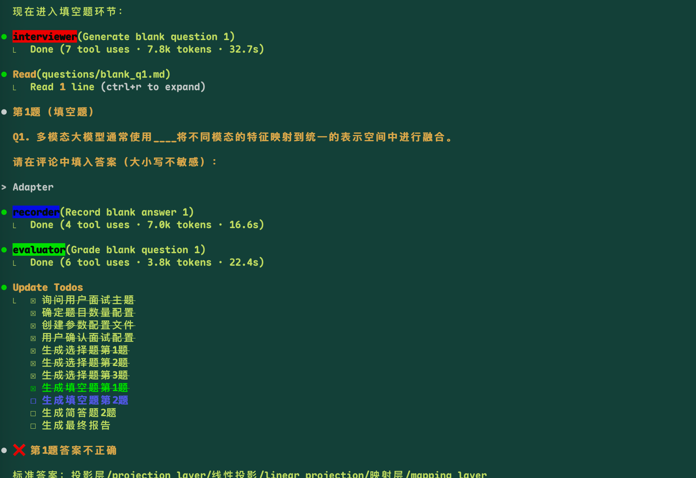
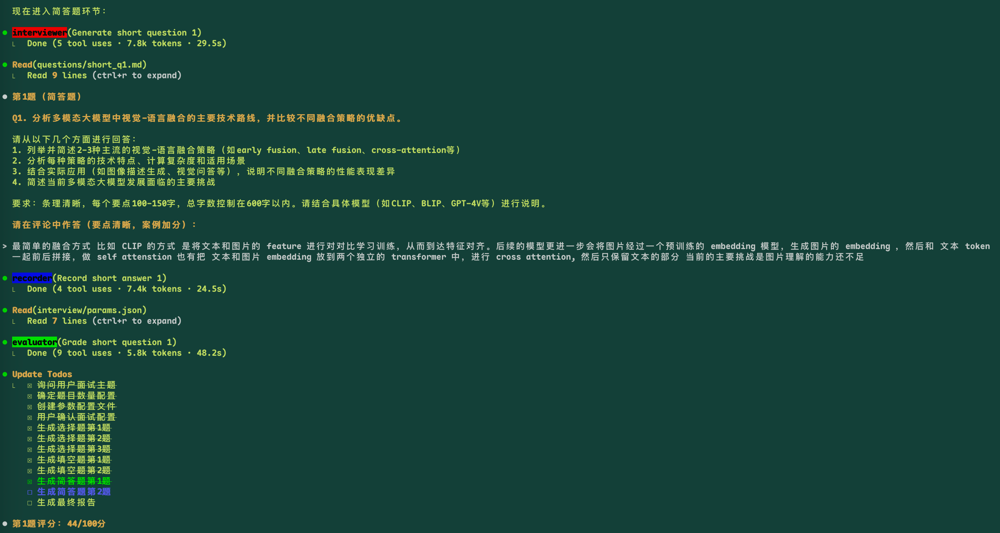
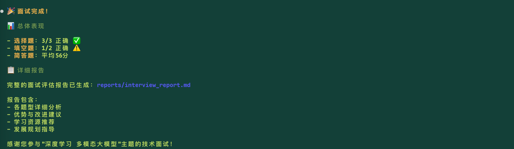

# Claude Code 自动化面试工作流示例

本文档展示如何使用 Claude Code CLI 的自定义工作流功能，实现自动化技术面试流程。该工作流基于 `interview/.claude/workflow/workflow.yaml` 配置，提供完整的面试、评分和总结功能。

## 工作流概述

该面试工作流支持三种题型的混合面试：
- **选择题 (MCQ)**: 测试基础概念理解
- **填空题 (Blank)**: 测试关键术语掌握
- **简答题 (Short)**: 深入评估理论理解和实践能力

## 工作流程演示

### 1. 面试初始化

**功能说明:**
- 系统读取工作流配置文件 (`workflow.yaml`)
- 自动创建任务清单 (Todo List)
- 询问用户面试主题，默认为"机器学习基础"
- 支持多个技术领域：编程语言、算法数据结构、系统设计、数据库、前端开发、后端开发、DevOps、机器学习、深度学习、云计算等

### 2. 参数配置确认

**配置过程:**
- 系统生成参数配置文件 `interview/params.json`
- 用户确认面试设置：
  - 面试主题：深度学习 多模态大模型
  - 选择题：3题
  - 填空题：2题
  - 简答题：2题
- 显示评分规则 (Rubric)：概念准确性、结构清晰度、深度与广度、实践相关性、逻辑与例证

### 3. 选择题阶段

**多Agent协作:**
- **Interviewer Agent**: 生成选择题，保存到 `questions/mcq_q1.md`
- **Recorder Agent**: 记录用户答案到 `answers/mcq_q1.md`
- **Evaluator Agent**: 自动评分，生成 `scores/mcq_q1.json`

**题目示例:**
关于Vision Transformer (ViT)处理图像数据时的核心机制，用户选择正确答案A。

### 4. 填空题阶段

**流程特点:**
- Interviewer Agent生成带空位的填空题（用`____`标记）
- 用户在评论中填入答案（大小写不敏感）
- 系统自动对比标准答案，支持多个可接受答案（用`||`分隔）
- 实时更新Todo状态，显示答题进度

### 5. 简答题阶段

**深度评估:**
- 生成开放性简答题，要求100-150字回答
- 用户提供详细回答，包含理论解释和实践案例
- 基于5个维度评分规则进行综合评估
- 记录详细的答题内容和评分依据

### 6. 面试结果总结

**最终报告包含:**
- **总体表现**: 各题型正确率统计
  - 选择题：3/3 正确 ✅
  - 填空题：1/2 正确 ⚠️
  - 简答题：平均56分
- **详细评估报告**: 保存至 `reports/interview_report.md`
- **改进建议**: 优势与待改进Top-3
- **学习资源推荐**: 后续学习方向和练习建议
- **发展规划指导**: 针对性的技能提升建议

## 技术实现特点

### Multi-Agent架构
- **主Agent**: 流程协调和用户交互
- **InterviewerAgent**: 专业出题，确保题目质量和难度适中
- **RecorderAgent**: 准确记录用户回答，格式化存储
- **EvaluatorAgent**: 智能评分，提供详细反馈和改进建议

### 智能评分系统
- **选择题**: 即时判定，二进制评分
- **填空题**: 模糊匹配，支持多种正确答案
- **简答题**: 多维度评分，包含概念准确性、逻辑清晰度等5个维度

### 工作流自动化
- **状态管理**: 实时更新Todo List，展示面试进度
- **文件组织**: 自动生成和管理问题、答案、评分文件
- **标准化流程**: 严格按照 `workflow.yaml` 配置执行
- **质量保证**: 内置标准检查，确保每个环节完成质量

## 使用价值

1. **高效面试**: 自动化流程减少人工干预，提高面试效率
2. **标准化评估**: 统一的评分标准，确保面试公平性
3. **详细反馈**: 全面的评估报告，帮助面试者了解自身水平
4. **可定制化**: 支持不同技术领域和难度配置
5. **追踪记录**: 完整的面试过程记录，便于后续回顾和分析

这套工作流充分展示了Claude Code CLI在复杂业务流程自动化方面的强大能力，通过多Agent协作和智能评估，为技术面试提供了完整的解决方案。