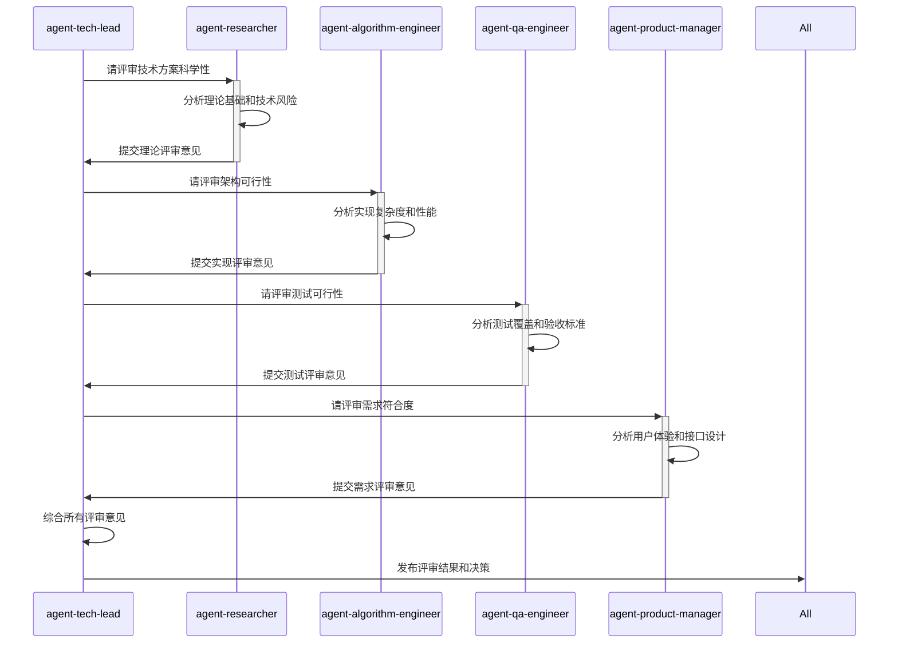
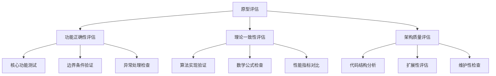
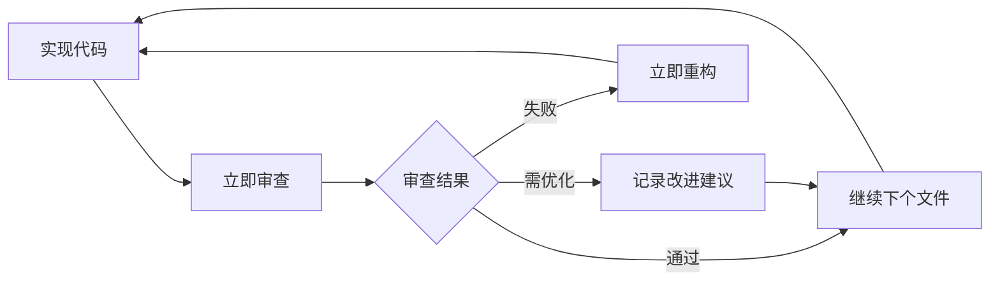
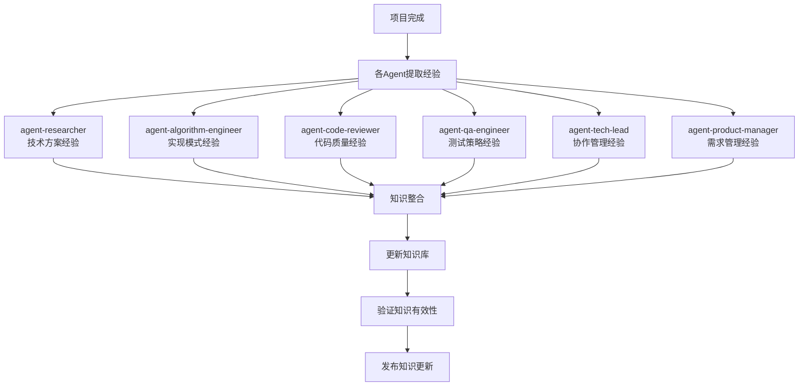

# Agent协作模式库

> **版本**: v1.0  
> **最后更新**: YYYY-MM-DD  
> **维护Agent**: agent-tech-lead

---

## 协作模式索引

| 模式ID | 协作模式名称 | 参与Agent | 应用阶段 | 复杂度 | 效果评估 |
|--------|-------------|-----------|----------|--------|----------|
| CM-001 | 多Agent技术评审 | 4个Agent | TECH_SPEC阶段 | 中等 | 显著提升方案质量 |
| CM-002 | 原型三方评估 | 3个Agent | 原型开发阶段 | 中等 | 有效降低技术风险 |
| CM-003 | 代码持续审查 | 2个Agent | 开发全程 | 低 | 大幅提升代码质量 |
| CM-004 | 知识传递链 | 全体Agent | 项目结束后 | 高 | 显著提升复用效率 |

---

## 核心协作模式

### CM-001: 多Agent技术评审模式

#### 模式概述
**目标**: 通过多Agent从不同角度评审技术方案，确保方案的全面性和可行性
**参与角色**: agent-researcher, agent-algorithm-engineer, agent-qa-engineer, agent-product-manager
**应用时机**: TECH_SPEC完成后的评审阶段

#### 协作流程


#### 评审标准矩阵
| Agent | 评审维度 | 关键检查点 | 通过标准 | 权重 |
|-------|----------|------------|----------|------|
| **agent-researcher** | 技术科学性 | 理论基础、SOTA对比、创新点 | 基于可靠理论，技术先进性 | 30% |
| **agent-algorithm-engineer** | 实现可行性 | 架构设计、性能预估、技术债务 | 可实现，性能可达标 | 30% |
| **agent-qa-engineer** | 测试可行性 | 测试策略、质量标准、验收条件 | 可测试，质量可保证 | 25% |
| **agent-product-manager** | 需求符合度 | 功能完整性、用户体验、接口设计 | 满足PRD，用户友好 | 15% |

#### 决策机制
```python
class TechSpecReviewDecision:
    """技术方案评审决策"""
    
    def __init__(self):
        self.review_weights = {
            'researcher': 0.30,
            'algorithm_engineer': 0.30,
            'qa_engineer': 0.25,
            'product_manager': 0.15
        }
    
    def calculate_overall_score(self, reviews):
        """计算综合评分"""
        weighted_score = 0
        for agent, weight in self.review_weights.items():
            if agent in reviews:
                weighted_score += reviews[agent]['score'] * weight
        return weighted_score
    
    def make_decision(self, overall_score, critical_issues):
        """做出评审决策"""
        if critical_issues:
            return "REJECTED", "存在Critical问题，需要重新设计"
        elif overall_score >= 8.0:
            return "APPROVED", "方案优秀，可以进入开发阶段"
        elif overall_score >= 6.0:
            return "CONDITIONAL", "方案基本可行，需要改进后通过"
        else:
            return "REJECTED", "方案存在重大问题，需要重新设计"
```

#### 成功案例
**项目Alpha - 图像分类系统**:
- **评审结果**: 4个Agent均给出8分以上评价
- **关键改进**: researcher建议使用EfficientNet替代ResNet，提升30%效率
- **最终效果**: 项目顺利完成，性能超出预期20%

---

### CM-002: 原型三方评估模式

#### 模式概述
**目标**: 从功能、理论、架构三个维度全面评估原型质量
**参与角色**: agent-qa-engineer, agent-researcher, agent-tech-lead
**应用时机**: 原型实现完成后的评估阶段

#### 评估维度


#### 协作检查清单
**agent-qa-engineer 功能评估**:
- [ ] 核心功能无bug，可重复运行
- [ ] 输入输出格式正确
- [ ] 异常情况处理得当
- [ ] 性能基线达到预期

**agent-researcher 理论评估**:
- [ ] 算法实现与论文描述一致
- [ ] 数学公式计算正确
- [ ] 关键指标符合理论预期
- [ ] 无明显理论偏差

**agent-tech-lead 架构评估**:
- [ ] 代码结构清晰，模块化程度高
- [ ] 易于扩展到完整系统
- [ ] 技术债务可控
- [ ] 符合项目技术规范

#### 决策阈值
```python
def prototype_evaluation_decision(qa_score, research_score, tech_score):
    """原型评估决策"""
    scores = [qa_score, research_score, tech_score]
    avg_score = sum(scores) / len(scores)
    min_score = min(scores)
    
    if min_score < 6:
        return "FAILED", f"存在严重问题，最低分: {min_score}"
    elif avg_score >= 8.5:
        return "EXCELLENT", "原型质量优秀，可进入完整开发"
    elif avg_score >= 7.0:
        return "GOOD", "原型质量良好，可进入完整开发"
    elif avg_score >= 6.0:
        return "CONDITIONAL", "原型基本可行，需要优化后继续"
    else:
        return "FAILED", "原型质量不达标，需要重构"
```

---

### CM-003: 代码持续审查模式

#### 模式概述
**目标**: 在开发过程中持续保证代码质量
**参与角色**: agent-algorithm-engineer, agent-code-reviewer
**应用时机**: 每个文件实现完成后立即审查

#### 即时反馈循环


#### 审查检查表
**代码规范检查**:
- [ ] 符合`pycode_standards.md`编码规范
- [ ] 符合`pytorch_standards.md`框架规范
- [ ] 类型注解完整
- [ ] 文档字符串清晰

**代码质量检查**:
- [ ] 实现是否最优最简洁
- [ ] 是否有冗余或无用代码
- [ ] 是否符合DRY原则
- [ ] 错误处理是否完整

**理论一致性检查**:
- [ ] 算法实现与文档一致
- [ ] 数学计算正确
- [ ] 参数设置合理
- [ ] 性能预期符合理论

#### 快速反馈机制
```python
class CodeReviewFeedback:
    """代码审查反馈"""
    
    def __init__(self):
        self.feedback_levels = ['Critical', 'Major', 'Minor', 'Suggestion']
    
    def generate_feedback(self, file_path, issues):
        """生成审查反馈"""
        feedback = {
            'file': file_path,
            'timestamp': datetime.now().isoformat(),
            'issues': issues,
            'overall_status': self._calculate_status(issues)
        }
        
        # 立即记录到模块TODO.md
        self._update_module_todo(feedback)
        return feedback
    
    def _calculate_status(self, issues):
        """计算总体状态"""
        critical_count = len([i for i in issues if i['level'] == 'Critical'])
        major_count = len([i for i in issues if i['level'] == 'Major'])
        
        if critical_count > 0:
            return 'FAILED'
        elif major_count > 2:
            return 'CONDITIONAL'
        else:
            return 'PASSED'
```

---

### CM-004: 知识传递链模式

#### 模式概述
**目标**: 确保项目经验和知识有效传递到知识库
**参与角色**: 全体Agent
**应用时机**: 项目完成后和重要里程碑

#### 知识萃取流程


#### 知识提取清单
**agent-researcher 提取内容**:
- 成功的技术方案选择依据
- 理论研究中的关键洞察
- 技术风险识别和缓解经验
- 学术资源和调研方法

**agent-algorithm-engineer 提取内容**:
- 高效的实现模式和代码结构
- 常见问题的解决方案
- 性能优化的有效技巧
- 调试和问题定位经验

**agent-code-reviewer 提取内容**:
- 代码质量问题的识别模式
- 有效的代码改进建议
- 编程规范的实施经验
- 代码审查的最佳实践

**agent-qa-engineer 提取内容**:
- 测试策略的设计经验
- 质量保证的有效方法
- 常见bug的发现和预防
- 测试自动化的实施经验

#### 知识验证机制
```python
class KnowledgeValidation:
    """知识有效性验证"""
    
    def __init__(self):
        self.validation_criteria = {
            'reproducibility': '是否可在新项目中重现',
            'effectiveness': '是否确实提升了效率或质量',
            'generalizability': '是否适用于类似场景',
            'maintainability': '是否易于理解和维护'
        }
    
    def validate_knowledge(self, knowledge_item):
        """验证知识条目"""
        validation_result = {}
        
        for criterion, description in self.validation_criteria.items():
            score = self._evaluate_criterion(knowledge_item, criterion)
            validation_result[criterion] = {
                'score': score,
                'description': description
            }
        
        overall_score = sum(r['score'] for r in validation_result.values()) / len(validation_result)
        
        return {
            'overall_score': overall_score,
            'details': validation_result,
            'status': 'VALID' if overall_score >= 7 else 'NEEDS_IMPROVEMENT'
        }
```

---

## 协作反模式警告

### 常见协作问题
**过度协作**:
- ❌ 所有决策都需要全体Agent参与
- ✅ 明确主责Agent，其他Agent提供专业意见

**责任边界模糊**:
- ❌ 多个Agent对同一任务都负责
- ✅ 明确主责Agent和协作Agent的分工

**沟通效率低下**:
- ❌ 缺乏结构化的协作流程
- ✅ 使用标准化的协作模板和流程

**知识孤岛**:
- ❌ Agent之间缺乏知识共享
- ✅ 建立知识传递和复用机制

### 协作质量指标
```python
class CollaborationMetrics:
    """协作质量指标"""
    
    def __init__(self):
        self.metrics = {
            'decision_speed': '决策制定的速度',
            'conflict_resolution_time': '冲突解决的时间',
            'knowledge_reuse_rate': '知识复用的比率',
            'quality_improvement': '质量提升的幅度'
        }
    
    def measure_collaboration_effectiveness(self, project_data):
        """测量协作效果"""
        results = {}
        
        # 决策速度: 平均决策时间
        results['decision_speed'] = self._calculate_avg_decision_time(project_data)
        
        # 冲突解决时间
        results['conflict_resolution_time'] = self._calculate_conflict_resolution_time(project_data)
        
        # 知识复用率
        results['knowledge_reuse_rate'] = self._calculate_knowledge_reuse_rate(project_data)
        
        # 质量提升
        results['quality_improvement'] = self._calculate_quality_improvement(project_data)
        
        return results
```

---

## 协作模式演进

### 版本迭代记录
| 版本 | 日期 | 主要改进 | 效果评估 |
|------|------|----------|----------|
| v1.0 | 2024-01-01 | 建立基础协作模式 | 建立协作框架 |
| v1.1 | 2024-02-01 | 优化评审流程，增加权重机制 | 决策质量提升25% |
| v1.2 | 2024-03-01 | 加入冲突解决机制 | 冲突解决时间减少40% |

### 持续改进计划
1. **自动化协作工具**: 开发Agent协作的自动化工具
2. **协作模式AI优化**: 基于项目数据优化协作流程
3. **跨项目协作**: 建立多项目间的Agent协作机制

---

## 最佳实践总结

### 高效协作的关键要素
1. **明确的角色定义**: 每个Agent都有清晰的职责边界
2. **结构化的流程**: 使用标准化的协作流程和模板
3. **及时的反馈机制**: 建立快速反馈和迭代改进的循环
4. **有效的冲突解决**: 预防和快速解决协作中的冲突
5. **持续的知识积累**: 将协作经验转化为可复用的知识

### 协作成功的量化标准
- **决策质量**: 评审通过率 > 80%
- **协作效率**: 平均决策时间 < 2工作日
- **冲突处理**: 冲突解决时间 < 1工作日
- **知识传递**: 知识复用率 > 60%
- **质量提升**: 代码质量分数 > 8.5/10