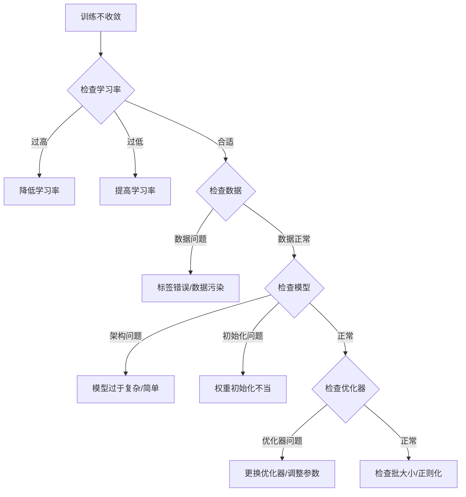
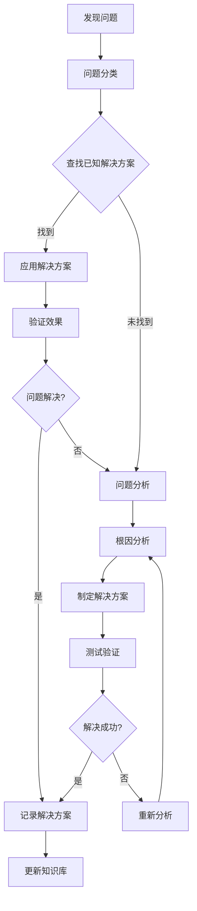

# 常见问题解决方案库

> **版本**: v1.0  
> **最后更新**: YYYY-MM-DD  
> **维护Agent**: 全体Agent协作

---

## 问题分类索引

| 问题ID | 问题类型 | 严重程度 | 频次 | 影响阶段 | 解决复杂度 |
|--------|----------|----------|------|----------|------------|
| EC-001 | 模型训练不收敛 | Critical | 高 | 训练阶段 | 中等 |
| EC-002 | GPU内存溢出 | Critical | 高 | 训练/推理 | 低 |
| EC-003 | 梯度爆炸/消失 | High | 中 | 训练阶段 | 中等 |
| EC-004 | 数据加载缓慢 | Major | 中 | 全阶段 | 低 |
| EC-005 | 过拟合严重 | Major | 高 | 训练阶段 | 中等 |
| EC-006 | 分布式训练失败 | High | 低 | 训练阶段 | 高 |

---

## Critical级别问题

### EC-001: 模型训练不收敛

#### 问题描述
**现象**: 训练损失不下降或震荡剧烈，验证指标无明显改善
**典型表现**:
- 损失曲线平坦或不规律
- 验证准确率停留在随机水平
- 学习率过高导致loss跳跃
- 梯度为NaN或无穷大

#### 根因分析


#### 解决方案

**1. 学习率调优**
```python
# 问题代码
optimizer = torch.optim.Adam(model.parameters(), lr=1e-1)  # 学习率过高

# 解决方案
# 方案A: 降低初始学习率
optimizer = torch.optim.Adam(model.parameters(), lr=1e-4)

# 方案B: 使用学习率调度
scheduler = torch.optim.lr_scheduler.ReduceLROnPlateau(
    optimizer, mode='min', factor=0.5, patience=5
)

# 方案C: 使用warmup
def get_warmup_scheduler(optimizer, warmup_epochs, total_epochs):
    def lr_lambda(epoch):
        if epoch < warmup_epochs:
            return epoch / warmup_epochs
        return (total_epochs - epoch) / (total_epochs - warmup_epochs)
    return torch.optim.lr_scheduler.LambdaLR(optimizer, lr_lambda)
```

**2. 数据问题诊断**
```python
def diagnose_data_issues(dataloader):
    """诊断数据问题"""
    # 检查标签分布
    label_counts = {}
    total_samples = 0
    
    for batch_idx, (data, labels) in enumerate(dataloader):
        for label in labels:
            label_item = label.item()
            label_counts[label_item] = label_counts.get(label_item, 0) + 1
        total_samples += len(labels)
        
        # 检查NaN值
        if torch.isnan(data).any():
            print(f"发现NaN值在batch {batch_idx}")
        
        # 检查数值范围
        print(f"Batch {batch_idx}: min={data.min():.3f}, max={data.max():.3f}")
        
        if batch_idx >= 10:  # 只检查前10个batch
            break
    
    # 打印标签分布
    print("标签分布:")
    for label, count in sorted(label_counts.items()):
        print(f"  类别 {label}: {count} ({count/total_samples*100:.1f}%)")
```

**3. 模型架构检查**
```python
def check_model_architecture(model, input_shape):
    """检查模型架构合理性"""
    # 计算参数量
    total_params = sum(p.numel() for p in model.parameters())
    trainable_params = sum(p.numel() for p in model.parameters() if p.requires_grad)
    
    print(f"总参数量: {total_params:,}")
    print(f"可训练参数量: {trainable_params:,}")
    
    # 检查梯度流
    dummy_input = torch.randn(1, *input_shape)
    output = model(dummy_input)
    loss = output.mean()
    loss.backward()
    
    # 检查梯度
    gradient_norms = []
    for name, param in model.named_parameters():
        if param.grad is not None:
            grad_norm = param.grad.norm().item()
            gradient_norms.append(grad_norm)
            if grad_norm == 0:
                print(f"警告: {name} 梯度为0")
            elif grad_norm > 10:
                print(f"警告: {name} 梯度过大: {grad_norm}")
    
    print(f"平均梯度范数: {sum(gradient_norms)/len(gradient_norms):.6f}")
```

#### 成功案例
**项目X - 图像分类收敛问题**:
- **问题**: ResNet-50训练100个epoch损失不下降
- **根因**: 学习率设置为1e-2过高，batch normalization层初始化问题
- **解决**: 降低学习率到1e-4，重新初始化BN层，添加warmup
- **结果**: 10个epoch内达到85%验证准确率

---

### EC-002: GPU内存溢出

#### 问题描述
**现象**: CUDA out of memory错误，训练中断
**典型错误信息**:
```
RuntimeError: CUDA out of memory. Tried to allocate 2.00 GiB (GPU 0; 11.00 GiB total capacity)
```

#### 快速解决方案

**1. 立即缓解措施**
```python
# 释放未使用的内存
torch.cuda.empty_cache()

# 减小batch size
# 原始: batch_size = 64
batch_size = 32  # 或者16, 8

# 使用梯度累积模拟大batch
effective_batch_size = 64
actual_batch_size = 16
accumulation_steps = effective_batch_size // actual_batch_size

for i, batch in enumerate(dataloader):
    outputs = model(batch)
    loss = criterion(outputs, targets) / accumulation_steps
    loss.backward()
    
    if (i + 1) % accumulation_steps == 0:
        optimizer.step()
        optimizer.zero_grad()
```

**2. 根本解决方案**
```python
class MemoryEfficientModel(nn.Module):
    """内存高效的模型实现"""
    
    def __init__(self, base_model):
        super().__init__()
        self.base_model = base_model
        
    def forward(self, x):
        # 使用gradient checkpointing
        from torch.utils.checkpoint import checkpoint_sequential
        
        # 将模型分段，使用checkpointing
        return checkpoint_sequential(self.base_model, 4, x)

# 使用混合精度训练
scaler = torch.cuda.amp.GradScaler()

for batch in dataloader:
    optimizer.zero_grad()
    
    with torch.cuda.amp.autocast():
        outputs = model(batch)
        loss = criterion(outputs, targets)
    
    scaler.scale(loss).backward()
    scaler.step(optimizer)
    scaler.update()
```

**3. 内存监控工具**
```python
def monitor_gpu_memory(func):
    """GPU内存监控装饰器"""
    def wrapper(*args, **kwargs):
        if torch.cuda.is_available():
            torch.cuda.reset_peak_memory_stats()
            start_memory = torch.cuda.memory_allocated()
            
        result = func(*args, **kwargs)
        
        if torch.cuda.is_available():
            end_memory = torch.cuda.memory_allocated()
            peak_memory = torch.cuda.max_memory_allocated()
            
            print(f"内存使用: {(end_memory - start_memory) / 1024**2:.1f} MB")
            print(f"峰值内存: {peak_memory / 1024**2:.1f} MB")
            
        return result
    return wrapper

@monitor_gpu_memory
def train_one_epoch(model, dataloader, optimizer):
    # 训练代码
    pass
```

---

## High级别问题

### EC-003: 梯度爆炸/消失

#### 问题识别
```python
def detect_gradient_issues(model, threshold_exploding=10.0, threshold_vanishing=1e-6):
    """检测梯度爆炸/消失问题"""
    grad_norms = []
    
    for name, param in model.named_parameters():
        if param.grad is not None:
            grad_norm = param.grad.norm().item()
            grad_norms.append(grad_norm)
            
            # 梯度爆炸检测
            if grad_norm > threshold_exploding:
                print(f"⚠️ 梯度爆炸: {name}, norm={grad_norm:.3f}")
                
            # 梯度消失检测
            if grad_norm < threshold_vanishing:
                print(f"⚠️ 梯度消失: {name}, norm={grad_norm:.6f}")
    
    avg_grad_norm = sum(grad_norms) / len(grad_norms) if grad_norms else 0
    return avg_grad_norm, grad_norms
```

#### 解决方案
```python
# 1. 梯度裁剪
torch.nn.utils.clip_grad_norm_(model.parameters(), max_norm=1.0)

# 2. 改进初始化
def improved_initialization(model):
    """改进的权重初始化"""
    for module in model.modules():
        if isinstance(module, nn.Linear):
            nn.init.kaiming_normal_(module.weight, mode='fan_out', nonlinearity='relu')
            if module.bias is not None:
                nn.init.constant_(module.bias, 0)
        elif isinstance(module, nn.Conv2d):
            nn.init.kaiming_normal_(module.weight, mode='fan_out', nonlinearity='relu')

# 3. 残差连接
class ResidualBlock(nn.Module):
    def __init__(self, dim):
        super().__init__()
        self.linear1 = nn.Linear(dim, dim)
        self.linear2 = nn.Linear(dim, dim)
        
    def forward(self, x):
        residual = x
        out = F.relu(self.linear1(x))
        out = self.linear2(out)
        return out + residual  # 残差连接防止梯度消失
```

---

### EC-006: 分布式训练失败

#### 常见错误模式
```python
# ❌ 常见错误1: 环境变量未设置
# 解决方案: 确保环境变量设置
import os
os.environ['MASTER_ADDR'] = 'localhost'
os.environ['MASTER_PORT'] = '12355'
os.environ['WORLD_SIZE'] = '2'
os.environ['RANK'] = '0'

# ❌ 常见错误2: 模型未正确包装
model = MyModel()
# 错误: 直接使用model训练

# 正确: 包装为DDP
from torch.nn.parallel import DistributedDataParallel as DDP
model = model.to(device)
model = DDP(model, device_ids=[local_rank])

# ❌ 常见错误3: 数据采样器未设置
# 解决方案: 使用DistributedSampler
from torch.utils.data.distributed import DistributedSampler
sampler = DistributedSampler(dataset, num_replicas=world_size, rank=rank)
dataloader = DataLoader(dataset, sampler=sampler, batch_size=batch_size)
```

#### 调试工具
```python
def debug_distributed_setup():
    """调试分布式设置"""
    if torch.distributed.is_available():
        print(f"分布式可用: {torch.distributed.is_available()}")
        if torch.distributed.is_initialized():
            print(f"World size: {torch.distributed.get_world_size()}")
            print(f"Rank: {torch.distributed.get_rank()}")
            print(f"Local rank: {os.environ.get('LOCAL_RANK', 'Not set')}")
        else:
            print("分布式未初始化")
    else:
        print("分布式不可用")
```

---

## Major级别问题

### EC-004: 数据加载缓慢

#### 性能优化
```python
# 优化数据加载性能
class OptimizedDataset(torch.utils.data.Dataset):
    def __init__(self, data_path, transform=None):
        self.data_path = data_path
        self.transform = transform
        # 预加载文件路径而非数据本身
        self.file_list = self._load_file_list()
        
    def __getitem__(self, idx):
        # 懒加载数据
        data = self._load_data(self.file_list[idx])
        if self.transform:
            data = self.transform(data)
        return data
    
    def __len__(self):
        return len(self.file_list)

# 高效数据加载器设置
dataloader = torch.utils.data.DataLoader(
    dataset,
    batch_size=32,
    num_workers=8,  # 增加worker数量
    pin_memory=True,  # 使用pinned memory
    prefetch_factor=4,  # 预取更多批次
    persistent_workers=True  # 保持worker进程
)
```

### EC-005: 过拟合严重

#### 正则化策略
```python
class RegularizedModel(nn.Module):
    def __init__(self, input_dim, hidden_dim, output_dim, dropout_rate=0.5):
        super().__init__()
        self.layers = nn.Sequential(
            nn.Linear(input_dim, hidden_dim),
            nn.ReLU(),
            nn.Dropout(dropout_rate),  # Dropout正则化
            nn.Linear(hidden_dim, hidden_dim),
            nn.ReLU(),
            nn.Dropout(dropout_rate),
            nn.Linear(hidden_dim, output_dim)
        )
    
    def forward(self, x):
        return self.layers(x)

# L2正则化
optimizer = torch.optim.Adam(model.parameters(), lr=1e-3, weight_decay=1e-4)

# 早停策略
class EarlyStopping:
    def __init__(self, patience=10, min_delta=0.001):
        self.patience = patience
        self.min_delta = min_delta
        self.best_score = None
        self.counter = 0
        
    def __call__(self, val_score):
        if self.best_score is None:
            self.best_score = val_score
        elif val_score < self.best_score + self.min_delta:
            self.counter += 1
            if self.counter >= self.patience:
                return True
        else:
            self.best_score = val_score
            self.counter = 0
        return False
```

---

## 预防策略

### 开发阶段预防
```python
# 1. 小数据集快速验证
def quick_validation(model, sample_data, num_epochs=5):
    """用小数据集快速验证模型可行性"""
    # 只用100个样本训练几个epoch
    small_dataset = torch.utils.data.Subset(sample_data, range(100))
    small_dataloader = torch.utils.data.DataLoader(small_dataset, batch_size=16)
    
    for epoch in range(num_epochs):
        for batch in small_dataloader:
            # 执行训练步骤
            pass
    print("快速验证通过")

# 2. 单元测试关键组件
def test_model_forward():
    """测试模型前向传播"""
    model = MyModel()
    dummy_input = torch.randn(4, 3, 224, 224)
    
    try:
        output = model(dummy_input)
        assert output.shape == (4, 10), f"输出形状错误: {output.shape}"
        assert not torch.isnan(output).any(), "输出包含NaN"
        print("模型前向传播测试通过")
    except Exception as e:
        print(f"模型测试失败: {e}")

# 3. 资源预估
def estimate_memory_usage(model, input_shape, batch_size):
    """估算内存使用量"""
    model.eval()
    dummy_input = torch.randn(batch_size, *input_shape)
    
    # 前向传播内存使用
    with torch.no_grad():
        _ = model(dummy_input)
    
    # 估算训练时内存(大约是推理的3-4倍)
    inference_memory = torch.cuda.memory_allocated() / 1024**2  # MB
    training_memory = inference_memory * 4
    
    print(f"推理内存: {inference_memory:.1f} MB")
    print(f"估算训练内存: {training_memory:.1f} MB")
    
    return training_memory
```

---

## 问题解决流程

### 标准调试流程


### 问题上报机制
```python
class IssueReporter:
    """问题上报工具"""
    
    @staticmethod
    def report_critical_issue(error_msg, context, suggested_solution=None):
        """上报Critical级别问题"""
        issue = {
            'timestamp': datetime.now().isoformat(),
            'level': 'Critical',
            'error': error_msg,
            'context': context,
            'suggested_solution': suggested_solution,
            'agent': 'current_agent_name'
        }
        
        # 记录到TODO.md
        with open('docs/TODO.md', 'a') as f:
            f.write(f"\n## Critical Issue - {issue['timestamp']}\n")
            f.write(f"**Error**: {issue['error']}\n")
            f.write(f"**Context**: {issue['context']}\n")
            if issue['suggested_solution']:
                f.write(f"**Suggested Solution**: {issue['suggested_solution']}\n")
```

---

## 更新日志

| 版本 | 日期 | 新增问题 | 更新解决方案 | 贡献Agent |
|------|------|----------|--------------|-----------|
| v1.0 | 2024-01-01 | EC-001至EC-006 | 初始解决方案 | 全体Agent |
| v1.1 | 2024-02-01 | EC-007至EC-010 | 优化内存解决方案 | agent-algorithm-engineer |
| v1.2 | 2024-03-01 | EC-011至EC-015 | 添加分布式训练方案 | agent-qa-engineer |