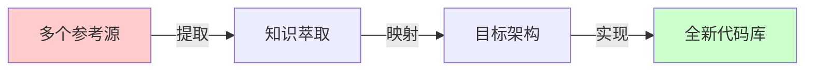

# 重写型工作流设计
这个工作流 是根据现有的 repos 或者 paper，提取我们我们需要的信息，然后根据我们需要设计的数据结构，代码结构，重新写出代码更加清晰易懂，容易上手的项目. 需要设计不同的 agent 赋予他们的角色定位和特产，以及一个项目不同阶段不同的 agent 之间怎么合作。

## Agent 列表

| Agent | 核心职责 | 主要产出 | 关键技能 |
|-------|----------|----------|----------|
| **agent-product-manager** | 需求分析、PRD编写、功能优先级规划 | PRD.md、需求变更文档、产品路线图 | 业务理解、用户体验设计、需求管理 |
| **agent-tech-lead** | 技术方案设计、架构决策、技术评审 | TECH_SPEC.md | 系统架构、技术选型、团队领导 |
| **agent-researcher** | 论文调研、技术可行性分析、SOTA方法研究 | 技术调研报告、可行性分析、论文解读 | 学术研究、技术趋势分析、实验设计 |
| **agent-algorithm-engineer** | 算法实现、模型设计、核心逻辑开发 | 模型代码、训练脚本、算法文档 | 深度学习、PyTorch、算法优化 |
| **agent-data-engineer** | 数据处理、数据集构建、数据管道设计 | 数据处理代码、数据集、ETL脚本 | 数据工程、数据清洗、数据可视化 |
| **agent-code-reviewer** | 代码质量审核、最佳实践检查 | Code Review报告、改进建议 | 代码审查、编程规范、质量标准 |
| **agent-qa-engineer** | 测试用例编写、质量保证、性能测试 | 测试代码、测试报告、质量评估 | 软件测试、自动化测试、性能分析 |
| **agent-docs-writer** | 技术文档、API文档、使用手册 | 项目文档、API说明、教程 | 技术写作、文档管理、知识整理 |

### Agent工作流程映射

| 工作流阶段 | 主责Agent | 协作Agent | 交付物 |
|------------|-----------|-----------|--------|
| **需求分析** | agent-product-manager | agent-tech-lead | PRD.md |
| **技术设计** | agent-tech-lead | agent-researcher, agent-algorithm-engineer | TECH_SPEC.md, CONTRACTS.md |
| **可行性验证** | agent-researcher | agent-algorithm-engineer | 调研报告、PoC代码 |
| **原型开发** | agent-algorithm-engineer | agent-data-engineer | 原型代码、实验结果 |
| **代码实现** | agent-algorithm-engineer | agent-training-engineer, agent-data-engineer | 完整代码库 |
| **质量保证** | agent-qa-engineer | agent-code-reviewer | 测试报告、代码审查 |
| **文档完善** | agent-docs-writer | 所有相关Agent | 完整项目文档 |

## 核心理念转变

## Phase 1: 需求分析与知识提取

| 阶段 | 负责人 | 任务 | 产出物 | 审核标准 | 文档模板|
|------|--------|------|---------|----------|---|
| **需求映射** | agent-product-manager | 分析目标功能需求 | `PRD.md` | 功能点明确、优先级清晰 |`PRD/prd_template.md`|

| **架构设计** | agent-tech-lead/agent-researcher | 目标系统设计 | `TECH_SPEC.md` | 接口定义、模块划分 | `TECH_SPEC/TECH_SPEC_template.md`|
|**调研**| agent-researcher | 研究现有技术方案，paper，总结技术趋势分析, 未来发展预测,理论知识,推荐技术方案,潜在改进点| `/docs/research/recommendations.md`,`/docs/research/literature_review.md` | |

### Phase 2: 模块化重写

| 阶段 | 负责人 | 任务 | 产出物 | 审核标准 |
|------|--------|------|---------|----------|
| **数据模块** | algo | 数据加载/预处理 | `data/` | 单测通过、格式正确 |
| **模型模块** | algo | 模型架构实现 | `models/` | 前向传播正确 |
| **训练模块** | algo | 训练循环实现 | `training/` | 损失下降、梯度正常 |
| **评估模块** | algo | 指标计算 | `evaluation/` | 指标匹配论文 |

### Phase 3: 集成与验证

| 阶段 | 负责人 | 任务 | 产出物 | 审核标准 |
|------|--------|------|---------|----------|
| **端到端测试** | QA | 完整流程验证 | `test_results/` | 可训练、可收敛 |
| **性能基准** | QA | 对比原始实现 | `benchmark.md` | 达到预期指标 |
| **鲁棒性测试** | QA | 边界情况测试 | `robustness_report.md` | 无关键bug |

## 每个阶段具体workflow

### PRD 起草到确定阶段
-  agent-product-manager 根据一句话需求，拆分细节需求 输出文档 [pytorch_project/documentation/TECH_SPEC/TECH_SPEC_template.md](pytorch_project/documentation/TECH_SPEC/TECH_SPEC_template.md)
- 这个过程中需要和需求方(human)反复讨论需求是否可行。对于需求不明白的地方，一定要询问需求方，直到弄清楚为止
- 最终通过则进入 TECH_SPEC 阶段

### TECH_SPEC 起草到确定阶段

1. 草稿（DRAFT）
   agent-product-manager提出需求，agent-tech-lead 负责人起草初版 `TECH_SPEC.md`。若调研后发现设想不妥，agent-product-manager会重`PRD.md`

2. 调研与可行性（RESEARCH）
   agent-researcher 对资源进行搜索，通过深度调研和分析，确保项目：
   1. 技术方案科学: 基于最新研究和最佳实践
   2. 风险可控: 提前识别和规避技术风险
   3. 效率最优: 避免不必要的技术探索和试错成本
   4. 持续改进: 为项目提供持续的技术优化方向
   生成`/docs/research/feasibility_analysis.md` 和 `/docs/research/recommendations.md` 为agent-tech-lead提供技术方案选择的理论支撑
   agent-researcher 对资源进行分析理解，生成 `/docs/research/literature_review.md`, 理解每个算法，代码实现的原理，提取公式，构建流程图，完善理论理解。
   完善`TECH_SPEC.md`中的 ·`Source Inventory` 章节
。

3. 方案设计（DESIGN）
   agent-tech-lead 根据 agent-researcher 的调研结果`/docs/research/feasibility_analysis.md` 和 `/docs/research/recommendations.md`,`TECH_SPEC.md`，沉淀系统/数据/模型/评测方案，明确输入输出契约、风控与里程碑。设计作为原型实现的蓝本。进入原型阶段。

4. 评审（REVIEW）
   agent-research/agent-algorithm-engineer/agent-qa-engineer/agent-product-manager 根据 `TECH_SPEC.md` 进行审核。补充`TECH_SPEC.md` 中的 `审核意见章节`
   如果不通过，退回到第三步方案设计阶段
   不同的 agent 审核内容会不一样，如下表

   | Agent | 主要审核章节 | 关键审核点 | 审核标准 |
   |-------|-------------|------------|----------|
   | **agent-researcher** | Source Inventory, 技术选择 | 技术方案科学性、理论基础 | 基于SOTA方法，风险可控 |
   | **agent-algorithm-engineer** | 模块设计, 数据流, 实现细节 | 架构可行性、性能可达成 | 符合PyTorch最佳实践 |
   | **agent-qa-engineer** | 测试计划, 异常处理, 质量目标 | 可测试性、验收标准 | 测试覆盖完整，指标可量化 |
   | **agent-product-manager** | 背景目标, 边界约束, API标准 | 需求对应、用户体验 | 满足PRD要求，接口易用 |

5. 批准（APPROVED）
   如果agent-research/agent-algorithm-engineer/agent-qa-engineer/agent-product-manager 都通过了审核，则进入下一阶段，进入开发阶段。

### 规划阶段
agent-tech-lead 生成 `docs/TODO.md` 文档，列出需要各个 agent 完成的任务
参考这个模板 `pytorch_project/documentation/TODO_template.md`
### PROTOTYPE 原型开发

**前置条件**: TECH_SPEC审核通过，所有agent已批准技术方案

1. **agent-tech-lead** 根据已批准的 `TECH_SPEC.md` 和 `docs/research/literature_review.md`，与 agent-algorithm-engineer 协作制定原型开发计划：
   - ✅ **原型规划通过**: 核心算法范围明确、验证目标清晰、成功标准可量化 → 生成 `PROTOTYPE.md` 文档，更新 `docs/TODO.md` 原型开发任务清单，进入步骤2
   - ⚠️ **规划需调整**: 验证目标模糊或成功标准不够具体 → 在 `docs/TODO.md` 中记录调整事项，完善后进入步骤2
   - ❌ **规划严重不足**: 核心算法不明确或技术风险过高 → 返回TECH_SPEC设计阶段重新分析技术方案

2. **agent-algorithm-engineer** 根据 `PROTOTYPE.md` 的规划要求，实现最小可行的核心算法模型：
   - ✅ **核心实现成功**: 算法逻辑正确，前向传播无误，基本功能完整 → 更新 `docs/TODO.md` 实现状态为"完成"，生成核心算法代码，进入步骤3
   - ⚠️ **实现基本完成**: 核心功能正确但存在性能或稳定性问题 → 记录问题到 `docs/TODO.md`，可进入步骤3但需后续优化
   - ❌ **实现失败**: 算法逻辑错误、无法运行或严重偏离设计 → 在 `docs/TODO.md` 中创建Critical级实现问题，agent-researcher 协助分析理论偏差，返回步骤1重新规划

3. **agent-algorithm-engineer** 根据核心算法代码和 `PROTOTYPE.md` 中的验证计划，设计并执行小规模验证实验：
   - ✅ **验证实验通过**: 算法收敛正常，关键指标达到 `PROTOTYPE.md` 预期范围80%以上 → 生成实验结果和性能数据报告，进入步骤4
   - ⚠️ **实验部分达标**: 指标达到预期60-80%，收敛但性能有待优化 → 记录性能gap到实验报告，可进入步骤4
   - ❌ **验证实验失败**: 算法不收敛、指标严重不达标(<60%)或实验无法运行 → 在 `docs/TODO.md` 中创建Critical级验证问题，需要修复核心算法(返回步骤2)

4. **agent-tech-lead** 根据实验结果报告，组织 agent-qa-engineer 和 agent-researcher 进行原型评估：
   - **agent-qa-engineer** 评估功能正确性和稳定性：核心功能无bug，可重复运行，异常处理正确
   - **agent-researcher** 评估算法理论正确性：指标符合理论预期，数学公式实现正确，无明显理论偏差  
   - **agent-tech-lead** 评估架构质量和扩展性：代码结构清晰，模块化程度高，易于后续开发
   - ✅ **三方评估通过**: 所有评估都达标 → 生成 `docs/prototype_review.md` 正面评估报告，进入步骤5
   - ⚠️ **评估基本通过**: 2/3评估通过，1个评估有条件通过 → 记录改进建议，可进入步骤5
   - ❌ **评估失败**: 任一评估完全失败 → 在 `docs/TODO.md` 中创建对应问题，返回相应步骤修复

5. **agent-tech-lead** 根据所有评估结果和 `docs/prototype_review.md`，做原型阶段决策：

   **✅ 原型开发成功** - 需满足以下条件：
   - 核心算法实现：✅完成 或 ⚠️基本完成
   - 验证实验：✅通过 或 ⚠️部分达标  
   - 功能评估：✅通过 或 ⚠️基本通过
   - 理论评估：✅通过 或 ⚠️基本通过
   - 架构评估：✅通过 或 ⚠️基本通过
   
   → **进入完整代码实现阶段**，生成原型成功报告

   **❌ 原型开发失败** - 出现以下情况：
   - 任一环节完全失败 (❌状态)
   - Critical问题未解决
   - 验证实验指标<60%预期
   - 核心算法存在严重理论错误
   
   → **返回对应阶段修复**：
   - 算法问题 → 返回步骤2重新实现
   - 验证问题 → 返回步骤3重新设计实验
   - 理论问题 → 返回步骤1，可能需要重回TECH_SPEC阶段
   
   **🔄 有条件继续** - 大部分 ⚠️ 状态：
   - 可以进入完整实现阶段，但需制定技术债务清理计划
   - 在 `docs/TODO.md` 中记录所有待优化项
   - 在完整实现阶段中优先解决原型遗留问题
### 完整代码实现阶段
agent-algorithm-engineer 按照代码开发工作流进行开发

### 测试和 debug 阶段

**前置条件**: 完整代码实现阶段完成，所有模块代码实现完毕

1. **agent-qa-engineer** 根据 `TECH_SPEC.md` 和完整代码，进行端到端集成测试，验证各模块协作和数据流完整性。
   - ✅ **集成测试通过**: 完整流程可运行，模型能正常训练收敛 → 更新 `docs/TODO.md` 状态为"集成测试通过"，进入步骤2
   - ❌ **集成测试失败**: 模块间协作异常、数据流错误、训练无法启动 → 在 `docs/TODO.md` 中创建Critical级别问题清单，跳转到步骤4让 agent-algorithm-engineer 紧急修复

2. **agent-qa-engineer** 根据 `docs/research/literature_review.md` 中的性能基准和 `PRD.md` 的性能要求，对比测试训练速度、内存占用、推理延迟。
   - ✅ **性能达标**: 指标达到PRD要求的80%以上 → 生成 `tests/benchmark.md` 性能对比报告，进入步骤3
   - ⚠️ **性能部分达标**: 指标在60-80%范围 → 生成 `tests/benchmark.md` 报告，在 `docs/TODO.md` 中标记性能优化任务，进入步骤3
   - ❌ **性能严重不达标**: 指标低于60% → 生成问题报告，在 `docs/TODO.md` 中创建High级别性能问题，需要 agent-algorithm-engineer 重新优化算法

3. **agent-qa-engineer** 根据集成测试和性能测试结果，评估问题严重程度：
   - ✅ **无关键问题**: 仅有Minor问题 → 在 `docs/TODO.md` 中记录问题清单，进入步骤4
   - ⚠️ **有中等问题**: 存在Major问题但不影响核心功能 → 创建问题清单，进入步骤4
   - ❌ **有严重问题**: 存在Critical问题影响核心功能 → 标记为阻塞状态，必须先解决Critical问题

4. **agent-algorithm-engineer** 根据 `docs/TODO.md` 中的问题清单，按优先级修复代码bug：
   - **Critical问题**: 立即修复，完成后通知 agent-qa-engineer 重新进行集成测试（回到步骤1）
   - **High/Major问题**: 2工作日内修复完成，更新模块级别 `TODO.md` 状态
   - **Minor问题**: 可推迟到下个版本修复
   - ❌ **修复失败**: 无法解决关键技术问题 → 上报给 agent-tech-lead，可能需要返回TECH_SPEC重新设计阶段

5. **agent-code-reviewer** 根据修复的代码和 `standards/pycode_standards.md` 规范，审核代码修复质量：
   - ✅ **审核通过**: 修复正确，符合编码规范 → 更新 `docs/TODO.md` 审核状态为"通过"，进入步骤6
   - ⚠️ **有条件通过**: 修复正确但代码质量需改进 → 标记优化建议，允许进入步骤6，但记录技术债务
   - ❌ **审核失败**: 修复不正确或严重违反规范 → 在 `docs/TODO.md` 中驳回修复，要求 agent-algorithm-engineer 重新修复（返回步骤4）

6. **agent-qa-engineer** 根据修复后的代码，进行鲁棒性测试：
   - ✅ **鲁棒性测试通过**: 边界情况处理正常，异常输入无崩溃，长时间运行稳定 → 生成 `tests/robustness_report.md`，测试阶段完成
   - ⚠️ **部分鲁棒性问题**: 个别边界情况处理不当 → 生成报告，在 `docs/TODO.md` 中记录改进建议，可进入验收阶段
   - ❌ **鲁棒性测试失败**: 严重稳定性问题，系统容易崩溃 → 创建Critical问题，返回步骤4要求修复

### 项目验收阶段

**前置条件**: 测试和debug阶段完成，`tests/benchmark.md` 和 `tests/robustness_report.md` 已生成

1. **agent-code-reviewer** 根据整体代码库和 `standards/pycode_standards.md` 规范，进行最终全面代码审核：
   - ✅ **最终审核通过**: 代码整洁、结构清晰、无关键技术债务、符合所有编码规范 → 在 `docs/TODO.md` 中记录"最终审核通过"，进入步骤2
   - ⚠️ **有条件通过**: 存在少量技术债务但不影响功能 → 记录技术债务清单到 `docs/TODO.md`，可进入步骤2，但需在下版本修复
   - ❌ **审核失败**: 存在严重代码质量问题、架构设计缺陷、大量违反规范的代码 → 在 `docs/TODO.md` 中创建代码质量问题清单，返回测试阶段要求 agent-algorithm-engineer 重构

2. **agent-tech-lead** 根据 `docs/TODO.md` 中的审核结果和整体代码架构，评估系统可维护性和扩展性：
   - ✅ **架构评估通过**: 技术方案执行到位，系统具备良好的可维护性和扩展性 → 确认技术质量达标，进入步骤3
   - ⚠️ **架构有改进空间**: 基本功能实现正确，但存在架构优化点 → 记录改进建议到 `docs/TODO.md`，可进入步骤3
   - ❌ **架构评估失败**: 技术方案执行偏差较大，存在严重架构问题 → 可能需要返回TECH_SPEC重新设计，或要求重大重构

3. **agent-product-manager** 根据 `PRD.md` 的验收标准，对照实际实现功能，逐项验证需求满足度：
   - ✅ **需求验收通过**: 所有P0需求100%实现，P1需求≥80%实现，用户体验良好 → 更新 `docs/TODO.md` 需求验收状态为"通过"，进入步骤4
   - ⚠️ **需求部分满足**: P0需求100%但P1需求60-80%实现 → 记录未实现功能清单，可进入步骤4，但需明确后续版本计划
   - ❌ **需求验收失败**: P0需求未完全实现或核心功能严重不符合预期 → 在 `docs/TODO.md` 中创建需求缺陷清单，返回开发阶段补充实现

4. **agent-qa-engineer** 根据 `tests/benchmark.md`、`tests/robustness_report.md` 和测试覆盖率数据，汇总质量验收：
   - ✅ **质量验收通过**: 测试覆盖率≥90%，性能指标达标，稳定性良好 → 生成 `docs/final_quality_report.md` 正面质量报告，进入步骤5
   - ⚠️ **质量基本达标**: 测试覆盖率80-90%，性能基本达标 → 生成质量报告，记录改进建议，可进入步骤5
   - ❌ **质量验收失败**: 测试覆盖率<80%，性能严重不达标，稳定性差 → 生成问题质量报告，返回测试阶段要求提升质量

5. **agent-researcher** 根据 `TECH_SPEC.md`、`docs/research/literature_review.md` 和完整实现代码，审核理论一致性：
   - ✅ **理论一致性通过**: 算法实现与理论原理完全吻合，数学公式正确，流程逻辑符合学术标准 → 生成 `docs/theoretical_consistency_review.md` 理论审核报告，进入步骤6
   - ⚠️ **理论基本一致**: 核心算法正确，个别细节与理论有微小偏差但不影响整体效果 → 记录偏差说明和改进建议，可进入步骤6
   - ❌ **理论一致性失败**: 算法实现存在理论错误、数学公式错误或严重偏离学术标准 → 在 `docs/TODO.md` 中创建Critical级理论问题，返回开发阶段修正

6. **agent-docs-writer** 根据完整代码库、`PRD.md`、`TECH_SPEC.md` 和 agent-algorithm-engineer 创建的模块级别README文件，生成最终项目级别 `README.md`：
   - **主要内容**: 项目整体介绍、快速开始指南、完整开发流程说明、技术架构概述
   - **文档引用**: 明确引用 `TECH_SPEC.md`、`PRD.md`、各模块README文件，形成完整文档体系
   - **流程梳理**: 对整个AI协作开发流程进行清晰梳理，包括需求分析→技术设计→原型验证→开发实现→测试验收的完整链路
   - ✅ **最终文档通过**: 项目README结构清晰、引用完整、开发流程描述准确 → 完整项目文档体系建立，进入步骤7
   - ⚠️ **文档基本完整**: 核心内容完整，少量引用或流程描述需完善 → 记录待完善清单，可进入步骤7
   - ❌ **文档严重不足**: 缺少关键文档引用、流程描述错误或结构混乱 → 需要重新完善文档，暂缓进入步骤7

7. **agent-tech-lead** 根据所有验收结果，做最终交付决策：

   **✅ 项目交付通过** - 需满足以下条件：
   - 代码审核: ✅通过 或 ⚠️有条件通过
   - 架构评估: ✅通过 或 ⚠️有改进空间
   - 需求验收: ✅通过 或 ⚠️部分满足
   - 质量验收: ✅通过 或 ⚠️基本达标
   - 理论一致性: ✅通过 或 ⚠️基本一致
   - 最终文档: ✅通过 或 ⚠️基本完整

   → **项目正式交付**，生成最终交付报告

   **❌ 项目交付失败** - 出现以下情况：
   - 任一环节完全失败 (❌状态)
   - Critical问题未解决
   - P0需求未完全实现
   - 测试覆盖率<80%
   - 理论一致性存在严重错误

   → **返回对应阶段修复**：
   - 代码问题 → 返回测试和debug阶段
   - 需求问题 → 返回开发阶段补充实现
   - 架构问题 → 可能返回TECH_SPEC重新设计
   - 理论问题 → 返回开发阶段修正算法实现
   - 文档问题 → 返回文档完善阶段重新整理

   **🔄 有条件交付** - 大部分 ⚠️ 状态：
   - 可以交付使用，但需制定下版本改进计划
   - 在 `docs/TODO.md` 中记录所有待改进项（包括理论偏差和文档完善）
   - 设定下版本的修复和优化目标

## 代码开发工作流 (原型开发和正式开发都遵循)
背景: 我们已有
- 理论理解: `docs/research/literature_review.md` 和 `docs/research/recommendations.md`,
- 结构设计: `docs/TECH_SPEC.md`或者 `docs/PROTOTYPE.md`
- 任务跟踪: `docs/TODO.md`
agent-algorithm-engineer负责根据 `TECH_SPEC.md`和 `PROTOTYPE.md`，以及 `docs/research/literature_review.md` 和 `docs/research/recommendations.md`,
然后进行开发代。
按照
- config
- data
- model
- callbacks
...
- model.py
- train.py
的模块依次开发。为每个模块创建模块级别的 `README.md` 先进行构思，然后据此生成 `TODO.md`, 并在总的`TODO.md`中引用这个模块级别的`TODO.md`。 每个模块一个文件一个文件的实现，实现完之后可以在
`__name__=='__main__` 中编写一个小的测试代码，立即进行测试。 测试没有问题在 TODO.md 中更改状态。没问题的话
agent-code-reviwer 用来检查代码是否符合规范，是否和目标一致，是否有无用的代码, 是否符合规范`standards/pycode_standards.md` 和`standards/pycode_standards.md`

是否有 dumpy 代码，是否和 `docs/research/literature_review.md` 中的原理一致。有问题的话，在 TODO.md 中创建 issue 的 todo list

没有问题的话  agent-qa-engineer 会按 1:1 原则创建对应的测试代码，测试规范依照 `standards/pytest_stands.md`
测试不通过先查看是否是测试代码本身有问题，确认不是测试代码本身，而是 agent-algorithm-engineer实现有问题，也在模块级别的`TODO.md` 生成问题 todo list
agent-algorithm-engineer 查看模块级别的`TODO.md`,如果有未完成的任务，这继续开发此模块，否则在`docs/TODO.md`中关闭此模块任务，并进入下一个模块
