# 重写型工作流设计
这个工作流 是根据现有的 repos 或者 paper，提取我们我们需要的信息，然后根据我们需要设计的数据结构，代码结构，重新写出代码更加清晰易懂，容易上手的项目. 需要设计不同的 agent 赋予他们的角色定位和特产，以及一个项目不同阶段不同的 agent 之间怎么合作。

## Agent 列表

| Agent | 核心职责 | 主要产出 | 关键技能 | 关键工作阶段 |
|-------|----------|----------|----------|-------------|
| **agent-product-manager** | 需求分析、PRD编写、功能验收 | PRD.md、需求验收报告 | 业务理解、用户体验设计、需求管理 | 需求映射、需求验收 |
| **agent-tech-lead** | 技术方案设计、架构决策、项目协调、最终交付决策 | TECH_SPEC.md、TODO.md、原型评估、交付决策 | 系统架构、技术选型、团队领导、决策管理 | 架构设计、TECH_SPEC评审、原型评估、架构质量评估、项目交付决策 |
| **agent-researcher** | 论文调研、技术可行性分析、理论一致性审核 | literature_review.md、recommendations.md、理论审核报告 | 学术研究、技术趋势分析、理论验证 | 技术调研、TECH_SPEC评审、原型评估、理论一致性审核 |
| **agent-algorithm-engineer** | 算法实现、模型设计、核心开发 | 核心算法代码、模块代码、模块README | 深度学习、PyTorch、算法优化 | 原型实现、验证实验、所有模块开发 |
| **agent-code-reviewer** | 代码质量审核、标准检查、持续监控 | 代码审核报告、质量改进建议 | 代码审查、编程规范、PyTorch最佳实践 | 代码开发全程、测试代码审查、最终代码审核 |
| **agent-qa-engineer** | 测试用例编写、质量保证、性能测试 | 测试代码、测试报告、质量评估报告 | 软件测试、pytest规范、性能分析 | 模块测试、集成测试、性能测试、鲁棒性测试、质量验收 |
| **agent-docs-writer** | 技术文档、项目文档、文档体系构建 | 项目README.md、文档体系 | 技术写作、文档管理、知识整理 | 最终文档生成 |

## Agent工作流程映射

| 工作流阶段 | 主责Agent | 协作Agent | 核心交付物 | 审核/决策Agent |
|------------|-----------|-----------|------------|---------------|
| **需求映射** | agent-product-manager | - | PRD.md | agent-tech-lead |
| **架构设计** | agent-tech-lead | agent-researcher | TECH_SPEC.md | - |
| **技术调研** | agent-researcher | - | literature_review.md, recommendations.md | - |
| **TECH_SPEC评审** | agent-tech-lead | agent-researcher, agent-algorithm-engineer, agent-qa-engineer, agent-product-manager | TECH_SPEC.md(审核版) | 多Agent审核团队 |
| **项目规划** | agent-tech-lead | - | docs/TODO.md | - |
| **原型规划** | agent-tech-lead | agent-algorithm-engineer | PROTOTYPE.md | - |
| **核心算法实现** | agent-algorithm-engineer | agent-qa-engineer | 核心算法代码 | - |
| **验证实验** | agent-algorithm-engineer | - | 实验结果报告 | - |
| **原型评估** | agent-tech-lead | agent-qa-engineer, agent-researcher | prototype_review.md | 三方评估团队 |
| **模块开发** | agent-algorithm-engineer | agent-code-reviewer, agent-qa-engineer | 各模块代码+测试 | agent-code-reviewer |
| **集成测试** | agent-qa-engineer | - | test_results/ | - |
| **性能测试** | agent-qa-engineer | - | benchmark.md | - |
| **鲁棒性测试** | agent-qa-engineer | - | robustness_report.md | - |
| **代码最终审核** | agent-code-reviewer | - | 代码审核报告 | - |
| **架构质量评估** | agent-tech-lead | - | 架构评估报告 | - |
| **需求验收** | agent-product-manager | - | 需求验收报告 | - |
| **质量验收** | agent-qa-engineer | - | final_quality_report.md | - |
| **理论一致性审核** | agent-researcher | - | theoretical_consistency_review.md | - |
| **最终文档生成** | agent-docs-writer | - | 项目README.md | - |
| **项目交付决策** | agent-tech-lead | - | 最终交付报告 | agent-tech-lead |

## Agent协作模式

### 持续协作关系
- **agent-algorithm-engineer ↔ agent-code-reviewer**: 开发过程中的持续代码审查
- **agent-algorithm-engineer ↔ agent-qa-engineer**: 模块开发中的测试创建和验证
- **agent-tech-lead ↔ 所有Agent**: 项目协调和决策点管理

### 关键决策点
- **TECH_SPEC评审**: 4个Agent多维度审核
- **原型评估**: 3个Agent技术质量评估
- **项目交付决策**: agent-tech-lead基于所有Agent验收结果的最终决策

### 质量保证链
- **代码质量**: agent-code-reviewer持续监控
- **测试质量**: agent-qa-engineer全程负责
- **理论正确性**: agent-researcher理论审核
- **需求符合度**: agent-product-manager验收把关

## 核心理念转变

### 从单人开发到AI协作开发

```mermaid
flowchart TD
    subgraph "传统开发模式"
        A1[开发者独自分析] --> A2[独自设计架构]
        A2 --> A3[独自编码实现]
        A3 --> A4[独自测试调试]
        A4 --> A5[独自文档编写]
    end

    subgraph "AI协作开发模式"
        B1[多Agent需求分析] --> B2[协作架构设计]
        B2 --> B3[分工模块开发]
        B3 --> B4[持续质量保证]
        B4 --> B5[体系化文档]

        subgraph "质量保证链"
            C1[Code Review]
            C2[理论验证]
            C3[测试覆盖]
            C4[标准检查]
        end

        B3 -.-> C1
        B3 -.-> C2
        B3 -.-> C3
        B3 -.-> C4
    end

    style A1 fill:#ffcccc
    style A2 fill:#ffcccc
    style A3 fill:#ffcccc
    style A4 fill:#ffcccc
    style A5 fill:#ffcccc

    style B1 fill:#ccffcc
    style B2 fill:#ccffcc
    style B3 fill:#ccffcc
    style B4 fill:#ccffcc
    style B5 fill:#ccffcc
```

### 重写型工作流核心理念

```mermaid
flowchart LR
    subgraph "输入源"
        A1[现有代码库]
        A2[学术论文]
        A3[开源项目]
        A4[技术文档]
    end

    subgraph "AI协作萃取"
        B1[agent-researcher<br/>理论提取]
        B2[agent-tech-lead<br/>架构设计]
        B3[agent-algorithm-engineer<br/>实现方案]
    end

    subgraph "质量保证"
        C1[agent-code-reviewer<br/>代码规范]
        C2[agent-qa-engineer<br/>测试验证]
        C3[agent-researcher<br/>理论一致性]
    end

    subgraph "输出成果"
        D1[清晰易懂的代码]
        D2[完整的文档体系]
        D3[可靠的测试套件]
        D4[标准化的工程]
    end

    A1 --> B1
    A2 --> B1
    A3 --> B2
    A4 --> B3

    B1 --> C3
    B2 --> C1
    B3 --> C2

    C1 --> D1
    C2 --> D3
    C3 --> D1
    B2 --> D2
    C1 --> D4

    style A1 fill:#ffe6e6
    style A2 fill:#ffe6e6
    style A3 fill:#ffe6e6
    style A4 fill:#ffe6e6

    style D1 fill:#e6ffe6
    style D2 fill:#e6ffe6
    style D3 fill:#e6ffe6
    style D4 fill:#e6ffe6
```

## 完整工作流阶段总览

| 阶段分类 | 具体阶段 | 负责Agent | 协作Agent | 主要任务 | 核心产出物 | 审核标准 | 文档模板/规范 |
|---------|---------|-----------|----------|----------|------------|----------|--------------|
| **Phase 1** | 需求映射 | agent-product-manager | - | 分析目标功能需求，拆分细节 | `PRD.md` | 功能点明确、优先级清晰 | `PRD/prd_template.md` |
| **需求分析** | 架构设计 | agent-tech-lead | agent-researcher | 目标系统设计，技术方案选择 | `TECH_SPEC.md` | 接口定义、模块划分清晰 | `TECH_SPEC/TECH_SPEC_template.md` |
| **知识提取** | 技术调研 | agent-researcher | - | 研究现有方案，理论分析，技术趋势 | `literature_review.md`, `recommendations.md` | 技术方案科学，风险可控 | `/research/literature_review_template.md` |
|  | TECH_SPEC评审 | agent-tech-lead | 多Agent审核团队 | 多维度技术方案审核 | `TECH_SPEC.md`(审核版) | 所有Agent审核通过 | 审核表格 |
|  | 项目规划 | agent-tech-lead | - | 生成任务分解和TODO管理 | `docs/TODO.md` | 任务清晰，可追踪 | `TODO_template.md` |
| **Phase 2** | 原型规划 | agent-tech-lead | agent-algorithm-engineer | 制定原型开发计划 | `PROTOTYPE.md` | 验证目标明确，成功标准可量化 | `PROTOTYPE_template.md` |
| **原型开发** | 核心算法实现 | agent-algorithm-engineer | agent-qa-engineer | 实现最小可行核心算法 | 核心算法代码 | 前向传播正确，基本功能无误 | - |
| **模块化重写** | 验证实验 | agent-algorithm-engineer | - | 小规模验证实验 | 实验结果报告 | 指标达到预期80%以上 | - |
|  | 原型评估 | agent-tech-lead | agent-qa-engineer, agent-researcher | 多维度原型质量评估 | `prototype_review.md` | 功能/理论/架构三方评估通过 | - |
|  | 数据模块 | agent-algorithm-engineer | agent-code-reviewer, agent-qa-engineer | 数据加载/预处理实现 | `data/` 模块代码 | 单测通过、代码审查通过 | `pycode_standards.md`, `pytorch_standards.md` |
|  | 模型模块 | agent-algorithm-engineer | agent-code-reviewer, agent-qa-engineer | 模型架构实现 | `models/` 模块代码 | 前向传播正确、代码规范 | 同上 |
|  | 训练模块 | agent-algorithm-engineer | agent-code-reviewer, agent-qa-engineer | 训练循环实现 | `training/` 模块代码 | 损失下降、梯度正常 | 同上 |
|  | 评估模块 | agent-algorithm-engineer | agent-code-reviewer, agent-qa-engineer | 指标计算实现 | `evaluation/` 模块代码 | 指标匹配论文 | 同上 |
| **Phase 3** | 集成测试 | agent-qa-engineer | - | 端到端集成测试 | `test_results/` | 完整流程可运行，模型收敛 | `pytest_stands.md` |
| **集成验证** | 性能测试 | agent-qa-engineer | - | 性能基准对比测试 | `benchmark.md` | 达到PRD性能要求80%以上 | - |
|  | 鲁棒性测试 | agent-qa-engineer | - | 边界情况和稳定性测试 | `robustness_report.md` | 无关键bug，系统稳定 | - |
|  | 代码最终审核 | agent-code-reviewer | - | 全面代码质量审核 | 代码审核报告 | 符合所有编码规范 | `pycode_standards.md`, `pytorch_standards.md` |
|  | 架构质量评估 | agent-tech-lead | - | 系统可维护性和扩展性评估 | 架构评估报告 | 技术方案执行到位 | - |
|  | 需求验收 | agent-product-manager | - | 功能需求满足度验证 | 需求验收报告 | P0需求100%实现 | `PRD.md` |
|  | 质量验收 | agent-qa-engineer | - | 测试覆盖率和质量汇总 | `final_quality_report.md` | 测试覆盖率≥90% | - |
|  | 理论一致性审核 | agent-researcher | - | 算法实现与理论的一致性 | `theoretical_consistency_review.md` | 理论实现完全吻合 | `literature_review.md` |
|  | 最终文档生成 | agent-docs-writer | - | 项目级README和文档体系 | 项目`README.md` | 文档完整，引用清晰 | - |
|  | 项目交付决策 | agent-tech-lead | - | 最终交付决策 | 最终交付报告 | 所有维度验收通过 | - |

## 每个阶段具体workflow

### PRD 起草到确定阶段
-  agent-product-manager 根据一句话需求，拆分细节需求 输出文档 [pytorch_project/documentation/TECH_SPEC/TECH_SPEC_template.md](pytorch_project/documentation/TECH_SPEC/TECH_SPEC_template.md)
- 这个过程中需要和需求方(human)反复讨论需求是否可行。对于需求不明白的地方，一定要询问需求方，直到弄清楚为止
- 最终通过则进入 TECH_SPEC 阶段

### TECH_SPEC 起草到确定阶段

1. 草稿（DRAFT）
   agent-product-manager提出需求，agent-tech-lead 负责人起草初版 `TECH_SPEC.md`。若调研后发现设想不妥，agent-product-manager会重`PRD.md`

2. 调研与可行性（RESEARCH）
   agent-researcher 对资源进行搜索，通过深度调研和分析，确保项目：
   1. 技术方案科学: 基于最新研究和最佳实践
   2. 风险可控: 提前识别和规避技术风险
   3. 效率最优: 避免不必要的技术探索和试错成本
   4. 持续改进: 为项目提供持续的技术优化方向
   生成`/docs/research/feasibility_analysis.md` 和 `/docs/research/recommendations.md` 为agent-tech-lead提供技术方案选择的理论支撑
   agent-researcher 对资源进行分析理解，生成 `/docs/research/literature_review.md`, 理解每个算法，代码实现的原理，提取公式，构建流程图，完善理论理解。
   完善`TECH_SPEC.md`中的 ·`Source Inventory` 章节
。

3. 方案设计（DESIGN）
   agent-tech-lead 根据 agent-researcher 的调研结果`/docs/research/feasibility_analysis.md` 和 `/docs/research/recommendations.md`,`TECH_SPEC.md`，沉淀系统/数据/模型/评测方案，明确输入输出契约、风控与里程碑。设计作为原型实现的蓝本。进入原型阶段。

4. 评审（REVIEW）
   agent-research/agent-algorithm-engineer/agent-qa-engineer/agent-product-manager 根据 `TECH_SPEC.md` 进行审核。补充`TECH_SPEC.md` 中的 `审核意见章节`
   如果不通过，退回到第三步方案设计阶段
   不同的 agent 审核内容会不一样，如下表

   | Agent | 主要审核章节 | 关键审核点 | 审核标准 |
   |-------|-------------|------------|----------|
   | **agent-researcher** | Source Inventory, 技术选择 | 技术方案科学性、理论基础 | 基于SOTA方法，风险可控 |
   | **agent-algorithm-engineer** | 模块设计, 数据流, 实现细节 | 架构可行性、性能可达成 | 符合PyTorch最佳实践 |
   | **agent-qa-engineer** | 测试计划, 异常处理, 质量目标 | 可测试性、验收标准 | 测试覆盖完整，指标可量化 |
   | **agent-product-manager** | 背景目标, 边界约束, API标准 | 需求对应、用户体验 | 满足PRD要求，接口易用 |

5. 批准（APPROVED）
   如果agent-research/agent-algorithm-engineer/agent-qa-engineer/agent-product-manager 都通过了审核，则进入下一阶段，进入开发阶段。

### 规划阶段
agent-tech-lead 生成 `docs/TODO.md` 文档，列出需要各个 agent 完成的任务
参考这个模板 `pytorch_project/documentation/TODO_template.md`
### PROTOTYPE 原型开发

**前置条件**: TECH_SPEC审核通过，所有agent已批准技术方案

1. **agent-tech-lead** 根据已批准的 `TECH_SPEC.md` 和 `docs/research/literature_review.md`，与 agent-algorithm-engineer 协作制定原型开发计划：
   - ✅ **原型规划通过**: 核心算法范围明确、验证目标清晰、成功标准可量化 → 生成 `PROTOTYPE.md` 文档，更新 `docs/TODO.md` 原型开发任务清单，进入步骤2
   - ⚠️ **规划需调整**: 验证目标模糊或成功标准不够具体 → 在 `docs/TODO.md` 中记录调整事项，完善后进入步骤2
   - ❌ **规划严重不足**: 核心算法不明确或技术风险过高 → 返回TECH_SPEC设计阶段重新分析技术方案

2. **agent-algorithm-engineer** 根据 `PROTOTYPE.md` 的规划要求，实现最小可行的核心算法模型：
   - ✅ **核心实现成功**: 算法逻辑正确，前向传播无误，基本功能完整 → 更新 `docs/TODO.md` 实现状态为"完成"，生成核心算法代码，进入步骤3
   - ⚠️ **实现基本完成**: 核心功能正确但存在性能或稳定性问题 → 记录问题到 `docs/TODO.md`，可进入步骤3但需后续优化
   - ❌ **实现失败**: 算法逻辑错误、无法运行或严重偏离设计 → 在 `docs/TODO.md` 中创建Critical级实现问题，agent-researcher 协助分析理论偏差，返回步骤1重新规划

3. **agent-algorithm-engineer** 根据核心算法代码和 `PROTOTYPE.md` 中的验证计划，设计并执行小规模验证实验：
   - ✅ **验证实验通过**: 算法收敛正常，关键指标达到 `PROTOTYPE.md` 预期范围80%以上 → 生成实验结果和性能数据报告，进入步骤4
   - ⚠️ **实验部分达标**: 指标达到预期60-80%，收敛但性能有待优化 → 记录性能gap到实验报告，可进入步骤4
   - ❌ **验证实验失败**: 算法不收敛、指标严重不达标(<60%)或实验无法运行 → 在 `docs/TODO.md` 中创建Critical级验证问题，需要修复核心算法(返回步骤2)

4. **agent-tech-lead** 根据实验结果报告，组织 agent-qa-engineer 和 agent-researcher 进行原型评估：
   - **agent-qa-engineer** 评估功能正确性和稳定性：核心功能无bug，可重复运行，异常处理正确
   - **agent-researcher** 评估算法理论正确性：指标符合理论预期，数学公式实现正确，无明显理论偏差
   - **agent-tech-lead** 评估架构质量和扩展性：代码结构清晰，模块化程度高，易于后续开发
   - ✅ **三方评估通过**: 所有评估都达标 → 生成 `docs/prototype_review.md` 正面评估报告，进入步骤5
   - ⚠️ **评估基本通过**: 2/3评估通过，1个评估有条件通过 → 记录改进建议，可进入步骤5
   - ❌ **评估失败**: 任一评估完全失败 → 在 `docs/TODO.md` 中创建对应问题，返回相应步骤修复

5. **agent-tech-lead** 根据所有评估结果和 `docs/prototype_review.md`，做原型阶段决策：

   **✅ 原型开发成功** - 需满足以下条件：
   - 核心算法实现：✅完成 或 ⚠️基本完成
   - 验证实验：✅通过 或 ⚠️部分达标
   - 功能评估：✅通过 或 ⚠️基本通过
   - 理论评估：✅通过 或 ⚠️基本通过
   - 架构评估：✅通过 或 ⚠️基本通过

   → **进入完整代码实现阶段**，生成原型成功报告

   **❌ 原型开发失败** - 出现以下情况：
   - 任一环节完全失败 (❌状态)
   - Critical问题未解决
   - 验证实验指标<60%预期
   - 核心算法存在严重理论错误

   → **返回对应阶段修复**：
   - 算法问题 → 返回步骤2重新实现
   - 验证问题 → 返回步骤3重新设计实验
   - 理论问题 → 返回步骤1，可能需要重回TECH_SPEC阶段

   **🔄 有条件继续** - 大部分 ⚠️ 状态：
   - 可以进入完整实现阶段，但需制定技术债务清理计划
   - 在 `docs/TODO.md` 中记录所有待优化项
   - 在完整实现阶段中优先解决原型遗留问题
### 完整代码实现阶段
agent-algorithm-engineer 按照代码开发工作流进行开发

### 测试和 debug 阶段

**前置条件**: 完整代码实现阶段完成，所有模块代码实现完毕

1. **agent-qa-engineer** 根据 `TECH_SPEC.md` 和完整代码，进行端到端集成测试，验证各模块协作和数据流完整性。
   - ✅ **集成测试通过**: 完整流程可运行，模型能正常训练收敛 → 更新 `docs/TODO.md` 状态为"集成测试通过"，进入步骤2
   - ❌ **集成测试失败**: 模块间协作异常、数据流错误、训练无法启动 → 在 `docs/TODO.md` 中创建Critical级别问题清单，跳转到步骤4让 agent-algorithm-engineer 紧急修复

2. **agent-qa-engineer** 根据 `docs/research/literature_review.md` 中的性能基准和 `PRD.md` 的性能要求，对比测试训练速度、内存占用、推理延迟。
   - ✅ **性能达标**: 指标达到PRD要求的80%以上 → 生成 `tests/benchmark.md` 性能对比报告，进入步骤3
   - ⚠️ **性能部分达标**: 指标在60-80%范围 → 生成 `tests/benchmark.md` 报告，在 `docs/TODO.md` 中标记性能优化任务，进入步骤3
   - ❌ **性能严重不达标**: 指标低于60% → 生成问题报告，在 `docs/TODO.md` 中创建High级别性能问题，需要 agent-algorithm-engineer 重新优化算法

3. **agent-qa-engineer** 根据集成测试和性能测试结果，评估问题严重程度：
   - ✅ **无关键问题**: 仅有Minor问题 → 在 `docs/TODO.md` 中记录问题清单，进入步骤4
   - ⚠️ **有中等问题**: 存在Major问题但不影响核心功能 → 创建问题清单，进入步骤4
   - ❌ **有严重问题**: 存在Critical问题影响核心功能 → 标记为阻塞状态，必须先解决Critical问题

4. **agent-algorithm-engineer** 根据 `docs/TODO.md` 中的问题清单，按优先级修复代码bug：
   - **Critical问题**: 立即修复，完成后通知 agent-qa-engineer 重新进行集成测试（回到步骤1）
   - **High/Major问题**: 2工作日内修复完成，更新模块级别 `TODO.md` 状态
   - **Minor问题**: 可推迟到下个版本修复
   - ❌ **修复失败**: 无法解决关键技术问题 → 上报给 agent-tech-lead，可能需要返回TECH_SPEC重新设计阶段

5. **agent-code-reviewer** 根据修复的代码和 `standards/pycode_standards.md` 规范，审核代码修复质量：
   - ✅ **审核通过**: 修复正确，符合编码规范 → 更新 `docs/TODO.md` 审核状态为"通过"，进入步骤6
   - ⚠️ **有条件通过**: 修复正确但代码质量需改进 → 标记优化建议，允许进入步骤6，但记录技术债务
   - ❌ **审核失败**: 修复不正确或严重违反规范 → 在 `docs/TODO.md` 中驳回修复，要求 agent-algorithm-engineer 重新修复（返回步骤4）

6. **agent-qa-engineer** 根据修复后的代码，进行鲁棒性测试：
   - ✅ **鲁棒性测试通过**: 边界情况处理正常，异常输入无崩溃，长时间运行稳定 → 生成 `tests/robustness_report.md`，测试阶段完成
   - ⚠️ **部分鲁棒性问题**: 个别边界情况处理不当 → 生成报告，在 `docs/TODO.md` 中记录改进建议，可进入验收阶段
   - ❌ **鲁棒性测试失败**: 严重稳定性问题，系统容易崩溃 → 创建Critical问题，返回步骤4要求修复

### 项目验收阶段

**前置条件**: 测试和debug阶段完成，`tests/benchmark.md` 和 `tests/robustness_report.md` 已生成

1. **agent-code-reviewer** 根据整体代码库和 `standards/pycode_standards.md` 规范，进行最终全面代码审核：
   - ✅ **最终审核通过**: 代码整洁、结构清晰、无关键技术债务、符合所有编码规范 → 在 `docs/TODO.md` 中记录"最终审核通过"，进入步骤2
   - ⚠️ **有条件通过**: 存在少量技术债务但不影响功能 → 记录技术债务清单到 `docs/TODO.md`，可进入步骤2，但需在下版本修复
   - ❌ **审核失败**: 存在严重代码质量问题、架构设计缺陷、大量违反规范的代码 → 在 `docs/TODO.md` 中创建代码质量问题清单，返回测试阶段要求 agent-algorithm-engineer 重构

2. **agent-tech-lead** 根据 `docs/TODO.md` 中的审核结果和整体代码架构，评估系统可维护性和扩展性：
   - ✅ **架构评估通过**: 技术方案执行到位，系统具备良好的可维护性和扩展性 → 确认技术质量达标，进入步骤3
   - ⚠️ **架构有改进空间**: 基本功能实现正确，但存在架构优化点 → 记录改进建议到 `docs/TODO.md`，可进入步骤3
   - ❌ **架构评估失败**: 技术方案执行偏差较大，存在严重架构问题 → 可能需要返回TECH_SPEC重新设计，或要求重大重构

3. **agent-product-manager** 根据 `PRD.md` 的验收标准，对照实际实现功能，逐项验证需求满足度：
   - ✅ **需求验收通过**: 所有P0需求100%实现，P1需求≥80%实现，用户体验良好 → 更新 `docs/TODO.md` 需求验收状态为"通过"，进入步骤4
   - ⚠️ **需求部分满足**: P0需求100%但P1需求60-80%实现 → 记录未实现功能清单，可进入步骤4，但需明确后续版本计划
   - ❌ **需求验收失败**: P0需求未完全实现或核心功能严重不符合预期 → 在 `docs/TODO.md` 中创建需求缺陷清单，返回开发阶段补充实现

4. **agent-qa-engineer** 根据 `tests/benchmark.md`、`tests/robustness_report.md` 和测试覆盖率数据，汇总质量验收：
   - ✅ **质量验收通过**: 测试覆盖率≥90%，性能指标达标，稳定性良好 → 生成 `docs/final_quality_report.md` 正面质量报告，进入步骤5
   - ⚠️ **质量基本达标**: 测试覆盖率80-90%，性能基本达标 → 生成质量报告，记录改进建议，可进入步骤5
   - ❌ **质量验收失败**: 测试覆盖率<80%，性能严重不达标，稳定性差 → 生成问题质量报告，返回测试阶段要求提升质量

5. **agent-researcher** 根据 `TECH_SPEC.md`、`docs/research/literature_review.md` 和完整实现代码，审核理论一致性：
   - ✅ **理论一致性通过**: 算法实现与理论原理完全吻合，数学公式正确，流程逻辑符合学术标准 → 生成 `docs/theoretical_consistency_review.md` 理论审核报告，进入步骤6
   - ⚠️ **理论基本一致**: 核心算法正确，个别细节与理论有微小偏差但不影响整体效果 → 记录偏差说明和改进建议，可进入步骤6
   - ❌ **理论一致性失败**: 算法实现存在理论错误、数学公式错误或严重偏离学术标准 → 在 `docs/TODO.md` 中创建Critical级理论问题，返回开发阶段修正

6. **agent-docs-writer** 根据完整代码库、`PRD.md`、`TECH_SPEC.md` 和 agent-algorithm-engineer 创建的模块级别README文件，生成最终项目级别 `README.md`：
   - **主要内容**: 项目整体介绍、快速开始指南、完整开发流程说明、技术架构概述
   - **文档引用**: 明确引用 `TECH_SPEC.md`、`PRD.md`、各模块README文件，形成完整文档体系
   - **流程梳理**: 对整个AI协作开发流程进行清晰梳理，包括需求分析→技术设计→原型验证→开发实现→测试验收的完整链路
   - ✅ **最终文档通过**: 项目README结构清晰、引用完整、开发流程描述准确 → 完整项目文档体系建立，进入步骤7
   - ⚠️ **文档基本完整**: 核心内容完整，少量引用或流程描述需完善 → 记录待完善清单，可进入步骤7
   - ❌ **文档严重不足**: 缺少关键文档引用、流程描述错误或结构混乱 → 需要重新完善文档，暂缓进入步骤7

7. **agent-tech-lead** 根据所有验收结果，做最终交付决策：

   **✅ 项目交付通过** - 需满足以下条件：
   - 代码审核: ✅通过 或 ⚠️有条件通过
   - 架构评估: ✅通过 或 ⚠️有改进空间
   - 需求验收: ✅通过 或 ⚠️部分满足
   - 质量验收: ✅通过 或 ⚠️基本达标
   - 理论一致性: ✅通过 或 ⚠️基本一致
   - 最终文档: ✅通过 或 ⚠️基本完整

   → **项目正式交付**，生成最终交付报告

   **❌ 项目交付失败** - 出现以下情况：
   - 任一环节完全失败 (❌状态)
   - Critical问题未解决
   - P0需求未完全实现
   - 测试覆盖率<80%
   - 理论一致性存在严重错误

   → **返回对应阶段修复**：
   - 代码问题 → 返回测试和debug阶段
   - 需求问题 → 返回开发阶段补充实现
   - 架构问题 → 可能返回TECH_SPEC重新设计
   - 理论问题 → 返回开发阶段修正算法实现
   - 文档问题 → 返回文档完善阶段重新整理

   **🔄 有条件交付** - 大部分 ⚠️ 状态：
   - 可以交付使用，但需制定下版本改进计划
   - 在 `docs/TODO.md` 中记录所有待改进项（包括理论偏差和文档完善）
   - 设定下版本的修复和优化目标

## 代码开发工作流 (原型开发和正式开发都遵循)

**前置条件**: 已有理论理解(`docs/research/literature_review.md`)、结构设计(`TECH_SPEC.md`或`PROTOTYPE.md`)、任务跟踪(`docs/TODO.md`)

**开发顺序**: config → data → model → callbacks → ... → model.py → train.py

### 每个模块的开发流程

1. **agent-algorithm-engineer** 根据 `TECH_SPEC.md`/`PROTOTYPE.md` 和 `docs/research/literature_review.md`，为当前模块创建模块级别规划：
   - ✅ **模块规划完成**: 创建模块级别 `README.md` 描述设计思路，生成模块级别 `TODO.md` 任务清单，在总体 `docs/TODO.md` 中引用 → 进入步骤2
   - ⚠️ **规划需完善**: 设计思路基本明确但细节不够 → 完善 `README.md` 后进入步骤2
   - ❌ **规划失败**: 模块设计与整体架构冲突或理论不符 → 返回 `TECH_SPEC.md` 重新分析模块职责

2. **agent-algorithm-engineer** 根据模块级别 `TODO.md`，逐个文件实现模块功能：
   - **实现策略**: 一个文件一个文件完成，每个文件实现后在 `__name__=='__main__'` 中编写小测试代码立即验证
   - ✅ **文件实现成功**: 核心功能正确，小测试通过，代码逻辑清晰 → 更新模块级别 `TODO.md` 状态，进入步骤3
   - ⚠️ **实现基本完成**: 功能正确但代码质量有待优化 → 标记优化点，可进入步骤3
   - ❌ **实现失败**: 逻辑错误、测试不通过或严重偏离设计 → 在模块级别 `TODO.md` 中记录问题，重新实现

3. **agent-code-reviewer** 根据刚实现的代码文件和项目标准规范，进行即时代码审查：
   - **审查维度**:
     - 通用代码规范: 是否符合 `standards/pycode_standards.md` 编码标准
     - PyTorch规范: 是否符合 `pytorch_project/standards/pytorch_standards.md` 框架最佳实践
     - 实现质量: 是否是最佳实现、最简洁的解决方案
     - 理论一致性: 是否与 `docs/research/literature_review.md` 中的原理一致
     - 代码健康: 是否有冗余代码(dumpy code)、无用代码、过度复杂的实现
   - ✅ **代码审查通过**: 代码规范、PyTorch最佳实践、实现最优、理论正确、无冗余 → 更新模块级别 `TODO.md` 审查状态为"通过"，进入步骤4
   - ⚠️ **有条件通过**: 功能正确但有代码质量改进空间或PyTorch使用不够优雅 → 在模块级别 `TODO.md` 中记录优化建议，可进入步骤4但建议优化
   - ❌ **审查失败**: 违反编码规范、不符合PyTorch标准、实现不最优、理论错误或有明显冗余代码 → 在模块级别 `TODO.md` 中创建代码质量问题清单，返回步骤2要求 agent-algorithm-engineer 重构

4. **agent-qa-engineer** 根据通过审查的代码文件和 `standards/pytest_stands.md` 规范，按1:1原则创建对应测试代码：
   - ✅ **测试创建成功**: 测试覆盖完整，测试用例通过，符合pytest规范 → 更新模块级别 `TODO.md` 测试状态，进入步骤5
   - ⚠️ **测试基本完成**: 主要测试通过，个别边界情况待完善 → 记录待完善测试到模块级别 `TODO.md`，可进入步骤5
   - ❌ **测试失败**: 测试不通过或发现代码实现问题 → 分析失败原因：
     - 如果是测试代码问题: agent-qa-engineer 修复测试代码
     - 如果是实现代码问题: 在模块级别 `TODO.md` 中生成问题清单，返回步骤2要求 agent-algorithm-engineer 修复

5. **agent-code-reviewer** 根据 agent-qa-engineer 创建的测试代码和 `standards/pytest_stands.md` 规范，审查测试代码质量：
   - **测试代码审查维度**:
     - pytest规范符合性: 是否严格遵循 `standards/pytest_stands.md` 测试标准
     - 测试覆盖完整性: 是否覆盖所有关键功能路径、边界情况、异常处理
     - 测试代码质量: 测试逻辑清晰、断言合理、测试数据有效
     - 测试独立性: 测试用例间无依赖、可重复运行、环境清理完整
   - ✅ **测试审查通过**: 测试代码符合pytest规范、覆盖完整、质量优秀 → 更新模块级别 `TODO.md` 测试审查状态为"通过"，进入步骤6
   - ⚠️ **测试有条件通过**: 基本符合规范但有优化空间 → 在模块级别 `TODO.md` 中记录测试优化建议，可进入步骤6
   - ❌ **测试审查失败**: 严重违反pytest规范、覆盖不足或测试逻辑错误 → 在模块级别 `TODO.md` 中创建测试质量问题，要求 agent-qa-engineer 重写测试代码(返回步骤4)

6. **agent-algorithm-engineer** 根据模块级别 `TODO.md` 的完成状态，决定模块开发进度：
   - ✅ **模块完全完成**: 所有文件实现完成、代码审查通过、测试创建完成、测试审查通过 → 在 `docs/TODO.md` 中关闭当前模块任务，进入下一个模块开发
   - ⚠️ **模块基本完成**: 核心功能完成，代码和测试质量基本达标，存在少量待优化项 → 记录技术债务到 `docs/TODO.md`，可进入下一模块，但需后续版本优化
   - 🔄 **模块未完成**: 存在未完成任务或关键问题(代码质量问题、测试质量问题等) → 继续开发当前模块，优先解决Critical和High级别问题

### 持续质量保证机制

#### 代码质量监控
- **agent-code-reviewer** 在整个开发过程中持续监控代码质量，定期抽查已完成模块的代码健康度
- **即时反馈**: 每个文件完成后立即审查，避免技术债务积累
- **双重标准检查**: 同时检查通用编码规范(`standards/pycode_standards.md`)和PyTorch框架规范(`pytorch_project/standards/pytorch_standards.md`)
- **最佳实践推广**: 发现优秀实现模式时，更新相关标准文档的最佳实践示例
- **重构建议**: 当发现更简洁的实现方案时，及时提出重构建议并评估收益成本比

#### 测试质量监控
- **测试代码审查**: agent-code-reviewer 对所有测试代码进行质量审查，确保符合 `standards/pytest_stands.md` 规范
- **测试覆盖度检查**: 确保测试覆盖所有关键功能路径、边界情况、异常处理
- **测试独立性验证**: 验证测试用例间无依赖、可重复运行、环境清理完整

#### 跨模块一致性检查
- **定期全局审查**: 在关键里程碑对整个代码库进行一致性检查
- **标准同步**: 确保所有模块遵循相同的PyTorch使用模式和测试规范
- **技术债务清理**: 定期评估和清理累积的技术债务
