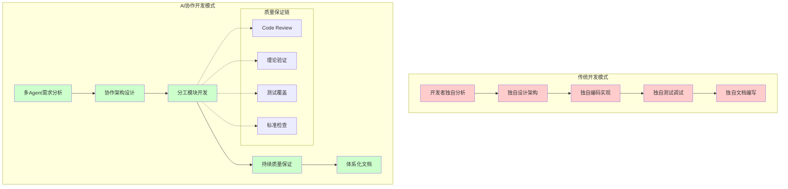
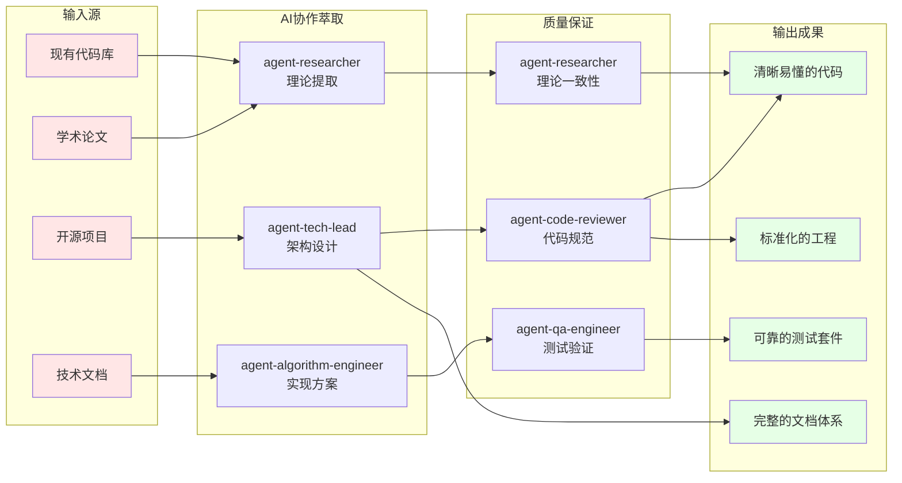
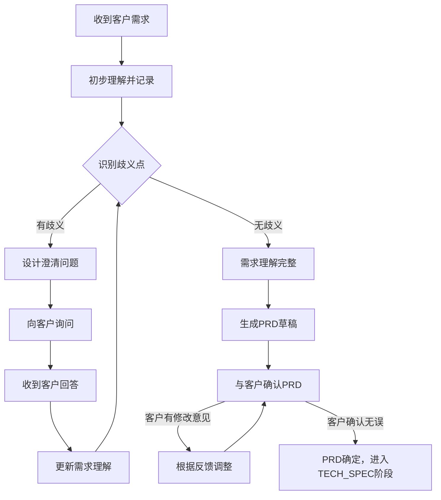
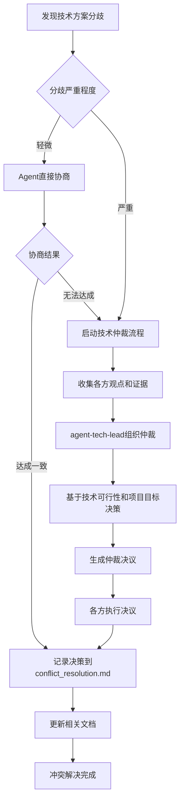
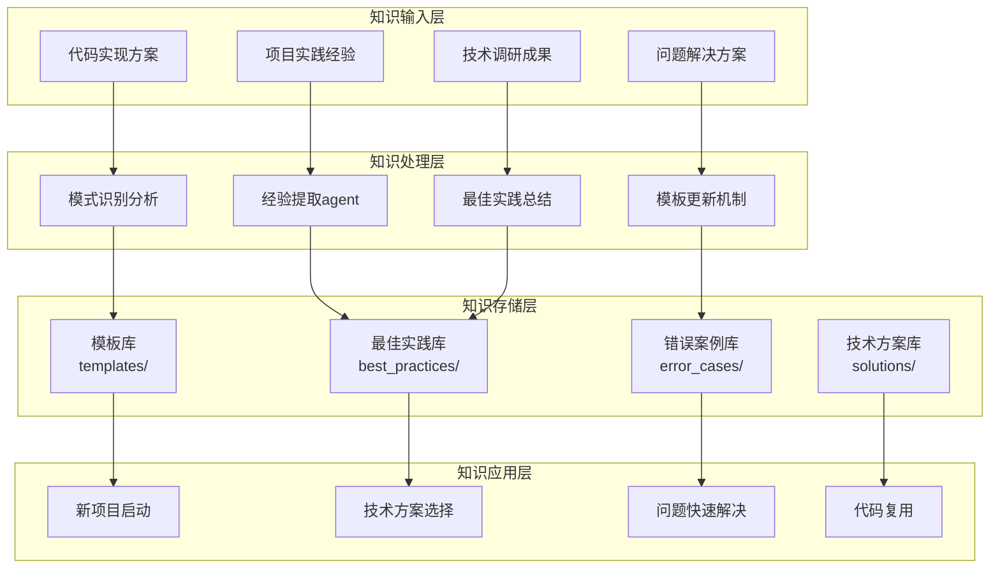
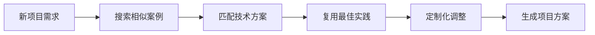

# 重写型工作流设计
这个工作流 是根据现有的 repos 或者 paper，提取我们我们需要的信息，然后根据我们需要设计的数据结构，代码结构，重新写出代码更加清晰易懂，容易上手的项目. 需要设计不同的 agent 赋予他们的角色定位和特产，以及一个项目不同阶段不同的 agent 之间怎么合作。

## Agent 列表

| Agent | 核心职责 | 主要产出 | 关键技能 | 关键工作阶段 |
|-------|----------|----------|----------|-------------|
| **agent-product-manager** | 需求分析、PRD编写、功能验收 | `docs/PRD/PRD.md`、需求验收报告 | 业务理解、用户体验设计、需求管理 | 需求映射、需求验收 |
| **agent-tech-lead** | 技术方案设计、架构决策、项目协调、最终交付决策 | `docs/TECH_SPEC/TECH_SPEC.md`、`docs/TODO/TODO.md`、原型评估、交付决策 | 系统架构、技术选型、团队领导、决策管理 | 架构设计、TECH_SPEC评审、原型评估、架构质量评估、项目交付决策 |
| **agent-researcher** | 论文调研、技术可行性分析、理论一致性审核 | `docs/research/literature_review.md`、`docs/research/recommendations.md`、理论审核报告 | 学术研究、技术趋势分析、理论验证 | 技术调研、TECH_SPEC评审、原型评估、理论一致性审核 |
| **agent-algorithm-engineer** | 算法实现、模型设计、核心开发 | 核心算法代码、模块代码、模块README | 深度学习、PyTorch、算法优化 | 原型实现、验证实验、所有模块开发 |
| **agent-code-reviewer** | 代码质量审核、标准检查、持续监控 | 代码审核报告、质量改进建议 | 代码审查、编程规范、PyTorch最佳实践 | 代码开发全程、测试代码审查、最终代码审核 |
| **agent-qa-engineer** | 测试用例编写、质量保证、性能测试 | 测试代码、测试报告、质量评估报告 | 软件测试、pytest规范、性能分析 | 模块测试、集成测试、性能测试、鲁棒性测试、质量验收 |
| **agent-docs-writer** | 技术文档、项目文档、文档体系构建 | 项目README.md、文档体系 | 技术写作、文档管理、知识整理 | 最终文档生成 |

## Agent工作流程映射

| 工作流阶段 | 主责Agent | 协作Agent | 核心交付物 | 审核/决策Agent |
|------------|-----------|-----------|------------|---------------|
| **需求映射** | agent-product-manager | - | docs/PRD/PRD.md | agent-tech-lead |
| **架构设计** | agent-tech-lead | agent-researcher | docs/TECH_SPEC/TECH_SPEC.md | - |
| **技术调研** | agent-researcher | - |docs/research/ literature_review.md, docs/research/recommendations.md | - |
| **TECH_SPEC评审** | agent-tech-lead | agent-researcher, agent-algorithm-engineer, agent-qa-engineer, agent-product-manager | docs/TECH_SPEC/TECH_SPEC.md(审核版) | 多Agent审核团队 |
| **项目规划** | agent-tech-lead | - | docs/TODO.md | - |
| **原型规划** | agent-tech-lead | agent-algorithm-engineer | docs/PROTOTYPE/PROTOTYPE.md | - |
| **核心算法实现** | agent-algorithm-engineer | agent-qa-engineer | 核心算法代码 | - |
| **原型评估** | agent-tech-lead | agent-qa-engineer, agent-researcher |docs/PROTOTYPE/prototype_review.md | 三方评估团队 |
| **集成测试** | agent-qa-engineer | - | docs/test/integration_report.md | - |
| **端到端测试** | agent-qa-engineer | - | docs/test/integration_report_template.md | - |
| **理论一致性审核** | agent-researcher | - | theoretical_consistency_review.md | - |
| **最终文档生成** | agent-docs-writer | - | 项目README.md | - |
| **项目交付决策** | agent-tech-lead | - | `docs/project_acceptance_report.md` | agent-tech-lead |

## Agent协作模式

### 持续协作关系
- **agent-algorithm-engineer ↔ agent-code-reviewer**: 开发过程中的持续代码审查
- **agent-algorithm-engineer ↔ agent-qa-engineer**: 模块开发中的测试创建和验证
- **agent-tech-lead ↔ 所有Agent**: 项目协调和决策点管理

### 关键决策点
- **TECH_SPEC评审**: 4个Agent多维度审核
- **原型评估**: 3个Agent技术质量评估
- **项目交付决策**: agent-tech-lead基于所有Agent验收结果的最终决策

### 质量保证链
- **代码质量**: agent-code-reviewer持续监控
- **测试质量**: agent-qa-engineer全程负责
- **理论正确性**: agent-researcher理论审核
- **需求符合度**: agent-product-manager验收把关

## 核心理念转变

### 从单人开发到AI协作开发


### 重写型工作流核心理念



## 完整工作流阶段总览

| 阶段分类 | 具体阶段 | 负责Agent | 协作Agent | 主要任务 | 核心产出物 | 审核标准 | 文档模板/规范 |
|---------|---------|-----------|----------|----------|------------|----------|--------------|
| **Phase 1** | 需求映射 | agent-product-manager | - | 分析目标功能需求，拆分细节 | `PRD.md` | 功能点明确、优先级清晰 | `PRD/prd_template.md` |
| **需求分析** | 架构设计 | agent-tech-lead | agent-researcher | 目标系统设计，技术方案选择 | `TECH_SPEC.md` | 接口定义、模块划分清晰 | `TECH_SPEC/TECH_SPEC_template.md` |
| **知识提取** | 技术调研 | agent-researcher | - | 研究现有方案，理论分析，技术趋势 | `literature_review.md`, `recommendations.md` | 技术方案科学，风险可控 | `/research/literature_review_template.md` |
|  | TECH_SPEC评审 | agent-tech-lead | 多Agent审核团队 | 多维度技术方案审核 | `TECH_SPEC.md`(审核版) | 所有Agent审核通过 | 审核表格 |
|  | 项目规划 | agent-tech-lead | - | 生成任务分解和TODO管理 | `docs/TODO.md` | 任务清晰，可追踪 | `TODO_template.md` |
| **Phase 2** | 原型规划 | agent-tech-lead | agent-algorithm-engineer | 制定原型开发计划 | `PROTOTYPE.md` | 验证目标明确，成功标准可量化 | `PROTOTYPE_template.md` |
| **原型开发** | 核心算法实现 | agent-algorithm-engineer | agent-qa-engineer | 实现最小可行核心算法 | 核心算法代码 | 前向传播正确，基本功能无误 | - |
| **模块化重写** | 验证实验 | agent-algorithm-engineer | - | 小规模验证实验 | 实验结果报告 | 指标达到预期80%以上 | - |
|  | 原型评估 | agent-tech-lead | agent-qa-engineer, agent-researcher | 多维度原型质量评估 | `prototype_review.md` | 功能/理论/架构三方评估通过 | - |
|  | 数据模块 | agent-algorithm-engineer | agent-code-reviewer, agent-qa-engineer | 数据加载/预处理实现 | `data/` 模块代码 | 单测通过、代码审查通过 | `pycode_standards.md`, `pytorch_standards.md` |
|  | 模型模块 | agent-algorithm-engineer | agent-code-reviewer, agent-qa-engineer | 模型架构实现 | `models/` 模块代码 | 前向传播正确、代码规范 | 同上 |
|  | 训练模块 | agent-algorithm-engineer | agent-code-reviewer, agent-qa-engineer | 训练循环实现 | `training/` 模块代码 | 损失下降、梯度正常 | 同上 |
|  | 评估模块 | agent-algorithm-engineer | agent-code-reviewer, agent-qa-engineer | 指标计算实现 | `evaluation/` 模块代码 | 指标匹配论文 | 同上 |
| **Phase 3** | 集成测试 | agent-qa-engineer | - | 端到端集成测试 | `test_results/` | 完整流程可运行，模型收敛 | `pytest_stands.md` |
| **集成验证** | 性能测试 | agent-qa-engineer | - | 性能基准对比测试 | `benchmark.md` | 达到PRD性能要求80%以上 | - |
|  | 鲁棒性测试 | agent-qa-engineer | - | 边界情况和稳定性测试 | `robustness_report.md` | 无关键bug，系统稳定 | - |
|  | 代码最终审核 | agent-code-reviewer | - | 全面代码质量审核 | 代码审核报告 | 符合所有编码规范 | `pycode_standards.md`, `pytorch_standards.md` |
|  | 架构质量评估 | agent-tech-lead | - | 系统可维护性和扩展性评估 | 架构评估报告 | 技术方案执行到位 | - |
|  | 需求验收 | agent-product-manager | - | 功能需求满足度验证 | 需求验收报告 | P0需求100%实现 | `PRD.md` |
|  | 质量验收 | agent-qa-engineer | - | 测试覆盖率和质量汇总 | `final_quality_report.md` | 测试覆盖率≥90% | - |
|  | 理论一致性审核 | agent-researcher | - | 算法实现与理论的一致性 | `theoretical_consistency_review.md` | 理论实现完全吻合 | `literature_review.md` |
|  | 最终文档生成 | agent-docs-writer | - | 项目级README和文档体系 | 项目`README.md` | 文档完整，引用清晰 | - |
|  | 项目交付决策 | agent-tech-lead | - | 最终交付决策 | 最终交付报告 | 所有维度验收通过 | - |


## 每个阶段具体workflow

### 客户需求确认与PRD起草阶段

#### 阶段1: 客户需求收集与澄清
**负责**: agent-product-manager
**时机**: 项目启动，收到初始需求后

**需求输入方式**:
1. **对话方式**: 与客户直接对话，通过问答形式收集需求
2. **文档方式**: 阅读客户提供的需求文档、技术规格或参考项目

**需求澄清流程**:
1. **初始理解**: 基于客户输入（对话或文档）形成初步需求理解
2. **歧义识别**: 识别模糊、不明确或相互矛盾的需求点
3. **深度询问**: 针对不明确的地方，设计具体问题向客户询问：
   - 功能边界：这个功能的具体范围是什么？
   - 性能要求：期望的准确率、速度、资源消耗指标？
   - 数据规格：输入数据的格式、规模、质量要求？
   - 应用场景：实际使用环境和约束条件？
   - 优先级排序：哪些功能是核心必需，哪些是可选？

**反复确认机制**:


**需求澄清检查清单**:
- [ ] **功能需求**: 每个功能的具体定义、输入输出、边界条件
- [ ] **性能需求**: 准确率、延迟、吞吐量、资源使用等量化指标
- [ ] **数据需求**: 训练数据、测试数据的格式、规模、获取方式
- [ ] **环境约束**: 部署环境、硬件限制、集成要求
- [ ] **优先级**: P0(必须)、P1(重要)、P2(可选)功能分级
- [ ] **验收标准**: 如何判断项目成功完成的具体标准

#### 阶段2: PRD文档生成
**前置条件**: 需求澄清完成，无歧义点

**PRD起草流程**:
1. **基于澄清结果**: 将完整的需求理解转化为结构化PRD文档
2. **使用标准模板**: 按照`docs/templates/PRD/prd_template.md`规范编写
3. **客户审阅**: 将PRD草稿提交客户审阅确认
4. **迭代完善**: 根据客户反馈进行调整，直到客户正式签字确认

**客户需求澄清话术示例**:
- "您提到的'高准确率'，具体期望达到多少百分比？"
- "这个功能在什么场景下使用？有什么特殊的环境限制吗？"
- "输入数据的格式是什么？大概有多大规模？"
- "如果这个功能和那个功能发生冲突，您希望优先实现哪个？"
- "您期望这个项目在什么时间节点交付？"

**质量标准**:
- 客户需求100%明确，无歧义点
- PRD文档获得客户正式确认
- 所有假设和约束条件明确记录

**最终通过则进入 TECH_SPEC 阶段**

**🔄 Git Commit判断**:
- **Commit条件**: PRD.md 初版完成或重大修订完成
- **Commit类型**: `docs(prd): add initial project requirements` 或 `docs(prd): update requirements based on stakeholder feedback`
- **标准依据**: 参考 `docs/standards/git_commit_std.md`

**📚 知识沉淀任务**:
- **agent-product-manager** 将需求分析的有效方法和常见问题记录到 `knowledge/best_practices/collaboration_patterns.md`
- 如遇到需求理解分歧，按照冲突解决机制处理并记录到 `knowledge/error_cases/common_issues.md`

### TECH_SPEC 起草到确定阶段


1. **草稿（DRAFT）**
   agent-product-manager提出需求，agent-tech-lead 负责人起草初版 `TECH_SPEC.md`。若调研后发现设想不妥，agent-product-manager会重`PRD.md`

   **🔄 Git Commit判断**:
   - **Commit条件**: TECH_SPEC.md 初版草稿完成
   - **Commit类型**: `docs(tech-spec): add initial technical specification draft`

2. **调研与可行性（RESEARCH）**
   agent-researcher 按照Ilya Sutskever式的深度研究方法，进行多阶段递归调研：

   ### 阶段1: 初始调研与资源收集
   **具体操作**:
   ```bash
   # 多源资源搜索策略
   1. ArXiv搜索: "model_name" + "architecture"
   2. Google Scholar: 查找引用最多的相关论文
   3. GitHub搜索: "model_name" + "pytorch" + "implementation"
   4. 技术博客: Medium, Towards Data Science, Distill.pub
   5. 中文资源: 知乎、CSDN、机器之心
   ```

   **工作量标准**:
   - [ ] 收集至少15篇核心论文(包括原始论文、改进论文、综述)
   - [ ] 找到至少3个不同的代码实现(官方+社区)
   - [ ] 收集至少10篇高质量技术博客解析
   - [ ] 建立资源清单并按质量分级

   **创建文档**: `docs/research/resource_inventory.md`

   **资源质量评估与分类**:
   - **A级资源**: 原始论文、顶会论文、官方实现
   - **B级资源**: 知名机构博客、高质量复现、详细解析
   - **C级资源**: 个人博客、简单介绍、部分实现

   ### 阶段2: 概念预理解与盲点识别
   **具体操作**:
   1. 快速浏览所有A级资源，提取关键概念
   2. 列出所有专业术语和技术概念
   3. 标记理解程度: 完全理解/部分理解/完全不懂

   **创建文档**: `docs/research/concept_inventory.md`
   **概念依赖关系分析**: 识别概念间的依赖关系，确定学习顺序

   ### 阶段3: 深度迭代研究

   #### 概念深度学习循环
   **单个概念的研究流程**:
   ```
   选择概念 → 搜索资料 → 理论学习 → 代码验证 → 理解检验 → 文档更新
   ```

   **概念理解判断标准**:
   - [ ] **定义清晰**: 能准确描述概念的数学定义
   - [ ] **直觉理解**: 能用类比或可视化解释概念
   - [ ] **公式推导**: 能推导关键数学公式
   - [ ] **代码对应**: 理解理论与实现的对应关系
   - [ ] **应用场景**: 知道概念在模型中的具体作用

   **是否需要创建概念知识库的判断标准**:
   ```
   创建知识库 if (
       概念复杂度 > 中等 AND
       (概念频繁出现 OR 概念是核心创新点 OR 概念理解困难)
   )
   ```

   #### 模块架构递归分析
   **整体到局部的分解策略**:
   ```
   Level 0: 整个模型 (如Flux)
   ├─ Level 1: 主要组件 (Encoder, Decoder, 中间处理)
   │  ├─ Level 2: 子模块 (Attention Block, MLP, Norm Layer)
   │  │  ├─ Level 3: 基础操作 (MatMul, Softmax, LayerNorm)
   │  │  └─ Level 3: 具体实现细节
   ```

   **模块是否需要进一步拆分的判断标准**:
   ```
   继续拆分 if (
       模块内部逻辑复杂 OR
       包含多个不同功能 OR
       某个子部分是创新点 OR
       理解不够透彻
   )
   ```

   **模块理解透彻的判断标准**:
   - [ ] **功能清晰**: 能准确描述模块的作用
   - [ ] **IO明确**: 清楚输入输出的格式和含义
   - [ ] **内部透明**: 理解内部每个操作的目的
   - [ ] **参数理解**: 知道每个参数的作用和设置原理
   - [ ] **代码对应**: 能将理论分析与代码实现对应
   - [ ] **性能影响**: 理解模块对整体性能的影响

   #### 理论与代码验证循环
   **验证流程**:
   1. **理论预期**: 基于理论分析，预测代码应该如何实现
   2. **代码检查**: 实际查看代码实现
   3. **差异分析**: 对比理论预期与实际实现的差异
   4. **原因调查**: 理解差异的原因(工程优化、实现限制等)
   5. **知识更新**: 更新理论理解或发现新的细节

   ### 阶段4: 困难处理策略

   #### 概念始终理解不了的处理方案
   **问题诊断**:
   ```
   理解困难原因诊断:
   1. 数学基础不足 → 补充基础数学知识
   2. 概念过于抽象 → 寻找具体例子和类比
   3. 资料质量差 → 寻找更好的学习资源
   4. 概念确实复杂 → 寻求专家帮助或暂时搁置
   ```

   **具体策略**:
   1. **降维理解**: 先理解简化版本或特殊情况
   2. **类比学习**: 寻找相似概念进行类比
   3. **实验验证**: 通过代码实验观察行为
   4. **社区求助**: 在学术社区提问
   5. **暂时标记**: 标记为"深度理解待定"，继续其他部分

   **创建困难概念档案**: `docs/research/difficult_concepts.md`

   #### 理解正确性验证方法
   **多重验证策略**:
   1. **交叉验证**: 对比多个独立资源的解释
   2. **代码验证**: 理论预测与代码行为的一致性
   3. **实验验证**: 通过小实验验证理解
   4. **专家确认**: 在技术社区寻求确认
   5. **逻辑自洽**: 检查理解在整个框架内的逻辑一致性

   **理解正确性检查清单**:
   - [ ] 能否解释观察到的现象?
   - [ ] 预测是否与实际代码行为一致?
   - [ ] 是否与已知的理论框架兼容?
   - [ ] 能否回答"为什么这样设计"的问题?

   ### 最终产出
   通过深度调研和分析，确保项目：
   1. 技术方案科学: 基于最新研究和最佳实践
   2. 风险可控: 提前识别和规避技术风险
   3. 效率最优: 避免不必要的技术探索和试错成本
   4. 持续改进: 为项目提供持续的技术优化方向

   **生成文档**:
   - `docs/research/literature_review.md`: 深度理论理解，提取公式，构建流程图
   - `docs/research/feasibility_analysis.md`: 技术可行性分析
   - `docs/research/recommendations.md`: 技术建议和优化方向
   - 完善`TECH_SPEC.md`中的 `Source Inventory` 章节

   **完整文档结构**:
   ```
   docs/research/
   ├── overview.md                    # 研究总览和核心发现
   ├── resource_inventory.md          # 资源清单和质量评估
   ├── concept_inventory.md           # 概念清单和理解状态
   ├── research_log.md               # 详细研究日志
   ├── architecture/                 # 架构分析
   │   ├── overall_design.md         # 整体架构设计
   │   ├── encoder_analysis.md       # 编码器分析
   │   ├── decoder_analysis.md       # 解码器分析
   │   ├── innovation_analysis.md    # 创新点分析
   │   └── dataflow_analysis.md      # 数据流分析
   ├── concepts/                     # 概念知识库
   │   ├── [concept_name].md         # 各个核心概念详细解析
   │   └── difficult_concepts.md     # 困难概念处理
   ├── implementations/              # 代码实现分析
   │   ├── official_analysis.md      # 官方实现分析
   │   ├── community_comparison.md   # 社区实现对比
   │   └── key_functions.md          # 关键函数解析
   ├── validation/                   # 验证与实验
   │   ├── theory_code_mapping.md    # 理论代码对应
   │   ├── experiment_results.md     # 实验验证结果
   │   └── consistency_check.md      # 一致性检查
   └── insights/                     # 深度洞察
       ├── innovation_summary.md     # 创新点总结
       ├── agi_relevance.md          # AGI相关性分析
       ├── comparison_with_gpt.md    # 与GPT系列对比
       └── future_directions.md      # 未来发展方向
   ```

   **🔄 Git Commit判断**:
   - **Commit条件**: 完成所有调研文档(literature_review.md, feasibility_analysis.md, recommendations.md)
   - **Commit类型**: `docs(research): add comprehensive literature review and feasibility analysis`

   **📚 知识沉淀任务**:
   - **agent-researcher** 将有效的技术调研方法和资源发现记录到 `knowledge/best_practices/tech_solutions.md`
   - 将新发现的技术方案和理论洞察更新到 `knowledge/best_practices/tech_solutions.md` 对应章节

3. **方案设计（DESIGN）**
   agent-tech-lead 根据 agent-researcher 的调研结果`/docs/research/feasibility_analysis.md` 和 `/docs/research/recommendations.md`,`TECH_SPEC.md`，沉淀系统/数据/模型/评测方案，明确输入输出契约、风控与里程碑。设计作为原型实现的蓝本。进入原型阶段。

   **🔄 Git Commit判断**:
   - **Commit条件**: TECH_SPEC.md 完整设计方案完成
   - **Commit类型**: `docs(tech-spec): complete technical design and architecture specification`

4. **评审（REVIEW）**
   agent-research/agent-algorithm-engineer/agent-qa-engineer/agent-product-manager 根据 `TECH_SPEC.md` 进行审核。补充`TECH_SPEC.md` 中的 `审核意见章节`
   如果不通过，退回到第三步方案设计阶段
   不同的 agent 审核内容会不一样，如下表

   | Agent | 主要审核章节 | 关键审核点 | 审核标准 |
   |-------|-------------|------------|----------|
   | **agent-researcher** | Source Inventory, 技术选择 | 技术方案科学性、理论基础 | 基于SOTA方法，风险可控 |
   | **agent-algorithm-engineer** | 模块设计, 数据流, 实现细节 | 架构可行性、性能可达成 | 符合PyTorch最佳实践 |
   | **agent-qa-engineer** | 测试计划, 异常处理, 质量目标 | 可测试性、验收标准 | 测试覆盖完整，指标可量化 |
   | **agent-product-manager** | 背景目标, 边界约束, API标准 | 需求对应、用户体验 | 满足PRD要求，接口易用 |

   **🔄 Git Commit判断**:
   - **Commit条件**: 所有Agent审核意见完成，TECH_SPEC.md 审核版本完成
   - **Commit类型**: `docs(tech-spec): add multi-agent review feedback and approval`

   **📚 知识沉淀任务**:
   - **agent-tech-lead** 将多Agent协作评审的有效模式记录到 `knowledge/best_practices/collaboration_patterns.md`
   - 如出现技术方案分歧，将冲突解决过程记录到 `knowledge/error_cases/common_issues.md`

5. **批准（APPROVED）**
   如果agent-research/agent-algorithm-engineer/agent-qa-engineer/agent-product-manager 都通过了审核，则进入下一阶段，进入开发阶段。

   **🔄 Git Commit判断**:
   - **Commit条件**: TECH_SPEC 正式批准，状态更新为 APPROVED
   - **Commit类型**: `docs(tech-spec): approve final technical specification`

### 规划阶段
agent-tech-lead 生成 `docs/TODO.md` 文档，列出需要各个 agent 完成的任务
参考这个模板 `docs/templates/TODO/TODO_template.md`

**🔄 Git Commit判断**:
- **Commit条件**: TODO.md 项目任务规划完成
- **Commit类型**: `docs(planning): add comprehensive project task breakdown and agent assignments`
### PROTOTYPE 原型开发

**前置条件**: TECH_SPEC审核通过，所有agent已批准技术方案

1. **agent-tech-lead** 根据已批准的 `TECH_SPEC.md` 和 `docs/research/literature_review.md`，与 agent-algorithm-engineer 协作制定原型开发计划：
   - ✅ **原型规划通过**: 核心算法范围明确、验证目标清晰、成功标准可量化 → 生成 `PROTOTYPE.md` 文档，更新 `docs/TODO.md` 原型开发任务清单，进入步骤2
   - ⚠️ **规划需调整**: 验证目标模糊或成功标准不够具体 → 在 `docs/TODO.md` 中记录调整事项，完善后进入步骤2
   - ❌ **规划严重不足**: 核心算法不明确或技术风险过高 → 返回TECH_SPEC设计阶段重新分析技术方案

   **🔄 Git Commit判断**:
   - **Commit条件**: PROTOTYPE.md 原型规划文档完成
   - **Commit类型**: `docs(prototype): add prototype development plan and validation criteria`

2. **agent-algorithm-engineer** 根据 `PROTOTYPE.md` 的规划要求，实现最小可行的核心算法模型：
   - ✅ **核心实现成功**: 算法逻辑正确，前向传播无误，基本功能完整 → 更新 `docs/TODO.md` 实现状态为"完成"，生成核心算法代码，进入步骤3
   - ⚠️ **实现基本完成**: 核心功能正确但存在性能或稳定性问题 → 记录问题到 `docs/TODO.md`，可进入步骤3但需后续优化
   - ❌ **实现失败**: 算法逻辑错误、无法运行或严重偏离设计 → 在 `docs/TODO.md` 中创建Critical级实现问题，agent-researcher 协助分析理论偏差，返回步骤1重新规划

   **🔄 Git Commit判断**:
   - **Commit条件**: 核心算法代码实现完成，通过基本功能测试
   - **Commit类型**: `feat(prototype): implement core algorithm for prototype validation`

   **📚 知识沉淀任务**:
   - **agent-algorithm-engineer** 将核心算法实现的关键技巧记录到 `knowledge/best_practices/code_patterns.md`
   - 如遇到实现难题，将问题和解决方案记录到 `knowledge/error_cases/common_issues.md`

3. **agent-algorithm-engineer** 根据核心算法代码和 `PROTOTYPE.md` 中的验证计划，设计并执行小规模验证实验：
   - ✅ **验证实验通过**: 算法收敛正常，关键指标达到 `PROTOTYPE.md` 预期范围80%以上 → 生成实验结果和性能数据报告，进入步骤4
   - ⚠️ **实验部分达标**: 指标达到预期60-80%，收敛但性能有待优化 → 记录性能gap到实验报告，可进入步骤4
   - ❌ **验证实验失败**: 算法不收敛、指标严重不达标(<60%)或实验无法运行 → 在 `docs/TODO.md` 中创建Critical级验证问题，需要修复核心算法(返回步骤2)

   **🔄 Git Commit判断**:
   - **Commit条件**: 验证实验完成，实验结果报告生成
   - **Commit类型**: `test(prototype): add validation experiments and performance benchmarks`

   **📚 知识沉淀任务**:
   - **agent-algorithm-engineer** 将验证实验设计方法和性能调优经验记录到 `knowledge/best_practices/tech_solutions.md`
   - 如实验不达标，将调试过程和解决方案记录到 `knowledge/error_cases/common_issues.md`

4. **agent-tech-lead** 根据实验结果报告，组织 agent-qa-engineer 和 agent-researcher 进行原型评估：
   - **agent-qa-engineer** 评估功能正确性和稳定性：核心功能无bug，可重复运行，异常处理正确
   - **agent-researcher** 评估算法理论正确性：指标符合理论预期，数学公式实现正确，无明显理论偏差
   - **agent-tech-lead** 评估架构质量和扩展性：代码结构清晰，模块化程度高，易于后续开发
   - ✅ **三方评估通过**: 所有评估都达标 → 生成 `docs/prototype_review.md` 正面评估报告，进入步骤5
   - ⚠️ **评估基本通过**: 2/3评估通过，1个评估有条件通过 → 记录改进建议，可进入步骤5
   - ❌ **评估失败**: 任一评估完全失败 → 在 `docs/TODO.md` 中创建对应问题，返回相应步骤修复

5. **agent-tech-lead** 根据所有评估结果和 `docs/prototype_review.md`，做原型阶段决策：

   **✅ 原型开发成功** - 需满足以下条件：
   - 核心算法实现：✅完成 或 ⚠️基本完成
   - 验证实验：✅通过 或 ⚠️部分达标
   - 功能评估：✅通过 或 ⚠️基本通过
   - 理论评估：✅通过 或 ⚠️基本通过
   - 架构评估：✅通过 或 ⚠️基本通过

   → **进入完整代码实现阶段**，生成原型成功报告

   **❌ 原型开发失败** - 出现以下情况：
   - 任一环节完全失败 (❌状态)
   - Critical问题未解决
   - 验证实验指标<60%预期
   - 核心算法存在严重理论错误

   → **返回对应阶段修复**：
   - 算法问题 → 返回步骤2重新实现
   - 验证问题 → 返回步骤3重新设计实验
   - 理论问题 → 返回步骤1，可能需要重回TECH_SPEC阶段

   **🔄 有条件继续** - 大部分 ⚠️ 状态：
   - 可以进入完整实现阶段，但需制定技术债务清理计划
   - 在 `docs/TODO.md` 中记录所有待优化项
   - 在完整实现阶段中优先解决原型遗留问题

   **📚 知识沉淀任务**:
   - **agent-tech-lead** 将原型三方评估的协作模式记录到 `knowledge/best_practices/collaboration_patterns.md`
   - **agent-qa-engineer** 将原型功能测试的有效方法记录到 `knowledge/best_practices/test_strategies.md`
   - **agent-researcher** 将理论验证的关键检查点更新到 `knowledge/best_practices/tech_solutions.md`
### 完整代码实现阶段
agent-algorithm-engineer 按照代码开发工作流进行开发

### 测试和 debug 阶段

**前置条件**: 完整代码实现阶段完成，所有模块代码实现完毕

1. **agent-qa-engineer** 根据 `TECH_SPEC.md` 和完整代码，进行集成测试和端到端集成测试，验证各模块协作和数据流完整性。
   - ✅ **集成测试通过**: 完整流程可运行，模型能正常训练收敛 → 更新 `docs/TODO.md` 状态为"集成测试通过"，进入步骤2
   - ❌ **集成测试失败**: 模块间协作异常、数据流错误、训练无法启动 → 在 `docs/TODO.md` 中创建Critical级别问题清单，跳转到步骤4让 agent-algorithm-engineer 紧急修复

2. **agent-qa-engineer** 根据 `docs/research/literature_review.md` 中的性能基准和 `PRD.md` 的性能要求，对比测试训练速度、内存占用、推理延迟。
   - ✅ **性能达标**: 指标达到PRD要求的80%以上 → 生成 `tests/benchmark.md` 性能对比报告，进入步骤3
   - ⚠️ **性能部分达标**: 指标在60-80%范围 → 生成 `tests/benchmark.md` 报告，在 `docs/TODO.md` 中标记性能优化任务，进入步骤3
   - ❌ **性能严重不达标**: 指标低于60% → 生成问题报告，在 `docs/TODO.md` 中创建High级别性能问题，需要 agent-algorithm-engineer 重新优化算法

3. **agent-qa-engineer** 根据集成测试和性能测试结果，评估问题严重程度：
   - ✅ **无关键问题**: 仅有Minor问题 → 在 `docs/TODO.md` 中记录问题清单，进入步骤4
   - ⚠️ **有中等问题**: 存在Major问题但不影响核心功能 → 创建问题清单，进入步骤4
   - ❌ **有严重问题**: 存在Critical问题影响核心功能 → 标记为阻塞状态，必须先解决Critical问题

4. **agent-algorithm-engineer** 根据 `docs/TODO.md` 中的问题清单，按优先级修复代码bug：
   - **Critical问题**: 立即修复，完成后通知 agent-qa-engineer 重新进行集成测试（回到步骤1）
   - **High/Major问题**: 2工作日内修复完成，更新模块级别 `TODO.md` 状态
   - **Minor问题**: 可推迟到下个版本修复
   - ❌ **修复失败**: 无法解决关键技术问题 → 上报给 agent-tech-lead，可能需要返回TECH_SPEC重新设计阶段

5. **agent-code-reviewer** 根据修复的代码和 `docs/standards/pycode_standards.md` 规范，审核代码修复质量：
   - ✅ **审核通过**: 修复正确，符合编码规范 → 更新 `docs/TODO.md` 审核状态为"通过"，进入步骤6
   - ⚠️ **有条件通过**: 修复正确但代码质量需改进 → 标记优化建议，允许进入步骤6，但记录技术债务
   - ❌ **审核失败**: 修复不正确或严重违反规范 → 在 `docs/TODO.md` 中驳回修复，要求 agent-algorithm-engineer 重新修复（返回步骤4）

6. **agent-qa-engineer** 根据修复后的代码，进行鲁棒性测试：
   - ✅ **鲁棒性测试通过**: 边界情况处理正常，异常输入无崩溃，长时间运行稳定 → 生成 `docs/tests/e2e_report.md` 和`docs/tests/integration_report.md`，测试阶段完成
   - ⚠️ **部分鲁棒性问题**: 个别边界情况处理不当 → 生成报告，在 `docs/TODO.md` 中记录改进建议，可进入验收阶段
   - ❌ **鲁棒性测试失败**: 严重稳定性问题，系统容易崩溃 → 创建Critical问题，返回步骤4要求修复

   **📚 知识沉淀任务**:
   - **agent-qa-engineer** 将集成测试、性能测试、鲁棒性测试的有效策略记录到 `knowledge/best_practices/test_strategies.md`
   - **agent-algorithm-engineer** 将bug修复的调试方法和解决模式记录到 `knowledge/error_cases/common_issues.md`
   - **agent-code-reviewer** 将代码质量问题的识别模式更新到 `knowledge/best_practices/code_patterns.md`

### 项目验收阶段

**前置条件**: 测试和debug阶段完成， `docs/tests/e2e_report.md` 和`docs/tests/integration_report.md` 已生成

1. **agent-code-reviewer** 根据整体代码库和 `docs/standards/pycode_standards.md` 规范，进行最终全面代码审核：
   - ✅ **最终审核通过**: 代码整洁、结构清晰、无关键技术债务、符合所有编码规范 → 在 `docs/TODO.md` 中记录"最终审核通过"，进入步骤2
   - ⚠️ **有条件通过**: 存在少量技术债务但不影响功能 → 记录技术债务清单到 `docs/TODO.md`，可进入步骤2，但需在下版本修复
   - ❌ **审核失败**: 存在严重代码质量问题、架构设计缺陷、大量违反规范的代码 → 在 `docs/TODO.md` 中创建代码质量问题清单，返回测试阶段要求 agent-algorithm-engineer 重构

2. **agent-tech-lead** 根据 `docs/TODO.md` 中的审核结果和整体代码架构，评估系统可维护性和扩展性：
   - ✅ **架构评估通过**: 技术方案执行到位，系统具备良好的可维护性和扩展性 → 确认技术质量达标，进入步骤3
   - ⚠️ **架构有改进空间**: 基本功能实现正确，但存在架构优化点 → 记录改进建议到 `docs/TODO.md`，可进入步骤3
   - ❌ **架构评估失败**: 技术方案执行偏差较大，存在严重架构问题 → 可能需要返回TECH_SPEC重新设计，或要求重大重构

3. **agent-product-manager** 根据 `PRD.md` 的验收标准，对照实际实现功能，逐项验证需求满足度：
   - ✅ **需求验收通过**: 所有P0需求100%实现，P1需求≥80%实现，用户体验良好 → 更新 `docs/TODO.md` 需求验收状态为"通过"，进入步骤4
   - ⚠️ **需求部分满足**: P0需求100%但P1需求60-80%实现 → 记录未实现功能清单，可进入步骤4，但需明确后续版本计划
   - ❌ **需求验收失败**: P0需求未完全实现或核心功能严重不符合预期 → 在 `docs/TODO.md` 中创建需求缺陷清单，返回开发阶段补充实现

4. **agent-qa-engineer** 根据  `docs/tests/e2e_report.md` 和`docs/tests/integration_report.md` 和测试覆盖率数据，汇总质量验收：
   - ✅ **质量验收通过**: 测试覆盖率≥90%，性能指标达标，稳定性良好 → 进入步骤5
   - ⚠️ **质量基本达标**: 测试覆盖率80-90%，性能基本达标 → 生成质量报告，记录改进建议，可进入步骤5
   - ❌ **质量验收失败**: 测试覆盖率<80%，性能严重不达标，稳定性差 → 生成问题质量报告，返回测试阶段要求提升质量

5. **agent-researcher** 根据 `TECH_SPEC.md`、`docs/research/literature_review.md` 和完整实现代码，审核理论一致性：
   - ✅ **理论一致性通过**: 算法实现与理论原理完全吻合，数学公式正确，流程逻辑符合学术标准，进入步骤6
   - ⚠️ **理论基本一致**: 核心算法正确，个别细节与理论有微小偏差但不影响整体效果 → 记录偏差说明和改进建议，可进入步骤6
   - ❌ **理论一致性失败**: 算法实现存在理论错误、数学公式错误或严重偏离学术标准 → 在 `docs/TODO.md` 中创建Critical级理论问题，返回开发阶段修正

6. **agent-docs-writer** 根据完整代码库、`PRD.md`、`TECH_SPEC.md` 和 agent-algorithm-engineer 创建的模块级别README文件，生成最终项目级别 `README.md`：
   - **主要内容**: 项目整体介绍、快速开始指南、完整开发流程说明、技术架构概述
   - **文档引用**: 明确引用 `TECH_SPEC.md`、`PRD.md`、各模块README文件，形成完整文档体系
   - **流程梳理**: 对整个AI协作开发流程进行清晰梳理，包括需求分析→技术设计→原型验证→开发实现→测试验收的完整链路
   - ✅ **最终文档通过**: 项目README结构清晰、引用完整、开发流程描述准确 → 完整项目文档体系建立，进入步骤7
   - ⚠️ **文档基本完整**: 核心内容完整，少量引用或流程描述需完善 → 记录待完善清单，可进入步骤7
   - ❌ **文档严重不足**: 缺少关键文档引用、流程描述错误或结构混乱 → 需要重新完善文档，暂缓进入步骤7

7. **agent-tech-lead** 根据所有验收结果，做最终交付决策，生成`docs/project_acceptance_report.md`  参考模板`docs/project_acceptance_report_template.md`

   **✅ 项目交付通过** - 需满足以下条件：
   - 代码审核: ✅通过 或 ⚠️有条件通过
   - 架构评估: ✅通过 或 ⚠️有改进空间
   - 需求验收: ✅通过 或 ⚠️部分满足
   - 质量验收: ✅通过 或 ⚠️基本达标
   - 理论一致性: ✅通过 或 ⚠️基本一致
   - 最终文档: ✅通过 或 ⚠️基本完整

   → **项目正式交付**，生成最终交付报告

   **❌ 项目交付失败** - 出现以下情况：
   - 任一环节完全失败 (❌状态)
   - Critical问题未解决
   - P0需求未完全实现
   - 测试覆盖率<80%
   - 理论一致性存在严重错误

   → **返回对应阶段修复**：
   - 代码问题 → 返回测试和debug阶段
   - 需求问题 → 返回开发阶段补充实现
   - 架构问题 → 可能返回TECH_SPEC重新设计
   - 理论问题 → 返回开发阶段修正算法实现
   - 文档问题 → 返回文档完善阶段重新整理

   **🔄 有条件交付** - 大部分 ⚠️ 状态：
   - 可以交付使用，但需制定下版本改进计划
   - 在 `docs/TODO.md` 中记录所有待改进项（包括理论偏差和文档完善）
   - 设定下版本的修复和优化目标

   **📚 知识沉淀任务**:
   - **agent-tech-lead** 将项目交付决策的标准和流程记录到 `knowledge/best_practices/collaboration_patterns.md`
   - **agent-code-reviewer** 将最终代码审核的检查清单更新到 `knowledge/best_practices/code_patterns.md`
   - **agent-qa-engineer** 将质量验收的量化标准记录到 `knowledge/best_practices/test_strategies.md`
   - **agent-product-manager** 将需求验收的有效方法记录到 `knowledge/best_practices/collaboration_patterns.md`
   - **agent-researcher** 将理论一致性审核的关键点更新到 `knowledge/best_practices/tech_solutions.md`
   - **agent-docs-writer** 将文档体系构建的最佳实践记录到 `knowledge/best_practices/collaboration_patterns.md`

## Git Commit 策略总览

### Commit 时机原则
根据 `docs/standards/git_commit_std.md` 规范，在以下情况下必须进行git commit：

| 触发条件 | Commit类型 | 示例 |
|----------|------------|------|
| 文档完成/重大更新 | `docs` | `docs(prd): add initial project requirements` |
| 新功能实现完成 | `feat` | `feat(prototype): implement core algorithm` |
| Bug修复完成 | `fix` | `fix(model): resolve gradient computation issue` |
| 测试代码完成 | `test` | `test(prototype): add validation experiments` |
| 代码重构完成 | `refactor` | `refactor(data): optimize data loading pipeline` |
| 性能优化完成 | `perf` | `perf(model): improve inference speed by 20%` |

### 模块开发 Commit 规范
- **模块规划完成**: `docs(module): add [module_name] design and TODO`
- **模块实现完成**: `feat(module): implement [module_name] core functionality`
- **模块测试完成**: `test(module): add comprehensive tests for [module_name]`
- **模块优化完成**: `perf(module): optimize [module_name] performance`

---

## 代码开发工作流 (原型开发和正式开发都遵循)

**前置条件**: 已有理论理解(`docs/research/literature_review.md`)、结构设计(`TECH_SPEC.md`或`PROTOTYPE.md`)、任务跟踪(`docs/TODO.md`)

**开发顺序**: config → data → model → callbacks → ... → model.py → train.py

### 每个模块的开发流程

1. **agent-algorithm-engineer** 根据 `TECH_SPEC.md`/`PROTOTYPE.md` 和 `docs/research/literature_review.md`，为当前模块创建模块级别规划：
   - ✅ **模块规划完成**: 创建模块级别 `README.md` 描述设计思路，生成模块级别 `TODO.md` 任务清单，在总体 `docs/TODO.md` 中引用 → 进入步骤2
   - ⚠️ **规划需完善**: 设计思路基本明确但细节不够 → 完善 `README.md` 后进入步骤2
   - ❌ **规划失败**: 模块设计与整体架构冲突或理论不符 → 返回 `TECH_SPEC.md` 重新分析模块职责

   **🔄 Git Commit判断**:
   - **Commit条件**: 模块级别 README.md 和 TODO.md 完成
   - **Commit类型**: `docs([module]): add module design and development plan`

2. **agent-algorithm-engineer** 根据模块级别 `TODO.md`，逐个文件实现模块功能：
   - **实现策略**: 一个文件一个文件完成，每个文件实现后在 `__name__=='__main__'` 中编写小测试代码立即验证
   - ✅ **文件实现成功**: 核心功能正确，小测试通过，代码逻辑清晰 → 更新模块级别 `TODO.md` 状态，进入步骤3
   - ⚠️ **实现基本完成**: 功能正确但代码质量有待优化 → 标记优化点，可进入步骤3
   - ❌ **实现失败**: 逻辑错误、测试不通过或严重偏离设计 → 在模块级别 `TODO.md` 中记录问题，重新实现

   **🔄 Git Commit判断**:
   - **Commit条件**: 每个文件实现完成并通过小测试
   - **Commit类型**: `feat([module]): implement [filename] with core functionality`

3. **agent-code-reviewer** 根据刚实现的代码文件和项目标准规范，进行即时代码审查：
   - **审查维度**:
     - 通用代码规范: 是否符合 `docs/standards/pycode_standards.md` 编码标准
     - PyTorch规范: 是否符合 `docs/standards/pytorch_standards.md` 框架最佳实践
     - 实现质量: 是否是最佳实现、最简洁的解决方案
     - 理论一致性: 是否与 `docs/research/literature_review.md` 中的原理一致
     - 代码健康: 是否有冗余代码(dumpy code)、无用代码、过度复杂的实现
   - ✅ **代码审查通过**: 代码规范、PyTorch最佳实践、实现最优、理论正确、无冗余 → 更新模块级别 `TODO.md` 审查状态为"通过"，进入步骤4
   - ⚠️ **有条件通过**: 功能正确但有代码质量改进空间或PyTorch使用不够优雅 → 在模块级别 `TODO.md` 中记录优化建议，可进入步骤4但建议优化
   - ❌ **审查失败**: 违反编码规范、不符合PyTorch标准、实现不最优、理论错误或有明显冗余代码 → 在模块级别 `TODO.md` 中创建代码质量问题清单，返回步骤2要求 agent-algorithm-engineer 重构

   **🔄 Git Commit判断**:
   - **Commit条件**: 代码审查通过，代码质量达标
   - **Commit类型**: `style([module]): refactor code to meet quality standards` (如有重构) 或无需额外commit (如直接通过)

   **📚 知识沉淀任务**:
   - **agent-code-reviewer** 将发现的代码质量问题和改进建议记录到 `knowledge/best_practices/code_patterns.md`
   - 将代码审查的有效方法和检查清单更新到 `knowledge/best_practices/collaboration_patterns.md`

4. **agent-qa-engineer** 根据通过审查的代码文件和 `standards/pytest_stands.md` 规范，按1:1原则创建对应测试代码：
   - ✅ **测试创建成功**: 测试覆盖完整，测试用例通过，符合pytest规范 → 更新模块级别 `TODO.md` 测试状态，进入步骤5
   - ⚠️ **测试基本完成**: 主要测试通过，个别边界情况待完善 → 记录待完善测试到模块级别 `TODO.md`，可进入步骤5
   - ❌ **测试失败**: 测试不通过或发现代码实现问题 → 分析失败原因：
     - 如果是测试代码问题: agent-qa-engineer 修复测试代码
     - 如果是实现代码问题: 在模块级别 `TODO.md` 中生成问题清单，返回步骤2要求 agent-algorithm-engineer 修复

   **🔄 Git Commit判断**:
   - **Commit条件**: 测试代码创建完成，测试用例通过
   - **Commit类型**: `test([module]): add comprehensive tests for [module] functionality`

   **📚 知识沉淀任务**:
   - **agent-qa-engineer** 将有效的测试设计方法和用例模式记录到 `knowledge/best_practices/test_strategies.md`
   - 如发现代码实现问题，将问题诊断方法记录到 `knowledge/error_cases/common_issues.md`

5. **agent-code-reviewer** 根据 agent-qa-engineer 创建的测试代码和 `standards/pytest_stands.md` 规范，审查测试代码质量：
   - **测试代码审查维度**:
     - pytest规范符合性: 是否严格遵循 `standards/pytest_stands.md` 测试标准
     - 测试覆盖完整性: 是否覆盖所有关键功能路径、边界情况、异常处理
     - 测试代码质量: 测试逻辑清晰、断言合理、测试数据有效
     - 测试独立性: 测试用例间无依赖、可重复运行、环境清理完整
   - ✅ **测试审查通过**: 测试代码符合pytest规范、覆盖完整、质量优秀 → 更新模块级别 `TODO.md` 测试审查状态为"通过"，进入步骤6
   - ⚠️ **测试有条件通过**: 基本符合规范但有优化空间 → 在模块级别 `TODO.md` 中记录测试优化建议，可进入步骤6
   - ❌ **测试审查失败**: 严重违反pytest规范、覆盖不足或测试逻辑错误 → 在模块级别 `TODO.md` 中创建测试质量问题，要求 agent-qa-engineer 重写测试代码(返回步骤4)

   **🔄 Git Commit判断**:
   - **Commit条件**: 测试代码审查通过，测试质量达标
   - **Commit类型**: `test([module]): improve test quality and coverage` (如有优化) 或无需额外commit (如直接通过)

6. **agent-algorithm-engineer** 根据模块级别 `TODO.md` 的完成状态，决定模块开发进度：
   - ✅ **模块完全完成**: 所有文件实现完成、代码审查通过、测试创建完成、测试审查通过 → 在 `docs/TODO.md` 中关闭当前模块任务，进入下一个模块开发
   - ⚠️ **模块基本完成**: 核心功能完成，代码和测试质量基本达标，存在少量待优化项 → 记录技术债务到 `docs/TODO.md`，可进入下一模块，但需后续版本优化
   - 🔄 **模块未完成**: 存在未完成任务或关键问题(代码质量问题、测试质量问题等) → 继续开发当前模块，优先解决Critical和High级别问题

   **🔄 Git Commit判断**:
   - **Commit条件**: 模块完全完成，包括实现、审查、测试、测试审查全部通过
   - **Commit类型**: `feat([module]): complete [module] implementation with full test coverage`

### 持续质量保证机制

#### 代码质量监控
- **agent-code-reviewer** 在整个开发过程中持续监控代码质量，定期抽查已完成模块的代码健康度
- **即时反馈**: 每个文件完成后立即审查，避免技术债务积累
- **双重标准检查**: 同时检查通用编码规范(`docs/standards/pycode_standards.md`)和PyTorch框架规范(`docs/standards/pytorch_standards.md`)
- **最佳实践推广**: 发现优秀实现模式时，更新相关标准文档的最佳实践示例
- **重构建议**: 当发现更简洁的实现方案时，及时提出重构建议并评估收益成本比

#### 测试质量监控
- **测试代码审查**: agent-code-reviewer 对所有测试代码进行质量审查，确保符合 `standards/pytest_stands.md` 规范
- **测试覆盖度检查**: 确保测试覆盖所有关键功能路径、边界情况、异常处理
- **测试独立性验证**: 验证测试用例间无依赖、可重复运行、环境清理完整

#### 跨模块一致性检查
- **定期全局审查**: 在关键里程碑对整个代码库进行一致性检查
- **标准同步**: 确保所有模块遵循相同的PyTorch使用模式和测试规范
- **技术债务清理**: 定期评估和清理累积的技术债务

---

## Agent协作冲突解决机制

### 冲突类型分类

| 冲突类型 | 冲突场景 | 处理优先级 | 解决方式 | 仲裁Agent |
|---------|---------|-----------|----------|-----------|
| **技术方案分歧** | 不同Agent对技术选择意见不一致 | Critical | 技术仲裁会议 | agent-tech-lead |
| **代码实现争议** | 算法实现方式的不同观点 | High | 理论验证+性能对比 | agent-researcher |
| **质量标准冲突** | 代码质量与开发进度的权衡 | Major | 风险评估决策 | agent-tech-lead |
| **需求理解分歧** | 对PRD需求的不同解读 | Critical | 需求澄清会议 | agent-product-manager |
| **资源竞争冲突** | 多Agent同时修改同一文件 | Major | 协调调度机制 | agent-tech-lead |
| **优先级冲突** | 多个Critical问题同时出现 | Critical | 风险评估排序 | agent-tech-lead |

### 冲突解决流程

#### 1. 技术方案分歧处理


**仲裁标准**:
1. **技术可行性** (40%权重): 方案是否技术可行，风险可控
2. **项目目标符合度** (30%权重): 是否符合PRD和TECH_SPEC目标
3. **资源成本** (20%权重): 开发成本、时间成本、维护成本
4. **长期影响** (10%权重): 对后续开发和扩展的影响

#### 2. 资源竞争协调机制

**文件级别冲突处理**:
- **预防机制**: 在模块开发规划时明确文件修改边界
- **检测机制**: 通过 `docs/TODO.md` 跟踪文件修改状态
- **协调机制**: agent-tech-lead 协调文件修改顺序
- **合并策略**: Critical修复优先，其他按模块重要性排序

**决策优先级排序**:
```
Critical Bug修复 > P0功能实现 > High Bug修复 > P1功能实现 > 优化改进
```

#### 3. 优先级冲突管理

**多Critical问题处理流程**:
1. **快速风险评估** (15分钟内): agent-tech-lead 评估各问题影响面
2. **资源重新分配**: 必要时暂停非Critical任务
3. **并行处理策略**: 不同Agent处理不同Critical问题
4. **进度同步机制**: 每2小时同步一次处理进度

### 冲突预防机制

#### 前置沟通协议
- **需求澄清**: PRD阶段必须明确边界和优先级
- **技术对齐**: TECH_SPEC评审阶段确保技术理解一致
- **职责界限**: 每个阶段明确主责Agent和协作Agent的边界

#### 协作规范
- **决策透明**: 所有技术决策必须记录到相关文档
- **及时沟通**: 发现潜在冲突立即在 `docs/TODO.md` 中标记
- **定期同步**: 每个开发阶段结束时进行协作反思

---

## 知识沉淀和复用机制

### 知识管理体系架构



### 知识沉淀流程

#### 1. 项目完成后知识提取

**触发条件**: 项目交付决策完成，所有验收通过

**知识提取清单**:
| 知识类型 | 提取对象 | 负责Agent | 输出文档 |
|---------|---------|-----------|----------|
| **技术方案最佳实践** | TECH_SPEC.md, 实现代码 | agent-researcher | `knowledge/best_practices/tech_solutions.md` |
| **代码实现模式** | 各模块代码, 审查报告 | agent-code-reviewer | `knowledge/best_practices/code_patterns.md` |
| **测试策略总结** | 测试代码, 测试报告 | agent-qa-engineer | `knowledge/best_practices/test_strategies.md` |
| **协作模式经验** | TODO.md, 协作记录 | agent-tech-lead | `knowledge/best_practices/collaboration_patterns.md` |
| **常见问题解决** | 问题记录, 解决方案 | 全体Agent | `knowledge/error_cases/common_issues.md` |

#### 2. 实时知识积累

**在开发过程中持续收集**:
- **成功经验**: 每个模块完成时记录有效的实现模式
- **失败教训**: 每次问题解决后记录问题原因和解决方案
- **优化方案**: 代码审查中发现的改进点和重构经验
- **协作经验**: Agent协作中的有效沟通模式和冲突解决方法

#### 3. 知识库维护机制

**定期更新策略** (每完成3个项目后):
1. **模板更新**: 基于项目经验优化文档模板
2. **标准修订**: 更新编码规范和最佳实践指南
3. **案例补充**: 添加新的成功案例和失败教训
4. **工具改进**: 优化工作流程和自动化工具

### 知识复用机制

#### 1. 新项目启动时的知识应用

**知识检索流程**:


**复用决策矩阵**:
| 相似度 | 复用策略 | 定制化程度 | 风险评估 |
|--------|----------|------------|----------|
| 90%+ | 直接复用 | 10%以下调整 | 低风险 |
| 70-90% | 参考借鉴 | 30%以下调整 | 中低风险 |
| 50-70% | 部分复用 | 50%以下调整 | 中风险 |
| <50% | 新方案设计 | 全新设计 | 需要谨慎评估 |

#### 2. 开发过程中的知识应用

**实时查询机制**:
- **问题查询**: 遇到技术问题时先查询 `knowledge/error_cases/`
- **方案参考**: 设计技术方案时参考 `knowledge/best_practices/tech_solutions.md`
- **代码复用**: 实现功能时查找 `knowledge/best_practices/code_patterns.md`
- **测试借鉴**: 设计测试时参考 `knowledge/best_practices/test_strategies.md`

---

## 知识沉淀执行策略

### 实时沉淀原则
每个阶段的知识沉淀遵循"及时记录、定期整理、持续更新"的原则：

#### 立即记录 (Real-time Recording)
- **触发条件**: 每个关键步骤完成时立即执行
- **记录内容**: 具体的成功经验、失败教训、解决方案
- **责任Agent**: 各阶段的主责Agent负责记录

#### 阶段整理 (Stage Consolidation)
- **触发条件**: 每个主要阶段(PRD→TECH_SPEC→原型→开发→测试→验收)完成时
- **整理内容**: 将散点记录整合成结构化知识
- **责任Agent**: agent-tech-lead 协调各Agent完成

#### 项目总结 (Project Summary)
- **触发条件**: 项目交付完成后
- **总结内容**: 全项目的经验提取和最佳实践归纳
- **责任Agent**: 全体Agent协作完成

### 知识沉淀检查清单

**每个阶段必须完成的沉淀任务**:
- [ ] 识别本阶段的关键成功因素
- [ ] 记录遇到的问题和解决方案
- [ ] 更新相关的最佳实践文档
- [ ] 如有冲突，记录冲突解决过程
- [ ] 验证记录内容的准确性和完整性

### 知识质量标准

**记录的知识必须满足**:
1. **具体可操作**: 有明确的执行步骤，不是抽象描述
2. **可复现验证**: 其他项目可以按照记录重现经验
3. **上下文完整**: 包含适用条件、限制条件、风险提醒
4. **持续更新**: 基于新项目经验不断完善和修正

### 知识沉淀的Git管理

**提交策略**:
```bash
# 实时记录的提交
git commit -m "docs(knowledge): add real-time insights from [stage_name]"

# 阶段整理的提交
git commit -m "docs(knowledge): consolidate knowledge from [stage_name] completion"

# 项目总结的提交
git commit -m "docs(knowledge): extract comprehensive lessons from project completion"
```

**分支策略**:
- 主分支: 稳定验证过的知识
- 特性分支: 新项目产生的知识更新
- 合并策略: PR review确保知识质量


