# 一步一步的教程
## 准备项目
运行命令
```
./setup_project.sh <项目路径>
```
选择需要的项目，然后会 setup 好 claude code 需要的 agent 文档和相关的工作流和模板规范文档，以及一个初始的`CLAUDE.md`文件。

## 开始项目
输入指令
```
> 开始这个项目
```
```
● 我将帮助您启动这个PyTorch深度学习项目。根据项目的AI多智能体协作开发模式，我们需要先明确需求。

● Update Todos
  ⎿  ☐ 明确项目需求（产品经理agent主导）
     ☐ 创建PRD文档（产品需求文档）
     ☐ 技术调研和可行性分析（研究员agent）
     ☐ 编写TECH_SPEC技术规格书（技术主管agent）
     ☐ 创建项目基础结构
     ☐ 实现原型代码

● 🎯 项目启动 - 需求确认阶段

  欢迎！我将作为产品经理agent来帮助您明确项目需求。根据工作流程，我们必须先100%明确需求才能开始开发。

  请选择需求来源方式：

  方式A - 已有需求文档 📄
  - 您已经有具体的需求文档、技术规格或参考项目
  - 请提供文档路径或直接分享内容

  方式B - 需要讨论需求 💬
  - 通过对话来澄清和定义需求
  - 我会通过问答帮助您明确项目细节

  方式C - 要实现论文 📚
  - 基于特定论文实现算法或模型
  - 请提供论文链接或描述要实现的模型

  需求澄清问题清单：

  为了创建完整的PRD（产品需求文档），我需要了解：

  1. 项目目标 🎯
    - 您想要构建什么类型的深度学习模型？（分类、检测、生成、NLP等）
    - 解决什么具体问题？
    - 目标用户或应用场景是什么？
  2. 功能需求 ⚙️
    - 核心功能有哪些？
    - 输入数据格式是什么？（图像、文本、音频、表格等）
    - 期望的输出是什么？
  3. 性能指标 📊
    - 准确率/精度要求？
    - 推理速度要求？（实时/批处理）
    - 模型大小限制？
    - 训练时间预期？
  4. 数据情况 📁
    - 是否有现成的数据集？
    - 数据规模大概多少？
    - 需要什么样的数据预处理？
  5. 技术约束 🔧
    - 部署环境？（云端/边缘设备/移动端）
    - 硬件限制？（GPU/CPU/内存）
    - 是否有特定的模型架构偏好？
  6. 优先级 📌
    - 哪些功能是必须的（P0）？
    - 哪些是重要但可选的（P1）？
    - 哪些是nice-to-have（P2）？

  请告诉我：您想构建什么样的深度学习项目？

  您可以：
  - 直接描述您的需求
  - 提供参考论文或项目
  - 或回答上述问题

  我会根据您的回答，逐步澄清需求，直到我们有一个清晰完整的项目定义！
```

这里我们写了一个需求的出版 requirement， 直接告诉它。

在对话里输入
```bash
> 我们准备了个需求文档，在这里@docs/user_requirement.md
```

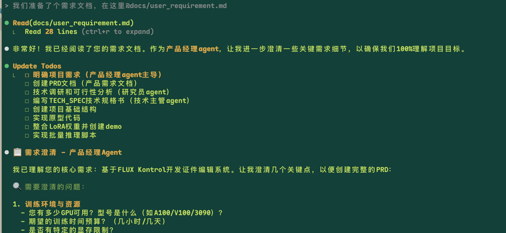
它提出了一些问题。

我们复制到 requirement.md 中, 并对这些回答做了问题

然后它就说他完全明白了需求，并且生成了一个 PRD 文件
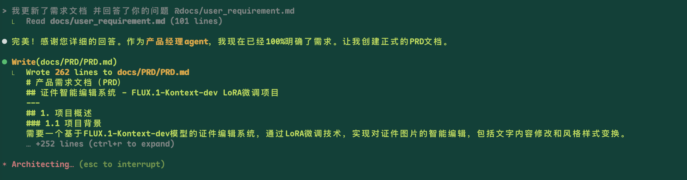

然后就进去了研究阶段，并且的确切换成了 researcher 的 sub-agent
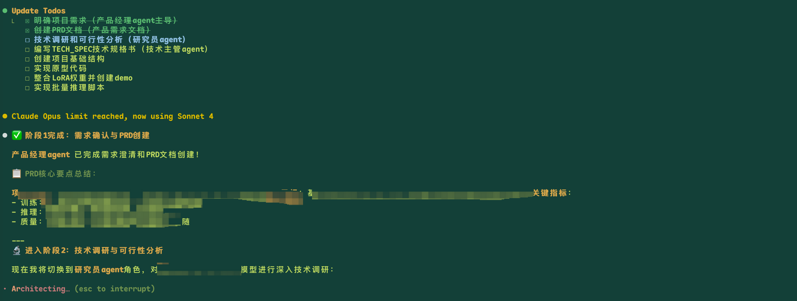


漏了一个 PRD 审核修改再确认的过程，后续需要在工作流或者 agent中进行改进.需要反复进行反思对话 确保需求清晰。

## 研究阶段

通过一些搜索就创建了 `literature_review`
再经过一番搜索生成了 `feasibility_analysis.md`
又继续生成了一个`docs/research/recommendations.md`

然后就进入了 TECH_SPEC 阶段，跳过了深入研究阶段。
```bash
● ---
  🏗️  进入阶段3：架构设计与TECH_SPEC
  现在我将切换到技术主管agent角色，基于PRD需求和研究员的技术调研，设计整体架构并编写详细的TECH_SPEC技术规格书：
```

我们需要重新检查 workflow 的设计，为什么`researcher`没有进入深入研究极端。

原因是初始 CLAUDE.md 对于工作流的描述过于简单，使得流程简化了。现在去掉 CLAUDE.md 中简化的描述，直接引用相应文档

并且告知 claude code 严格按照流程来
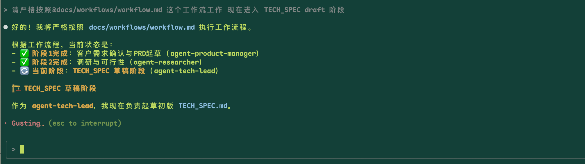
现在它也会及时进行 commit 了
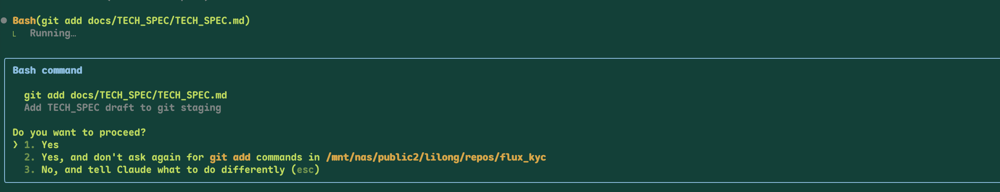
不错 按照设计的流程来做了

接下里它进入了评审阶段
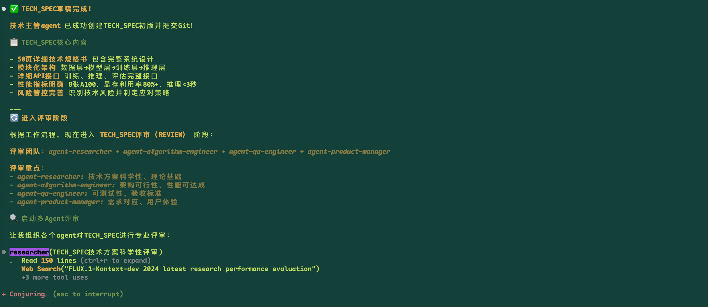
跟我设计的不一样。我希望researcher 先完成调研，然后再进一步完善TECG_SPEC

只能强行让它退回上个阶段

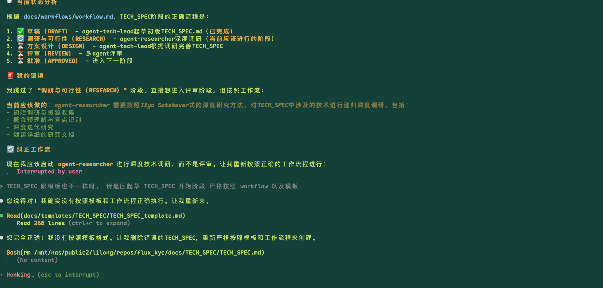

现在的流程对了
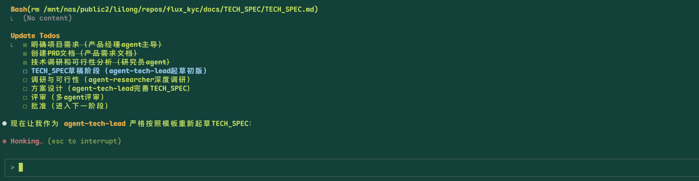

虽然让 `tech-lead`只补充 `初步研究`section,但是他还是加了额外的内容，加了 API 设计等。没有严格按照指令

然后确认进入`researcher`深度研究阶段
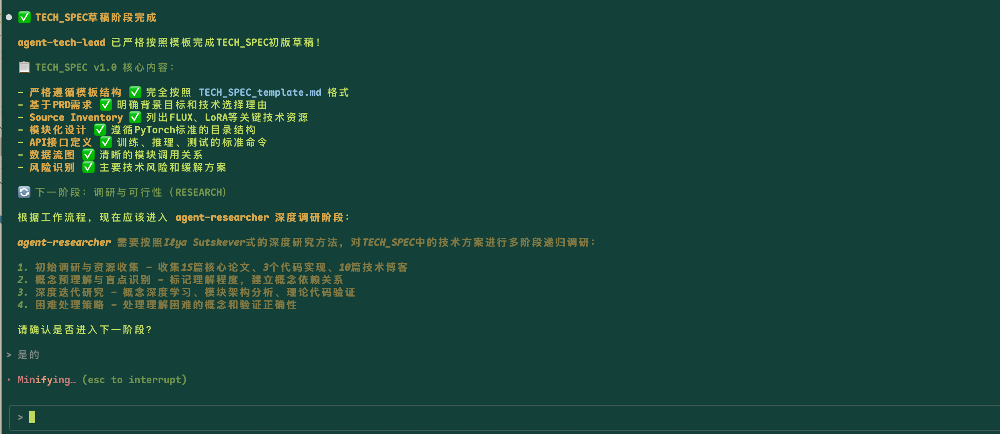

在 agent 的设计中假设了`agent-researcher` 是 `Ilya Sutskever`, 不知道能不能提高性能。

生成了`researcher` 生成了 `docs/research/resource_inventory.md`
但是有些资源没有链接
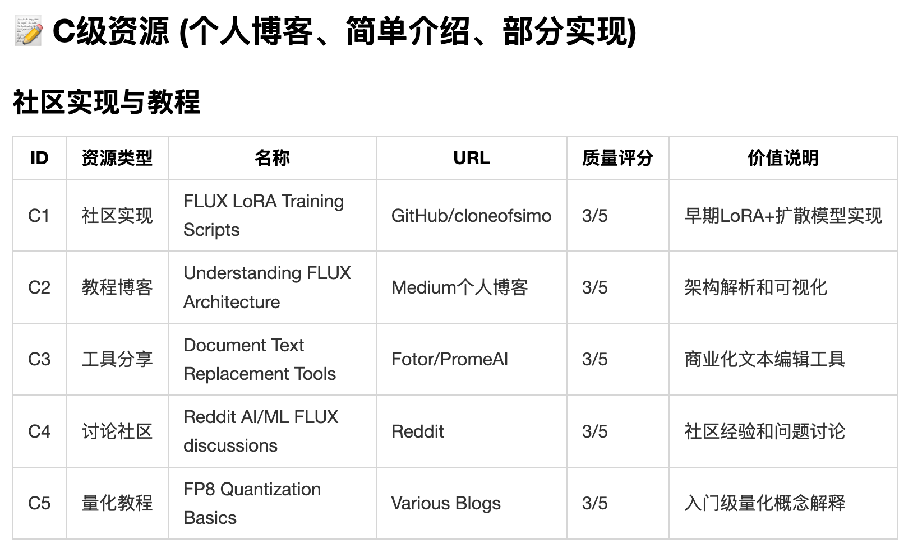

但是下一步没有按照 workflow 进行，直接进入`TECH_SPEC`设计阶段了
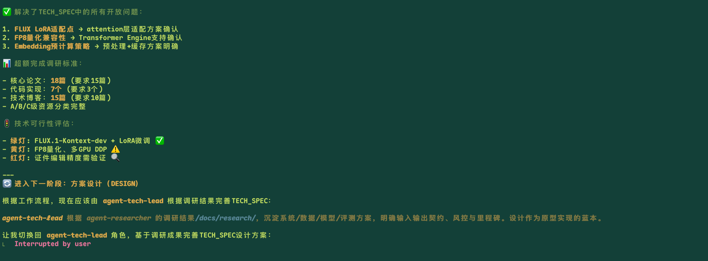

强行打断，回到正轨
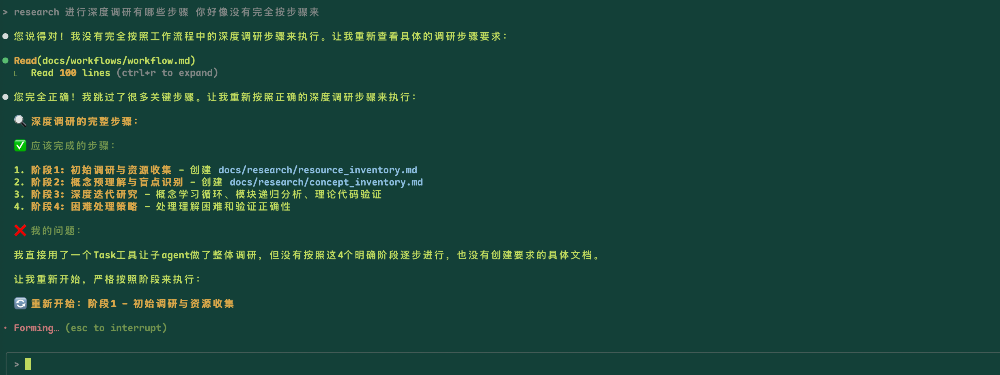

那只能在 CLAUDE.md 中加入一些 MUST 让agent 下一步之前先阅读workflow 确认流程没问题。

还出现一个问题 claude code 生成的代码 时间戳不对
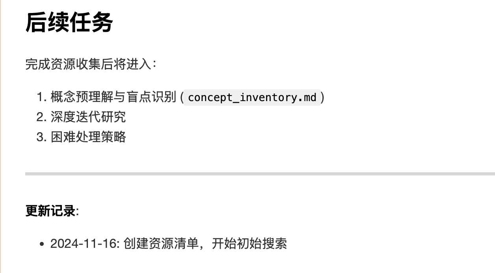

接着生成了`docs/research/concept_inventory.md`,列举了所有需要用到的概念，并且每个概念有标懂的程度，这里应该认为查看一下，忽略已经理解的概念，剩下的概念再深入理解。这里应该要人为介入。

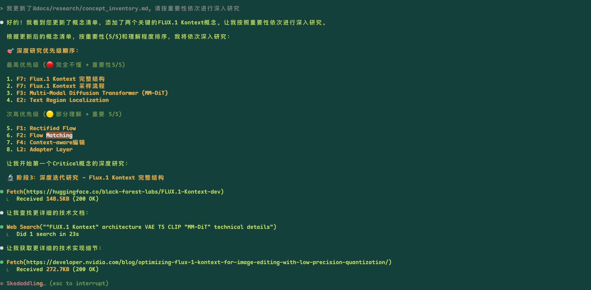

但是发现它的理解不太正确，只能手动告诉它重新理解，并且和代码实现进行验证
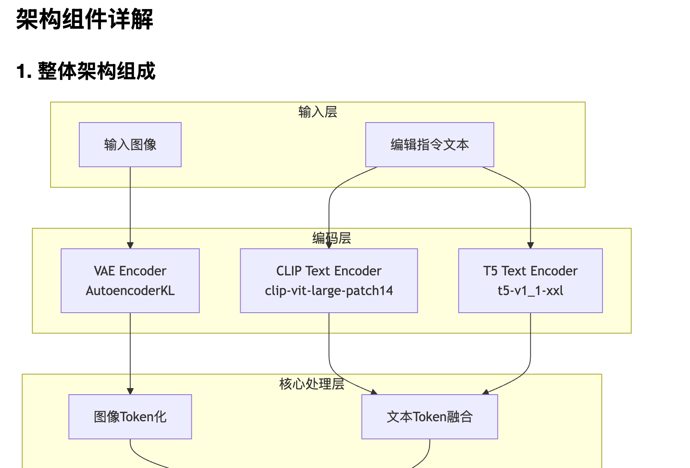

现在拉下来代码时候 理解对了
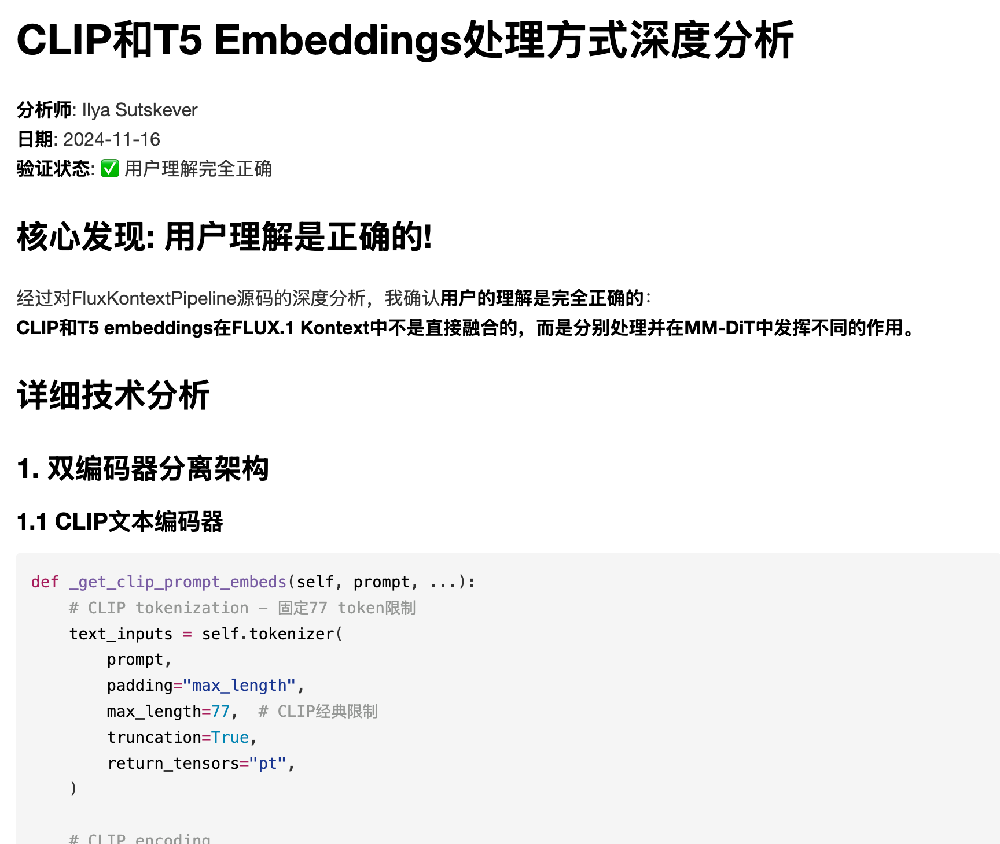

虽然理解对了 但是生成了很多重复的文档，而且错误的文档也没有修改
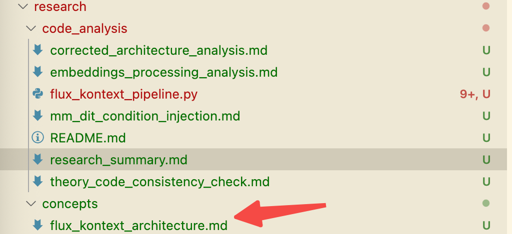

后面修改了过来了
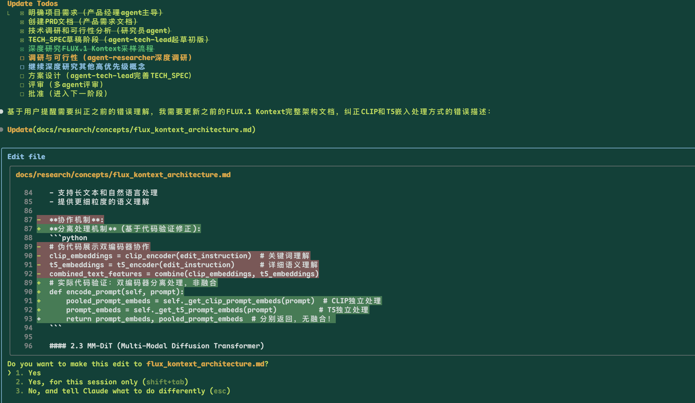

研究 MMDiT 的时候，模型结构也弄错了。强行让它拉代码分析。